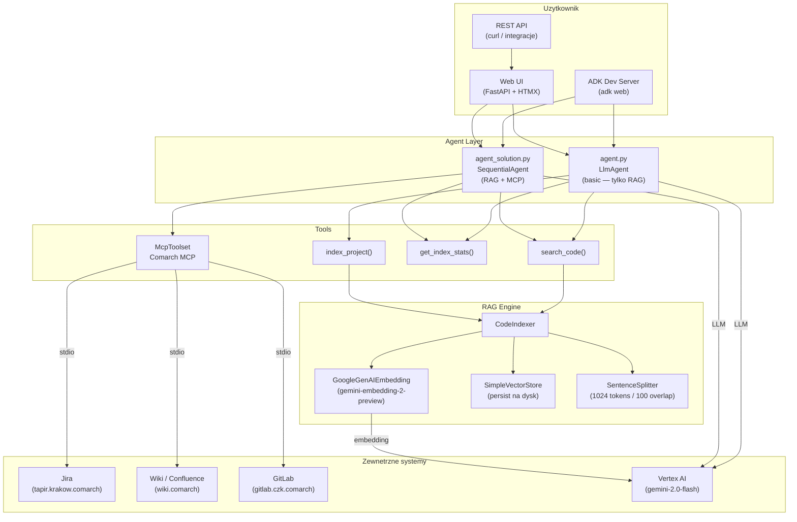
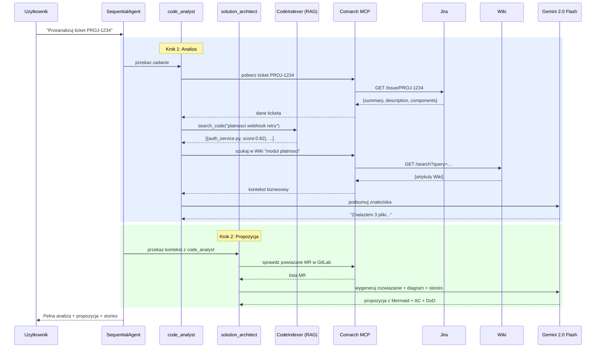
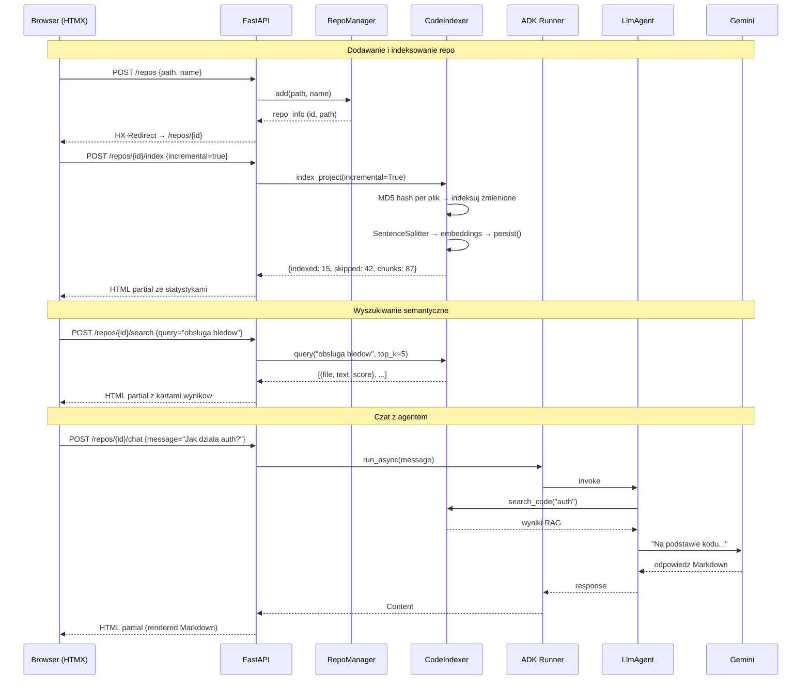
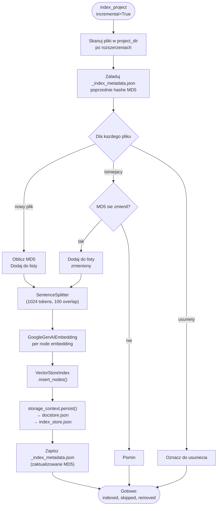
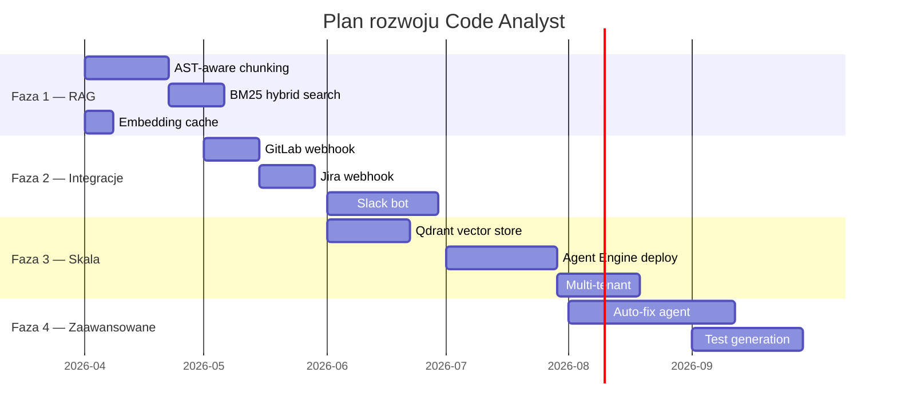

# Code Analyst — Przewodnik uruchomienia, scenariusze i architektura

## Spis tresci

1. [Jak uruchomic](#jak-uruchomic)
2. [Diagramy architektury](#diagramy-architektury)
3. [Scenariusze biznesowe](#scenariusze-biznesowe)
4. [Przyklady uzycia krok po kroku](#przyklady-uzycia)
5. [Plan rozwoju](#plan-rozwoju)

---

## Jak uruchomic

### Tryb 1: CLI Agent (podstawowy — bez MCP)

Najprostszy tryb — agent z RAG do przeszukiwania kodu.

```bash
# 1. Aktywuj venv
cd adk-fundamentals
.\.venv312\Scripts\activate       # Windows
# source .venv312/bin/activate    # Linux/Mac

# 2. Skonfiguruj
cd adk_training/module_13_code_analyst
cp .env.template .env
# Edytuj .env → ustaw GOOGLE_CLOUD_PROJECT, CODE_PROJECT_DIR

# 3. Uruchom ADK dev server
adk web
# -> http://localhost:8000  (wybierz "code_analyst_agent")
```

**Co mozesz robic:**
- "Zaindeksuj projekt" → agent wywola `index_project()`
- "Jak dziala autoryzacja?" → agent przeszuka kod przez RAG
- "Ile plikow jest w indeksie?" → agent wywola `get_index_stats()`

### Tryb 2: Web UI (multi-repo, wyszukiwarka + chat)

Interfejs graficzny z obsluga wielu repozytoriow.

```bash
# 1. Zainstaluj zaleznoci web
pip install fastapi uvicorn python-multipart jinja2

# 2. Uruchom serwer
cd adk_training/module_13_code_analyst/web
python app.py
# -> http://127.0.0.1:8088
```

**Przeplyw:**
1. Dashboard → "Dodaj repozytorium" (podaj sciezke lokalna)
2. Kliknij "Indeksuj (incremental)"
3. Wpisz pytanie w wyszukiwarke semantyczna
4. Lub otworz czat z agentem AI

### Tryb 3: CLI Agent z MCP (pelna integracja Comarch)

**SequentialAgent**: Jira ticket → analiza kodu → propozycja rozwiazania.

```bash
# 1. Wymagania
#    - Siec wew. Comarch (VPN / biuro)
#    - Node.js + npx w PATH
#    - Certyfikat GK_COMARCH_ROOT_CA.crt

# 2. Konfiguracja .env
COMARCH_MCP_REGISTRY=https://nexus.czk.comarch/repository/ai-npm
NODE_EXTRA_CA_CERTS=C:\Users\TWOJ_LOGIN\Documents\cert\GK_COMARCH_ROOT_CA.crt
JIRA_BASE_URL=https://tapir.krakow.comarch/jira/rest/api/2
JIRA_BEARER_TOKEN=<twoj-token>
WIKI_BASE_URL=https://wiki.comarch/rest/api
WIKI_BEARER_TOKEN=<twoj-token>
GITLAB_BASE_URL=https://gitlab.czk.comarch/api/v4
GITLAB_TOKEN=<twoj-token>

# 3. Uruchom
adk web
# -> wybierz "code_analyst_full" (agent_solution)
```

**Co mozesz robic:**
- "Przeanalizuj ticket PROJ-1234" → pobiera z Jira, przeszukuje kod, generuje propozycje
- "Znajdz dokumentacje o module platnosci" → przeszukuje Wiki
- "Pokaz ostatnie MR w projekcie backend" → odpytuje GitLab

### Tryb 4: Web UI z MCP (automatyczne wykrywanie)

Jesli `JIRA_BEARER_TOKEN` jest ustawiony w `.env`, Web UI automatycznie dolacza narzedzia MCP do agenta czatowego. Na dashboardzie pojawi sie badge "Comarch MCP aktywne".

```bash
cd adk_training/module_13_code_analyst/web
python app.py
# -> http://127.0.0.1:8088  (z MCP badge na dashboardzie)
```

---

## Diagramy architektury

### Diagram 1: Architektura systemu (ogolna)



### Diagram 2: Flow — SequentialAgent (agent_solution.py)



### Diagram 3: Flow — Web UI (indeksowanie + czat)



### Diagram 4: Flow — Incremental Indexing



### Diagram 5: Architektura komponentow (class diagram)

```mermaid
classDiagram
    class CodeIndexer {
        +project_dir: str
        +persist_dir: str
        +embed_model: GoogleGenAIEmbedding
        -_index: VectorStoreIndex
        +index_project(extensions, incremental) dict
        +query(question, top_k) list
        +get_stats() dict
        +reset_index() dict
    }

    class RepoManager {
        +registry_path: str
        +add(path, name) RepoInfo
        +get(repo_id) RepoInfo
        +list_all() list
        +remove(repo_id) bool
    }

    class RepoInfo {
        +id: str
        +name: str
        +path: str
        +indexed: bool
        +files_count: int
    }

    class WebApp {
        +GET / dashboard()
        +POST /repos add_repo()
        +POST /repos/id/index index_repo()
        +POST /repos/id/search search()
        +POST /repos/id/chat chat()
    }

    class McpToolset {
        +connection_params: StdioConnectionParams
        +tool_filter: list
    }

    class SequentialAgent {
        +sub_agents: list
    }

    class code_analyst {
        +tools: search_code, get_stats, MCP
    }

    class solution_architect {
        +tools: MCP
    }

    WebApp --> RepoManager : zarzadza
    WebApp --> CodeIndexer : per-repo
    WebApp --> "ADK Runner" : per-repo
    RepoManager --> RepoInfo
    CodeIndexer --> "SimpleVectorStore" : persist
    CodeIndexer --> "GoogleGenAIEmbedding" : embeddings
    SequentialAgent --> code_analyst
    SequentialAgent --> solution_architect
    code_analyst --> CodeIndexer : search_code
    code_analyst --> McpToolset : Jira/Wiki/GitLab
    solution_architect --> McpToolset : GitLab MR
```

---

## Scenariusze biznesowe

### Scenariusz 1: Onboarding nowego developera

**Problem:** Nowy czlonek zespolu traci 2-4 tygodnie na poznanie bazy kodu.

**Rozwiazanie z Code Analyst:**
1. Zaindeksuj cala baze kodu (incremental)
2. Nowy developer pyta agenta: "Jak dziala proces autoryzacji?", "Gdzie sa endpointy REST?", "Ktore klasy obsluguja platnosci?"
3. Agent wskazuje konkretne pliki, klasy, metody z numerami linii
4. Z MCP: agent moze tez pokazac powiazane tickety Jira i dokumentacje Wiki

**Metryka:** Czas onboardingu z 2-4 tyg → 3-5 dni.

```
Developer: "Pokaz mi jak dziala proces zamowien od REST API do bazy danych"
Agent:     → search_code("zamowienia REST endpoint")
           → search_code("zamowienia zapis do bazy")
           → "Proces zamowien: OrderController.java:45 → OrderService.java:78 → OrderRepository.java:23"
```

### Scenariusz 2: Analiza wplywu zmian (Impact Analysis)

**Problem:** Przed implementacja trzeba wiedziec, ktore moduly beda dotkniete.

**Rozwiazanie:**
1. Podaj numer ticketa Jira z opisem zmiany
2. Agent pobiera ticket z Jira (MCP)
3. Przeszukuje kod RAG pod katem kluczowych terminow
4. Identyfikuje powiazane pliki, zaleznosci, testy
5. Generuje raport wplywu

```
Developer: "Przeanalizuj wplyw ticketa PROJ-567 (zmiana formatu daty w API)"
Agent:     → MCP: pobierz PROJ-567 z Jira
           → search_code("format daty") → 8 plikow
           → search_code("DateTimeFormatter") → 3 pliki
           → "Zmiana dotknie: OrderDTO.java, ReportService.java, DateUtils.java
              Testy do zaktualizowania: OrderDTOTest.java, ReportServiceTest.java
              Ryzyko: SREDNIE — DateUtils jest uzywany w 12 miejscach"
```

### Scenariusz 3: Code Review wspomagany AI

**Problem:** Reviewer nie zna kontekstu kazdego modulu rownie dobrze.

**Rozwiazanie:**
1. Agent przeszukuje kod powiazany z MR
2. Sprawdza dokumentacje Wiki o module
3. Weryfikuje czy zmiany sa spojne z architektura
4. Generuje checklist review

```
Developer: "Sprawdz MR !4521 w kontekscie architektury projektu"
Agent:     → MCP GitLab: pobierz diff MR !4521
           → search_code() dla zmienionych klas
           → MCP Wiki: sprawdz ADR o wzorcach architektonicznych
           → "MR modyfikuje PaymentGateway — zgodne z ADR-003 (Strategy Pattern).
              UWAGA: brak testu dla nowego providera Stripe. Dodaj StripeGatewayTest."
```

### Scenariusz 4: Generowanie stories z opisu funkcjonalnosci

**Problem:** Product Owner opisuje feature, a team lead musi reczne rozbic na stories.

**Rozwiazanie (SequentialAgent):**
1. code_analyst → analizuje istniejacy kod i kontekst
2. solution_architect → generuje stories z AC i DoD

```
PO: "Dodaj eksport raportow do PDF"
Agent:
  → code_analyst: search_code("raporty generowanie") → ReportService.java
  → code_analyst: MCP Wiki "polityka exportu danych"
  → solution_architect:
      Story 1: "Dodaj PDFExportService" (M) — AC: generuje PDF z ReportDTO...
      Story 2: "Endpoint REST /reports/{id}/pdf" (S) — AC: zwraca application/pdf...
      Story 3: "Testy integracyjne PDF" (S) — AC: test happy path + brak danych...
      [diagram Mermaid: sequence ReportController → PDFExportService → JasperReports]
```

### Scenariusz 5: Audyt bezpieczenstwa kodu

**Problem:** Okresowe przegladanie kodu pod katem podatnosci.

**Rozwiazanie:**
```
Security: "Znajdz potencjalne SQL injection w projekcie"
Agent:    → search_code("SQL query string concatenation")
          → search_code("PreparedStatement raw query")
          → search_code("@Query native")
          → "Znaleziono 3 potencjalne miejsca:
             1. UserRepository.java:67 — raw SQL z parametrem
             2. ReportDAO.java:34 — string concatenation w WHERE
             3. SearchService.java:89 — dynamiczny ORDER BY
             Rekomendacja: uzyj PreparedStatement lub @Param w @Query"
```

### Scenariusz 6: Dokumentacja techniczna (auto-generowanie)

**Problem:** Dokumentacja techniczna jest nieaktualna lub nie istnieje.

**Rozwiazanie:**
```
Tech Lead: "Wygeneruj dokumentacje modulu platnosci"
Agent:     → search_code("payment module") → 12 plikow
           → get_index_stats() → 45 chunkow w module
           → search_code("payment API endpoint") → 4 endpointy
           → MCP Wiki: sprawdz istniejaca dokumentacje
           → Generuje:
              - Diagram klas (Mermaid)
              - Lista endpointow REST
              - Opis flow (sequence diagram)
              - Lista zaleznosci zewnetrznych
```

### Scenariusz 7: Debugging wspomagany kontekstem

**Problem:** Bug report bez kontekstu — developer traci czas na szukanie.

**Rozwiazanie:**
```
Developer: "PROJ-890: NullPointerException w module zamowien"
Agent:     → MCP Jira: pobierz PROJ-890 (stacktrace w opisie)
           → search_code("OrderService.processOrder") → znalazl metode
           → search_code("OrderValidator null check") → brak walidacji
           → "Problem: OrderService.java:123 — brak null check na order.getCustomer()
              CustomerRepository.findById() zwraca null gdy klient usuniety.
              Fix: dodaj walidacje w OrderValidator.java:45
              Powiazane testy: OrderServiceTest.java — dodaj test_processOrder_nullCustomer"
```

---

## Przyklady uzycia

### Przyklad A: Pierwsze uruchomienie (sample project)

```bash
# 1. Uruchom Web UI
cd adk_training/module_13_code_analyst/web
python app.py

# 2. Otworz http://127.0.0.1:8088

# 3. Dodaj sample_project:
#    Path: C:\Users\TWOJ_LOGIN\IdeaProjects\adk-fundamentals\adk_training\module_13_code_analyst\sample_project
#    Name: Sample Project

# 4. Kliknij "Indeksuj (incremental)"
#    → Zaindeksowano 3 pliki, 3 chunki

# 5. Wyszukaj: "autoryzacja JWT"
#    → auth_service.py (score: 0.82)

# 6. Czat: "Opisz architekture tego projektu"
#    → Agent opisze 3 serwisy, ich odpowiedzialnosci
```

### Przyklad B: Rzeczywisty projekt firmowy z MCP

```bash
# 1. Ustaw .env z tokenami Comarch (patrz wyzej)

# 2. Uruchom
adk web   # wybierz code_analyst_full

# 3. W ADK chat:
"Zaindeksuj projekt"
"Przeanalizuj ticket PROJ-1234"
"Jakie stories sa potrzebne?"
"Pokaz diagram sekwencji dla proponowanego rozwiazania"
```

### Przyklad C: Szybkie wyszukiwanie przez curl

```bash
# Indeksuj
curl -X POST http://127.0.0.1:8088/repos/abc123/index -d "incremental=true"

# Szukaj
curl -X POST http://127.0.0.1:8088/repos/abc123/search \
  -d "query=obsluga+platnosci&top_k=10"

# Czat
curl -X POST http://127.0.0.1:8088/repos/abc123/chat \
  -d "message=Wylistuj+klasy+odpowiedzialne+za+walidacje"
```

---

## Plan rozwoju

### Faza 1: Ulepszenia RAG (Low effort / High impact)

| Feature | Opis | Zlozonosc |
|---------|------|-----------|
| AST-aware chunking | Chunking po klasach/metodach zamiast tokenow | M |
| Multi-language embeddings | Oddzielne modele embedding per jezyk | S |
| Ranking fuzji | Lacz wyniki RAG + keyword search (BM25) | M |
| Cache embeddingów | Redis/SQLite cache aby nie liczyc powtornie | S |

### Faza 2: Integracje (Medium effort)

| Feature | Opis | Zlozonosc |
|---------|------|-----------|
| Webhook Jira | Auto-indeksuj po zamknieciu ticketa | M |
| GitLab webhook | Re-indeksuj po merge do main | M |
| Slack bot | Odpowiadaj na pytania o kod w Slacku | L |
| CI/CD plugin | Agent jako krok w pipeline (code review) | L |

### Faza 3: Skalowalnosc (High effort)

| Feature | Opis | Zlozonosc |
|---------|------|-----------|
| Qdrant / Pinecone | Zdalny vector store zamiast lokalnego | M |
| Agent Engine (Vertex) | Deploy agenta jako managed service | L |
| Multi-tenant | Osobne indeksy per zespol/projekt | L |
| Streaming responses | SSE zamiast pelnych odpowiedzi | M |

### Faza 4: Zaawansowane agenty (Eksperymentalne)

| Feature | Opis | Zlozonosc |
|---------|------|-----------|
| Auto-fix agent | Agent proponuje patch + tworzy MR | XL |
| Test generation | Generuj testy na podstawie kodu + ticketa | L |
| Architecture guardian | Agent pilnuje ADR + wzorcow | L |
| Knowledge graph | Graf zaleznosci miedzy modulami | XL |

### Mapa drogowa (Mermaid)



---

## Podsumowanie: co mozna osiagnac

| Funkcja | Bez MCP | Z Comarch MCP |
|---------|---------|---------------|
| Przeszukiwanie kodu semantyczne | **TAK** | **TAK** |
| Onboarding nowych developerow | **TAK** | **TAK** + kontekst z Wiki |
| Impact analysis | Czesc (tylko kod) | **TAK** — ticket + kod + Wiki |
| Generowanie stories | Czesc (z opisu slownego) | **TAK** — z ticketa Jira |
| Code review wspomagany AI | Czesc (tylko kod) | **TAK** + diff z GitLab MR |
| Audyt bezpieczenstwa | **TAK** | **TAK** + sprawdzenie CVE w Wiki |
| Auto-dokumentacja | **TAK** | **TAK** + merge z istniejaca Wiki |
| Debugging z kontekstem | Czesc | **TAK** — stacktrace z Jira + kod |

**Kluczowa wartosc:** System laczy 3 zrodla wiedzy (kod + tickety + dokumentacja) w jeden interfejs konwersacyjny. Developer zadaje pytanie — agent szuka odpowiedzi we wszystkich zrodlach naraz.
