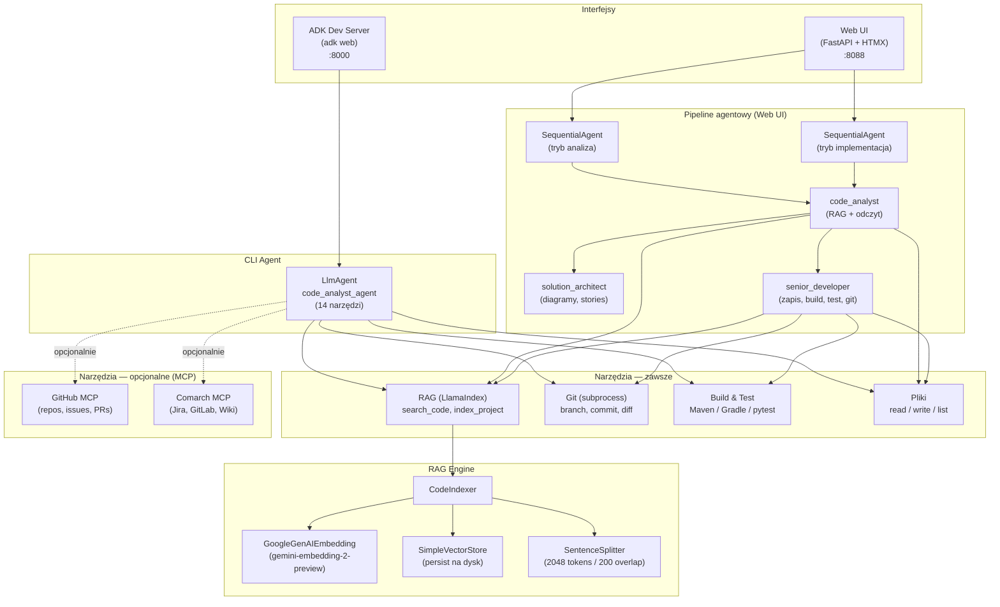
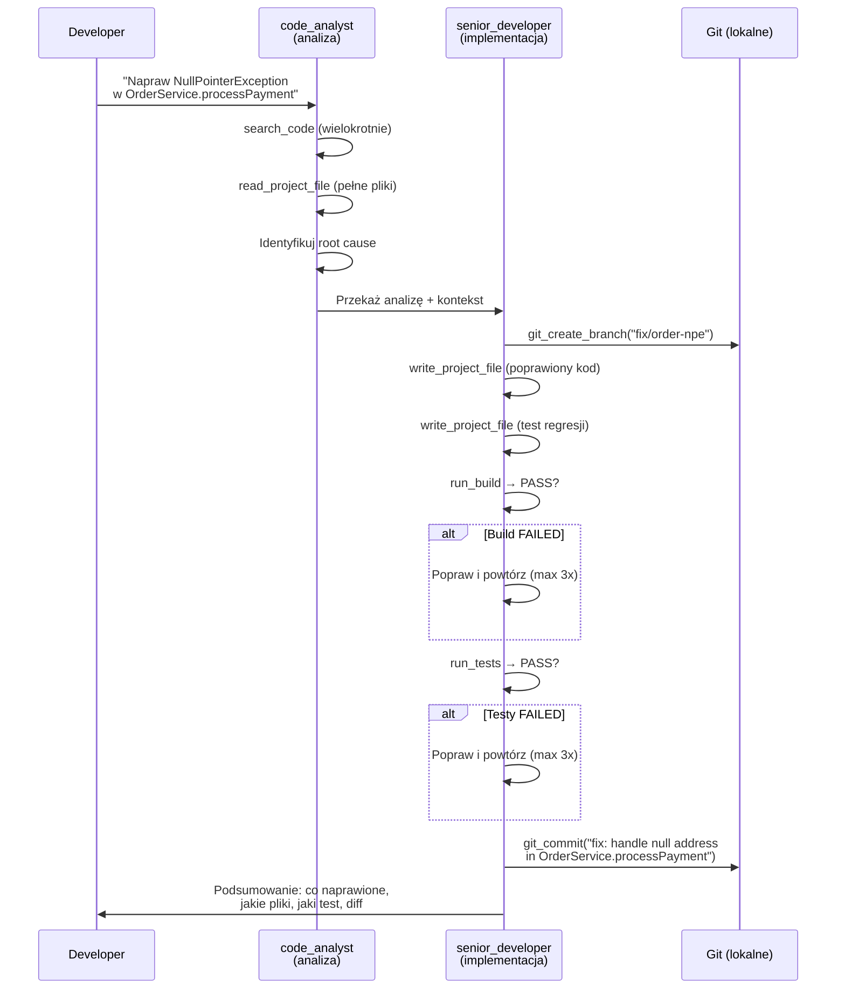
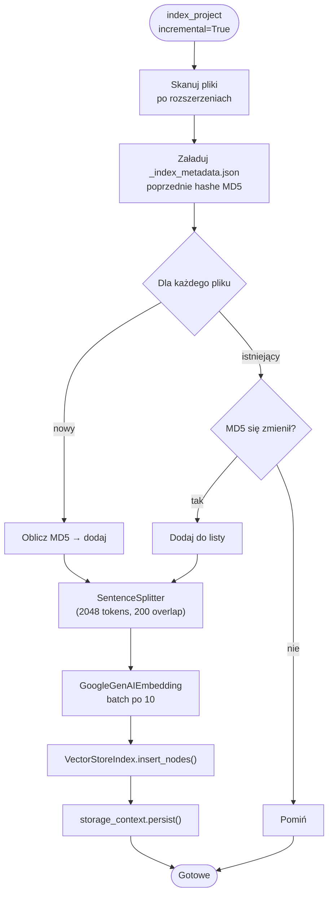

# Code Analyst — Dokumentacja produktu

> System agentowy do analizy, naprawy i rozwijania kodu źródłowego.
> Indeksuje repozytorium → przeszukuje semantycznie → analizuje / naprawia / testuje → commituje na branch.

---

## Spis treści

1. [Problem i ROI](#problem-i-roi)
2. [Szybki start](#szybki-start)
3. [Konfiguracja](#konfiguracja)
4. [Architektura](#architektura)
5. [Workflows — 9 scenariuszy](#workflows)
6. [Scenariusze biznesowe — przykłady](#scenariusze-biznesowe)
7. [Jakość i bezpieczeństwo](#jakość-i-bezpieczeństwo)
8. [Struktura plików](#struktura-plików)
9. [API Reference](#api-reference)
10. [Troubleshooting](#troubleshooting)
11. [Plan rozwoju](#plan-rozwoju)

---

## Problem i ROI

Developerzy tracą czas na powtarzalne czynności:

| Czynność | Czas ręcznie | Z Code Analyst |
|----------|-------------|----------------|
| Zrozumienie nowego repo (onboarding) | 2-5 dni | 15 min |
| Znalezienie kodu powiązanego z bugiem | 30-60 min | 2 min |
| Analiza wpływu zmiany (impact analysis) | 2-4h | 10 min |
| **Naprawa buga + test regresji** | **4-8h** | **30 min** |
| **Implementacja prostego CR** | **1-3 dni** | **1-2h** |
| **Dopisanie testów do klasy** | **2-4h** | **20 min** |
| Napisanie stories z AC i DoD | 1-2h per feature | 5 min |
| Przegląd bezpieczeństwa kodu | 1-2 dni (audytor) | 10 min (wstępny skan) |
| Wygenerowanie dokumentacji technicznej | 4-8h | 10 min |

**ROI przy zespole 8 osób:** ~60 osobodni/rok odzyskanych.

---

## Szybki start

### 1. Konfiguracja

```bash
cd adk_training/module_13_code_analyst
cp .env.template .env
# Edytuj .env — ustaw GOOGLE_CLOUD_PROJECT (wymagane)
# Opcjonalnie: GITHUB_PERSONAL_ACCESS_TOKEN lub tokeny Comarch MCP
```

### 2. CLI (adk web)

```bash
adk web
# → http://localhost:8000 → wybierz "code_analyst_agent"
```

**Pierwsze użycie:**
1. `"Zaindeksuj projekt"` → agent wywoła `index_project()`
2. `"Jak działa autoryzacja?"` → agent przeszuka kod przez RAG
3. `"Napraw NullPointerException w OrderService"` → analiza + fix + test + commit na branch

### 3. Web UI (multi-repo, workflows, chat)

```bash
pip install fastapi uvicorn python-multipart jinja2
cd web
python app.py
# → http://127.0.0.1:8088
```

**Przepływ:**
1. Dashboard → "Dodaj repozytorium" (ścieżka lokalna)
2. "Indeksuj (incremental)"
3. Wybierz workflow (analiza lub implementacja) lub otwórz czat

---

## Konfiguracja

### Wymagane (.env)

| Zmienna | Opis |
|---------|------|
| `GOOGLE_CLOUD_PROJECT` | Projekt GCP z Vertex AI |
| `GOOGLE_CLOUD_LOCATION` | Region (domyślnie `us-central1`) |
| `GOOGLE_GENAI_USE_VERTEXAI` | `1` |
| `CODE_PROJECT_DIR` | Ścieżka do kodu (domyślnie `./sample_project`) |
| `CODE_INDEX_DIR` | Ścieżka do indeksu (domyślnie `./index_store`) |

### Opcjonalne — GitHub MCP

| Zmienna | Opis |
|---------|------|
| `GITHUB_PERSONAL_ACCESS_TOKEN` | Token GitHub (scope: `repo`, `read:org`) |

### Opcjonalne — Comarch MCP (wymaga VPN)

| Zmienna | Opis |
|---------|------|
| `JIRA_BASE_URL` | URL REST API Jira |
| `JIRA_BEARER_TOKEN` | Token Jira |
| `WIKI_BASE_URL` | URL REST API Wiki/Confluence |
| `WIKI_BEARER_TOKEN` | Token Wiki |
| `GITLAB_BASE_URL` | URL REST API GitLab |
| `GITLAB_TOKEN` | Token GitLab |
| `COMARCH_MCP_REGISTRY` | Rejestr npm (nexus) |
| `NODE_EXTRA_CA_CERTS` | Ścieżka do certyfikatu CA |

### Auto-detekcja integracji

| Token w .env | MCP | Co zyskujesz |
|-------------|-----|--------------|
| `GITHUB_PERSONAL_ACCESS_TOKEN` | GitHub | repos, issues, PRs, code search |
| `JIRA_BEARER_TOKEN` + sieć | Comarch | tickety Jira, GitLab, Wiki |
| oba | oba | pełna integracja |
| żaden | brak | tylko RAG + Git + Build (w pełni funkcjonalny) |

---

## Architektura

### Dwa tryby pracy

1. **Analiza** (readonly) — odpowiedzi na pytania, diagramy, stories, audyt
2. **Implementacja** (branch + commit) — naprawa buga, CR, testy — z kompilacją i weryfikacją

### Diagram — komponenty i integracje



### Pipeline implementacji — Bug Fix flow



### Incremental Indexing — flow



### Diagram klas

```mermaid
classDiagram
    class CodeIndexer {
        +project_dir: str
        +persist_dir: str
        +embed_model: GoogleGenAIEmbedding
        -_index: VectorStoreIndex
        +index_project(extensions, incremental) dict
        +query(question, top_k) list
        +get_stats() dict
        +reset_index() dict
    }

    class RepoManager {
        +registry_path: str
        +add(path, name) RepoInfo
        +get(repo_id) RepoInfo
        +list_all() list
        +remove(repo_id) bool
    }

    class WebApp {
        +GET / dashboard()
        +POST /repos add_repo()
        +POST /repos/id/index index_repo()
        +POST /repos/id/search search()
        +POST /repos/id/chat chat()
        +POST /repos/id/workflow run_workflow()
    }

    class SequentialAgent {
        +sub_agents: list
    }

    class code_analyst {
        +tools: search_code, read_file, git_status, MCP
    }

    class solution_architect {
        +tools: MCP
    }

    class senior_developer {
        +tools: write_file, git_branch, git_commit, run_build, run_tests
    }

    WebApp --> RepoManager
    WebApp --> CodeIndexer : per-repo
    CodeIndexer --> "SimpleVectorStore"
    CodeIndexer --> "GoogleGenAIEmbedding"
    SequentialAgent --> code_analyst
    SequentialAgent --> solution_architect : tryb analiza
    SequentialAgent --> senior_developer : tryb implementacja
```

---

## Workflows

### Analiza (readonly — 6 scenariuszy)

| # | Workflow | Opis | Co dostaniesz |
|---|----------|------|---------------|
| 1 | **Onboarding developera** | Architektura, klasy, flow danych | Diagram Mermaid + lista kluczowych klas z odpowiedzialnością |
| 2 | **Analiza wpływu zmian** | Podaj opis zmiany | Lista dotkniętych plików, testy, ryzyko regresji |
| 3 | **Audyt bezpieczeństwa** | Skan kodu | SQL injection, hardcoded secrets, brak walidacji — z lokalizacją |
| 4 | **Generuj stories** | Podaj opis feature | 3-6 stories z AC, DoD, estymacją, diagram Mermaid |
| 5 | **Generuj dokumentację** | Podaj moduł | API, diagramy klas/sekwencji, zależności |
| 6 | **Debugging z kontekstem** | Podaj błąd/stacktrace | Przyczyna, proponowany fix, test regresji |

### Implementacja (branch + commit — 3 scenariusze)

| # | Workflow | Opis | Co dostaniesz |
|---|----------|------|---------------|
| 7 | **Napraw buga** | Podaj opis buga | Fix + test regresji na branchu `fix/...` |
| 8 | **Implementuj CR** | Podaj wymaganie | Kod + testy na branchu `feature/...` |
| 9 | **Generuj testy** | Wskaż klasy | Testy JUnit 5 + Mockito na branchu `test/...` |

**Pipeline implementacji:**
1. `code_analyst` analizuje kod (RAG + read_project_file)
2. `senior_developer` implementuje (write → build → test → commit)
3. Jeśli build/test FAILED → poprawia i powtarza (max 3x)
4. Commit na feature branch — **NIGDY** na main/master/develop

---

## Scenariusze biznesowe

### Scenariusz 1: Onboarding nowego developera

```
Developer: "Pokaż mi jak działa proces zamówień od REST API do bazy danych"
Agent:     → search_code("zamówienia REST endpoint")
           → search_code("zamówienia zapis do bazy")
           → "OrderController.java:45 → OrderService.java:78 → OrderRepository.java:23"
           → diagram Mermaid sequence
```

**Metryka:** Czas onboardingu z 2-4 tyg → 3-5 dni.

### Scenariusz 2: Impact Analysis

```
Developer: "Przeanalizuj wpływ zmiany formatu daty w API zamówień"
Agent:     → search_code("format daty") → 8 plików
           → search_code("DateTimeFormatter") → 3 pliki
           → "Zmiana dotknie: OrderDTO, ReportService, DateUtils
              Testy do zaktualizowania: OrderDTOTest, ReportServiceTest
              Ryzyko: ŚREDNIE — DateUtils używany w 12 miejscach"
```

### Scenariusz 3: Bug Fix (branch + commit)

```
Developer: "NullPointerException w OrderService.processPayment gdy brak adresu"
Agent:     → search_code("OrderService processPayment") → znalazł metodę
           → read_project_file("OrderService.java") → pełny kontekst
           → git_create_branch("fix/order-npe-missing-address")
           → write_project_file (poprawiony OrderService.java + null check)
           → write_project_file (OrderServiceTest.java z should_throwException_when_addressMissing)
           → run_build → PASS
           → run_tests → PASS
           → git_commit("fix: handle null address in processPayment")
```

### Scenariusz 4: Generowanie testów (branch + commit)

```
Developer: "Napisz testy dla PaymentService — happy path + błędy"
Agent:     → read_project_file("PaymentService.java")
           → git_create_branch("test/payment-service-coverage")
           → write_project_file("PaymentServiceTest.java"):
               should_processPayment_when_validCard()
               should_throwException_when_cardExpired()
               should_retryPayment_when_gatewayTimeout()
           → run_tests → PASS
           → git_commit("test: add PaymentService unit tests")
```

### Scenariusz 5: Implementacja CR (branch + commit)

```
Developer: "Dodaj endpoint GET /api/products z paginacją i filtrowaniem po kategorii"
Agent:     → search_code("Product") → zrozum model
           → diagram Mermaid z proponowaną architekturą
           → git_create_branch("feature/product-list-endpoint")
           → write_project_file: ProductController, ProductService, ProductRepository
           → write_project_file: ProductControllerTest
           → run_build → PASS, run_tests → PASS
           → git_commit("feat: add GET /api/products with pagination and category filter")
```

### Scenariusz 6: Audyt bezpieczeństwa

```
Security: "Znajdź potencjalne SQL injection w projekcie"
Agent:    → search_code("SQL query string concatenation")
          → search_code("@Query native")
          → "Znaleziono 3 potencjalne miejsca:
             1. UserRepository.java:67 — raw SQL z parametrem
             2. ReportDAO.java:34 — string concatenation w WHERE
             3. SearchService.java:89 — dynamiczny ORDER BY
             Rekomendacja: użyj PreparedStatement lub @Param"
```

### Scenariusz 7: Code Review wspomagany AI (z MCP)

```
Developer: "Sprawdź MR !4521 w kontekście architektury projektu"
Agent:     → MCP GitLab: pobierz diff MR !4521
           → search_code() dla zmienionych klas
           → MCP Wiki: sprawdź ADR o wzorcach
           → "MR zgodne z ADR-003 (Strategy Pattern).
              UWAGA: brak testu dla nowego providera Stripe."
```

---

## Jakość i bezpieczeństwo

### Jakość generowanego kodu

| Aspekt | Ocena | Komentarz |
|--------|-------|-----------|
| Znajdowanie root cause buga | Bardzo dobra | RAG + pełen odczyt pliku daje solidny kontekst |
| Generowanie fixów (1 plik) | Dobra | Proste fixy (null check, walidacja) — pewne. Złożona logika — wymaga review |
| Generowanie testów JUnit 5 | Dobra | Happy path + edge cases. Mockito setup poprawny |
| Implementacja prostego CR | Średnia-dobra | CRUD, endpoint, DTO — pewne. Złożona logika — wymaga review |
| Kompilacja po zmianach | Gwarantowana | Agent uruchamia build i iteruje do sukcesu |
| Nazewnictwo / konwencje | Konfigurowalny | Domyślnie Java/Quarkus/JUnit 5, zmienialny per repo |

**Zasada:** Agent robi 80% roboty. Pozostałe 20% (review, edge cases, integracja) robi developer.

### Mechanizmy bezpieczeństwa

| Mechanizm | Opis |
|-----------|------|
| Branch protection | Agent NIGDY nie commituje na main/master/develop |
| Brak push/merge | Wszystko lokalnie — do ręcznego review |
| Path traversal | Zapis plików zablokowany poza katalogiem repo |
| Rozmiar pliku | Odczyt ograniczony do 50K znaków per plik |
| Build verification | Kod musi się kompilować PRZED commitem |
| Test verification | Testy muszą przechodzić PRZED commitem |
| MCP auto-detect | Sieć Comarch sprawdzana TCP connect (2s timeout) — brak blokady startu |

### Domyślne konwencje (konfigurowalne per repo)

- **Język:** Java / Quarkus
- **Testy:** JUnit 5 + Mockito, nazewnictwo `should_X_when_Y`
- **Build:** Maven (`mvn compile`, `mvn test`)
- **Commit:** Conventional Commits (`fix:`, `feat:`, `test:`, `refactor:`)
- Python / TypeScript / Gradle — agent dostosowuje automatycznie

---

## Struktura plików

```
module_13_code_analyst/
  agent.py                 # CLI agent — 14 narzędzi (RAG + Git + Files + Build + MCP)
  code_indexer.py           # RAG engine — indeksowanie + query + persystencja
  code_retrieval_tool.py    # ADK FunctionTool wrapper na CodeIndexer
  git_tools.py              # Git: branch, commit, diff, log, status (subprocess)
  file_tools.py             # Pliki: read, write, list (z path traversal protection)
  build_tools.py            # Build: compile + test (auto-detect Maven/Gradle/Python)
  __init__.py               # Eksportuje root_agent (ADK discovery)
  agent_solution.py         # Legacy: SequentialAgent z hardcoded Comarch MCP
  requirements.txt          # Zależności Python
  .env.template             # Szablon konfiguracji
  .gitignore                # Wyklucza index_store/, web_data/, __pycache__/
  PRODUCT.md                # Ten dokument
  sample_project/           # Przykładowy kod do testowania RAG
  web/                      # Web UI
    app.py                  # FastAPI + SequentialAgent pipeline (9 workflows)
    repo_manager.py         # Rejestr repozytoriów (JSON)
    templates/              # Jinja2 + HTMX szablony
    static/                 # CSS
```

---

## API Reference

### Narzędzia agenta (CLI — 14 narzędzi)

| Grupa | Narzędzie | Opis |
|-------|-----------|------|
| **RAG** | `search_code(query, top_k)` | Semantyczne przeszukiwanie kodu |
| | `index_project(extensions, incremental)` | Zaindeksuj/odśwież kod |
| | `get_index_stats()` | Statystyki indeksu |
| **Pliki** | `read_project_file(repo_path, file_path)` | Pełna zawartość pliku (max 50K) |
| | `write_project_file(repo_path, file_path, content)` | Utwórz/nadpisz plik |
| | `list_project_files(repo_path, directory, extensions)` | Lista plików (max 500) |
| **Git** | `git_status(repo_path)` | Branch + zmiany |
| | `git_create_branch(repo_path, branch_name)` | Utwórz feature branch |
| | `git_commit(repo_path, message, files)` | Commit (Conventional Commits) |
| | `git_diff(repo_path, file_path)` | Pokaż zmiany |
| | `git_log(repo_path, count)` | Historia commitów |
| | `git_checkout_back(repo_path, branch_name)` | Wróć na branch |
| **Build** | `run_build(repo_path)` | Kompilacja (auto-detect) |
| | `run_tests(repo_path, test_filter)` | Uruchom testy |

### Web UI REST API

| Metoda | URL | Opis |
|--------|-----|------|
| GET | `/` | Dashboard — lista repozytoriów |
| GET | `/repos/{id}` | Szczegóły repo (search + chat) |
| POST | `/repos` | Dodaj repozytorium (form: path, name) |
| DELETE | `/repos/{id}` | Usuń repozytorium |
| POST | `/repos/{id}/index` | Indeksuj (form: incremental=true/false) |
| POST | `/repos/{id}/search` | Wyszukiwanie semantyczne (form: query, top_k) |
| POST | `/repos/{id}/chat` | Chat z agentem (form: message) |
| POST | `/repos/{id}/chat/reset` | Reset sesji czatu |
| POST | `/repos/{id}/workflow` | Uruchom workflow (form: workflow_id, input) |

### CodeIndexer API (Python)

```python
from code_indexer import CodeIndexer

indexer = CodeIndexer("./my_project", "./index_store")
stats = indexer.index_project(incremental=True)
# {'indexed': 3, 'skipped': 42, 'total_chunks': 87}

results = indexer.query("autoryzacja JWT", top_k=5)
# [{'file_path': 'auth_service.py', 'text': '...', 'score': 0.68}, ...]
```

---

## Troubleshooting

| Problem | Rozwiązanie |
|---------|-------------|
| "Indeks nie istnieje" | Uruchom "Zaindeksuj projekt" lub `index_project()` |
| MCP nie aktywne | Sprawdź tokeny w `.env`, sprawdź VPN (Comarch) |
| Wolne indeksowanie | Normalne przy pierwszym uruchomieniu. Kolejne są incremental |
| Web UI: "Repo nie znalezione" | Sprawdź czy ścieżka istnieje i jest katalogiem |
| `ModuleNotFoundError: code_indexer` | Uruchom z katalogu `module_13_code_analyst/` |
| GitHub MCP timeout | Sprawdź internet, sprawdź czy `npx` jest w PATH |
| Build failed po zmianach agenta | Agent automatycznie powtarza (max 3x). Sprawdź logi |
| Agent commituje na main | Niemożliwe — protected branches blokują `git_commit` |

---

## Stack technologiczny

| Warstwa | Technologia |
|---------|-------------|
| LLM | Gemini 2.0 Flash (Vertex AI) |
| Embeddings | gemini-embedding-2-preview (batch po 10) |
| RAG | LlamaIndex SimpleVectorStore (2048 tokens, 200 overlap) |
| Agent Framework | Google ADK (LlmAgent, SequentialAgent, FunctionTool) |
| Git | Lokalny subprocess (branch, commit, diff — bez push/merge) |
| Build | Auto-detect: Maven / Gradle / Python (pytest) |
| Integracje | GitHub MCP, Comarch MCP (Jira/GitLab/Wiki) — opcjonalne |
| Web UI | FastAPI + HTMX + Jinja2 (port 8088) |
| Persystencja | JSON (docstore) + MD5 metadata (incremental indexing) |

### Wymagania systemowe

- Python 3.11+ z zależnościami (`pip install -r requirements.txt`)
- Projekt GCP z Vertex AI (Gemini 2.0 Flash + embeddingi)
- Git zainstalowany lokalnie
- Maven/Gradle (dla projektów Java) — do kompilacji i testów
- Node.js + npx (tylko jeśli chcesz integracje MCP)

---

## Plan rozwoju

### Faza 1: Ulepszenia RAG

| Feature | Opis | Złożoność |
|---------|------|-----------|
| AST-aware chunking | Chunking po klasach/metodach zamiast tokenów | M |
| BM25 hybrid search | RAG + keyword search (fuzja wyników) | M |
| Embedding cache | Redis/SQLite cache aby nie liczyć powtórnie | S |

### Faza 2: Integracje

| Feature | Opis | Złożoność |
|---------|------|-----------|
| GitLab webhook | Re-indeksuj po merge do main | M |
| Jira webhook | Auto-indeksuj po zamknięciu ticketa | M |
| Slack bot | Odpowiadaj na pytania o kod w Slacku | L |
| CI/CD plugin | Agent jako krok w pipeline (code review) | L |

### Faza 3: Skalowalność

| Feature | Opis | Złożoność |
|---------|------|-----------|
| Qdrant / Pinecone | Zdalny vector store zamiast lokalnego | M |
| Agent Engine (Vertex) | Deploy agenta jako managed service | L |
| Multi-tenant | Osobne indeksy per zespół/projekt | L |
| Streaming responses | SSE zamiast pełnych odpowiedzi | M |

---

## Czego to NIE robi

- **Nie pushuje ani nie merguje** — commit tylko na lokalnym branchu
- **Nie zastępuje code review** — robi 80% roboty, developer robi review
- **Nie obsługuje złożonej logiki biznesowej** — CRUD tak, algorytmy finansowe nie
- **Nie wymaga chmury do indeksu** — indeks lokalny na dysku
- **Nie wysyła kodu na zewnątrz** — embeddingi via Vertex AI, sam kod zostaje lokalnie
