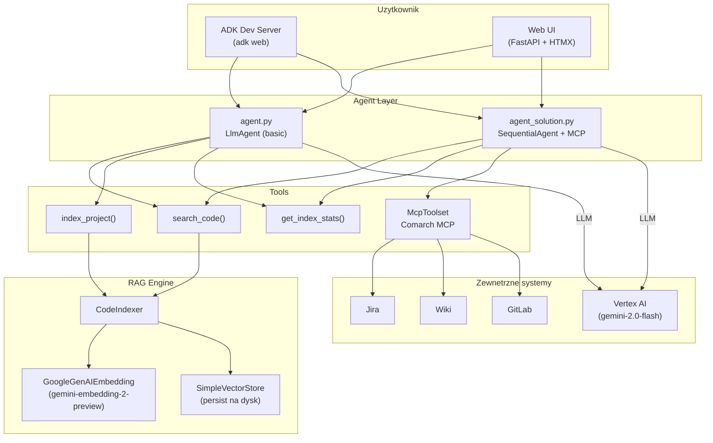
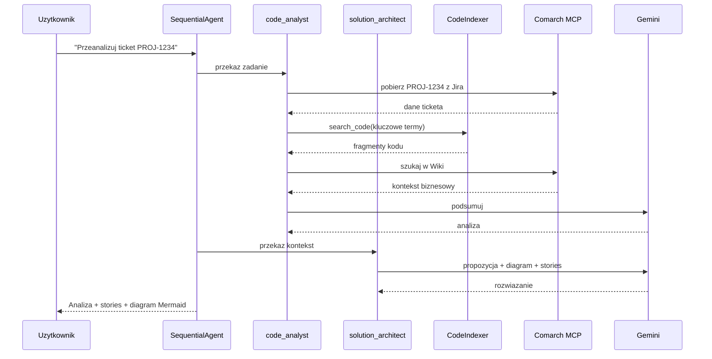

# Modul 13: Code Analyst - Persistent Code RAG + Web UI

## Cel modulu

Zbudowanie systemu do analizy kodu zrodlowego opartego o:
1. **Persistent Code RAG** - indeksowanie kodu do trwalego indeksu (LlamaIndex SimpleVectorStore)
2. **ADK Agent** - LlmAgent z narzedziami do semantycznego przeszukiwania kodu
3. **Web UI** - FastAPI + HTMX do zarzadzania wieloma repozytoriami, wyszukiwania i czatu z agentem

Opcjonalnie (wersja rozszerzona - `agent_solution.py`):
4. Integracja z **Jira** przez MCP (odczyt ticketow)
5. Integracja z **GitLab/Git** przez MCP

## Struktura plikow

```
module_13_code_analyst/
  code_indexer.py          # Core: indeksowanie + query + persystencja
  code_retrieval_tool.py   # ADK FunctionTool wrapper dla CodeIndexer
  agent.py                 # LlmAgent z 3 narzedziami (search/index/stats)
  agent_solution.py        # SequentialAgent z MCP Jira (wersja rozszerzona)
  requirements.txt         # Zaleznoci core (CLI agent)
  .env.template            # Szablon zmiennych srodowiskowych
  sample_project/          # Przykladowy kod do indeksowania
    user_service.py        #   CRUD uzytkownicy
    auth_service.py        #   JWT + blokowanie kont
    order_controller.py    #   REST kontroler zamowien
  web/                     # Aplikacja webowa
    app.py                 #   FastAPI + ADK Runner (multi-repo)
    repo_manager.py        #   JSON registry repozytoriow
    templates/             #   Jinja2 + HTMX szablony
    static/style.css       #   Style CSS
```

## Szybki start

### 1. Konfiguracja

```bash
cd adk_training/module_13_code_analyst
cp .env.template .env
# Edytuj .env:
#   GOOGLE_CLOUD_PROJECT=twoj-projekt-gcp
#   GOOGLE_CLOUD_LOCATION=us-central1
#   GOOGLE_GENAI_USE_VERTEXAI=1
#   CODE_PROJECT_DIR=./sample_project
#   CODE_INDEX_DIR=./index_store
```

### 2. CLI Agent (bez web)

```bash
# Uruchom przez ADK dev server
adk web
```

### 3. Web UI (multi-repo)

```bash
cd web
pip install fastapi uvicorn python-multipart jinja2
python app.py
# -> http://127.0.0.1:8088
```

**Przeplyw w Web UI:**
1. Dodaj repozytorium (podaj sciezke na dysku)
2. Kliknij "Indeksuj (incremental)"
3. Uzyj wyszukiwarki semantycznej lub czatu z agentem

### 4. E2E testy

```bash
cd adk_training
python -m e2e_tests.test_module_13
```

## Architektura

### Diagram architektury (ogolna)



### Flow — SequentialAgent (agent_solution.py)



> Pelna dokumentacja z 5 diagramami, 7 scenariuszami biznesowymi i planem rozwoju: [GUIDE.md](GUIDE.md)

## Kluczowe komponenty

### CodeIndexer (`code_indexer.py`)

Glowna klasa - indeksowanie i przeszukiwanie kodu z persystencja.

```python
from code_indexer import CodeIndexer

indexer = CodeIndexer(
    project_dir="./sample_project",
    persist_dir="./index_store",
    embedding_model="gemini-embedding-2-preview",
)

# Indeksuj (incremental - tylko zmienione pliki)
stats = indexer.index_project(incremental=True)
# {'indexed': 3, 'skipped': 0, 'total_chunks': 12, ...}

# Szukaj semantycznie
results = indexer.query("autoryzacja JWT", top_k=5)
# [{'file_path': 'auth_service.py', 'text': '...', 'score': 0.68}, ...]

# Statystyki
indexer.get_stats()
# {'indexed_files': 3, 'total_chunks': 12}

# Reset indeksu
indexer.reset_index()
```

**Cechy:**
- **Persystencja**: `storage_context.persist()` -> `docstore.json` + `index_store.json`
- **Incremental indexing**: MD5 hash per plik, indeksuje tylko zmienione
- **Rozszerzenia**: `.py`, `.java`, `.ts`, `.js`, `.go`, `.rs`, `.sql`, `.md` i inne
- **Wykluczenia**: `node_modules`, `.git`, `__pycache__`, `.venv`, `build`, `dist`

> **UWAGA (LlamaIndex 0.14.x bug)**: `VectorStoreIndex.from_documents()` z `GoogleGenAIEmbedding`
> rzuca `KeyError` w `_get_node_with_embedding`. Workaround w kodzie:
> `SentenceSplitter` -> reczne `node.embedding = embed_model.get_text_embedding(...)` per node ->
> `VectorStoreIndex(nodes=nodes)`.

### Agent CLI (`agent.py`)

| Narzedzie | Opis |
|-----------|------|
| `search_code(query, top_k)` | Semantyczne przeszukiwanie zaindeksowanego kodu |
| `index_project(extensions, incremental)` | Zaindeksuj/odswiez kod w indeksie |
| `get_index_stats()` | Statystyki indeksu (pliki, chunki) |

### Web UI (`web/app.py`)

| Metoda | URL | Opis |
|--------|-----|------|
| GET | `/` | Dashboard - lista repozytoriow |
| GET | `/repos/{id}` | Szczegoly repo (search + chat) |
| POST | `/repos` | Dodaj repozytorium (form: path, name) |
| DELETE | `/repos/{id}` | Usun repozytorium |
| POST | `/repos/{id}/index` | Indeksuj (form: incremental=true/false) |
| POST | `/repos/{id}/search` | Wyszukiwanie semantyczne (form: query, top_k) |
| POST | `/repos/{id}/chat` | Chat z ADK agentem (form: message) |
| POST | `/repos/{id}/chat/reset` | Reset sesji czatu |

## Przyklady testowania

### Test 1: CLI - indeksowanie i wyszukiwanie

```bash
cd adk_training/module_13_code_analyst
python -c "
from code_indexer import CodeIndexer
from dotenv import load_dotenv
load_dotenv('.env')

idx = CodeIndexer('./sample_project', './test_index')
stats = idx.index_project()
print('Stats:', stats)

results = idx.query('autoryzacja JWT', top_k=3)
for r in results:
    print(f'  {r[\"file_path\"]} (score: {r[\"score\"]:.2f})')
"
```

Oczekiwany wynik:
```
Stats: {'indexed': 3, 'skipped': 0, 'total_chunks': 12, ...}
  auth_service.py (score: 0.68)
  user_service.py (score: 0.45)
  order_controller.py (score: 0.32)
```

### Test 2: Web UI - curl

```bash
# Uruchom serwer
cd web && python app.py &

# Dashboard
curl http://127.0.0.1:8088/

# Dodaj repo
curl -X POST http://127.0.0.1:8088/repos \
  -d "path=/sciezka/do/projektu&name=Moj+Projekt"
# -> HX-Redirect: /repos/{id}

# Indeksuj
curl -X POST http://127.0.0.1:8088/repos/{id}/index \
  -d "incremental=true"
# -> HTML z statystykami: "Zaindeksowano X plikow..."

# Szukaj
curl -X POST http://127.0.0.1:8088/repos/{id}/search \
  -d "query=obsluga+bledow&top_k=5"
# -> HTML z kartami wynikow (plik, score, fragment kodu)

# Chat z agentem
curl -X POST http://127.0.0.1:8088/repos/{id}/chat \
  -d "message=Jakie+klasy+sa+w+tym+projekcie?"
# -> HTML z odpowiedzia agenta (Markdown)
```

### Test 3: E2E automatyczne

```bash
python -m e2e_tests.test_module_13
```

Testy sprawdzaja:
1. Import agenta i modelu `gemini-2.0-flash`
2. Obecnosc 3 narzedzi (`search_code`, `index_project`, `get_index_stats`)
3. Indeksowanie `sample_project/` (3 pliki)
4. Wyszukiwanie semantyczne "autoryzacja JWT" (wynik z `auth_service.py`)
5. Statystyki indeksu (`indexed_files >= 3`)
6. Odpowiedz agenta na pytanie o architekture (przez ADK Runner)

## Persystencja indeksu

| Tryb | Opis | Przezywa restart? |
|------|------|-------------------|
| In-memory (module_10) | Indeks w RAM | NIE |
| **SimpleVectorStore** (ten modul) | `persist()` na dysk | TAK |
| ChromaDB (opcjonalny) | `PersistentClient()` | TAK |

```python
# Zapis
index.storage_context.persist(persist_dir="./index_store")

# Odczyt (bez re-indeksowania)
storage_context = StorageContext.from_defaults(persist_dir="./index_store")
index = load_index_from_storage(storage_context, embed_model=embed_model)
```

## Porownanie z module_10

| Aspekt | Module 10 (FilesRetrieval) | Module 13 (Code RAG + Web) |
|--------|---------------------------|----------------------------|
| Indeks | In-memory, znika po restart | SimpleVectorStore na dysku |
| Dane | Dokumenty (.md) | Kod zrodlowy (.py, .java, .ts) |
| Chunking | Domyslny text splitter | SentenceSplitter (1024/100) |
| Re-indexing | Pelne przy starcie | Incremental (MD5 hash) |
| Interface | ADK dev server | Web UI (FastAPI + HTMX) |
| Multi-repo | Nie | Tak (RepoManager) |
| Use case | Q&A o procedurach | Analiza kodu + chat |

## Rozszerzenia (opcjonalne)

### Integracja Comarch MCP — Jira + GitLab + Wiki (`agent_solution.py`)

Wersja rozszerzona uzywa firmowego MCP `@comarch/mcp-integration-tool` do:
- **Jira**: wyszukiwanie/odczyt ticketow
- **Wiki (Confluence)**: przeszukiwanie dokumentacji
- **GitLab**: projekty, MR, issues

**Pipeline SequentialAgent:**
```
ticket Jira -> code_analyst (RAG + Jira/Wiki/GitLab) -> solution_architect (propozycja + diagram)
```

#### Konfiguracja

1. Wymagany dostep do sieci wew. Comarch (VPN lub biuro)
2. `npx` + Node.js w PATH
3. Certyfikat `GK_COMARCH_ROOT_CA.crt` (sciezka w `NODE_EXTRA_CA_CERTS`)
4. Zmienne w `.env`:

```env
# Comarch MCP
COMARCH_MCP_REGISTRY=https://nexus.czk.comarch/repository/ai-npm
NODE_EXTRA_CA_CERTS=C:\Users\TWOJ_LOGIN\Documents\cert\GK_COMARCH_ROOT_CA.crt

# Jira
JIRA_BASE_URL=https://tapir.krakow.comarch/jira/rest/api/2
JIRA_BEARER_TOKEN=<twoj-token>

# Wiki (Confluence)
WIKI_BASE_URL=https://wiki.comarch/rest/api
WIKI_BEARER_TOKEN=<twoj-token>

# GitLab
GITLAB_BASE_URL=https://gitlab.czk.comarch/api/v4
GITLAB_TOKEN=<twoj-token>
```

#### Uruchomienie

```bash
# CLI (ADK dev server)
adk web   # wybierz agent_solution

# Web UI (auto-wykrywa MCP jesli JIRA_BEARER_TOKEN jest ustawiony)
cd web && python app.py
```

#### API w kodzie

```python
from google.adk.tools.mcp_tool.mcp_toolset import (
    McpToolset, StdioConnectionParams, StdioServerParameters,
)

comarch_mcp = McpToolset(
    connection_params=StdioConnectionParams(
        server_params=StdioServerParameters(
            command="npx",
            args=["--registry", "https://nexus.czk.comarch/repository/ai-npm",
                  "@comarch/mcp-integration-tool"],
            env={"MCP_MODE": "stdio", "JIRA_BASE_URL": "...", ...},
        ),
        timeout=30.0,
    ),
)
```

> **UWAGA**: Uzywaj `McpToolset` (nowe API), NIE `MCPToolset` (deprecated w ADK 1.28+).

## Wymagania

### Core (CLI agent)
```
google-adk>=1.28.0
python-dotenv
llama-index-core
llama-index-embeddings-google-genai
```

### Web UI (dodatkowe)
```
fastapi
uvicorn
python-multipart
jinja2
```

## Ograniczenia

1. **LlamaIndex 0.14.x bug**: `from_documents()` z `GoogleGenAIEmbedding` -> `KeyError` (workaround w kodzie)
2. **SimpleVectorStore**: ~1MB na dysku per 1000 chunkow
3. **Embeddingi**: koszt ~0.001$/1000 tokenow (gemini-embedding-2-preview)
4. **Duze repo**: pierwszy indeks 10k plikow -> 5-10 minut
5. **Web UI sesje**: InMemorySessionService - sesje czatu nie przetrwaja restartu serwera (indeksy tak)
6. **Comarch MCP**: wymaga dostepu do sieci wew. + certyfikat CA + tokeny bearer (siec VPN lub biuro)

## Dalsze informacje

Szczegolowy przewodnik z diagramami, scenariuszami biznesowymi i planem rozwoju: [GUIDE.md](GUIDE.md)
