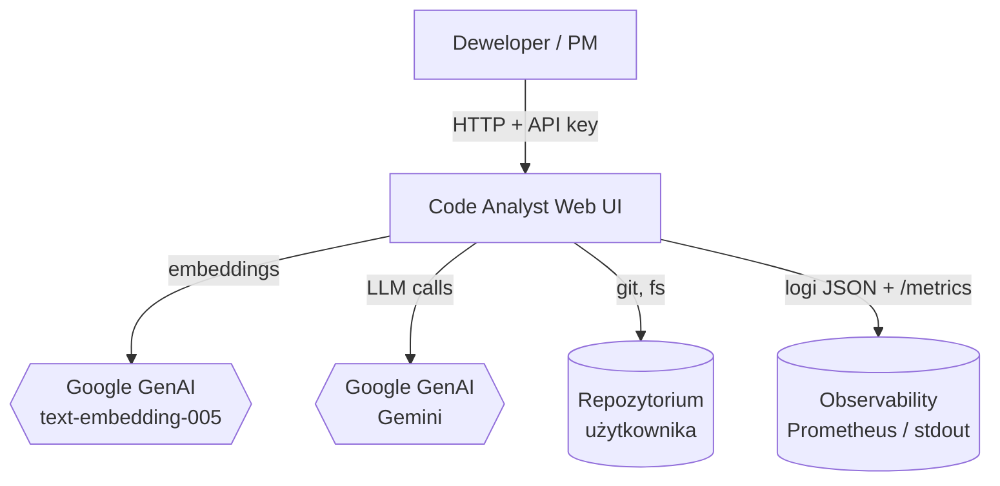
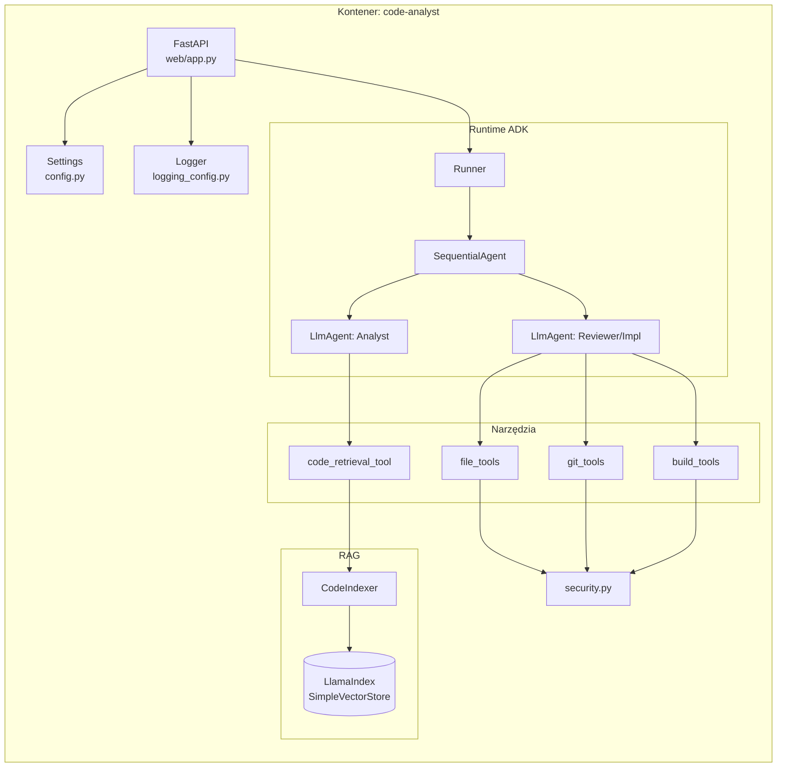
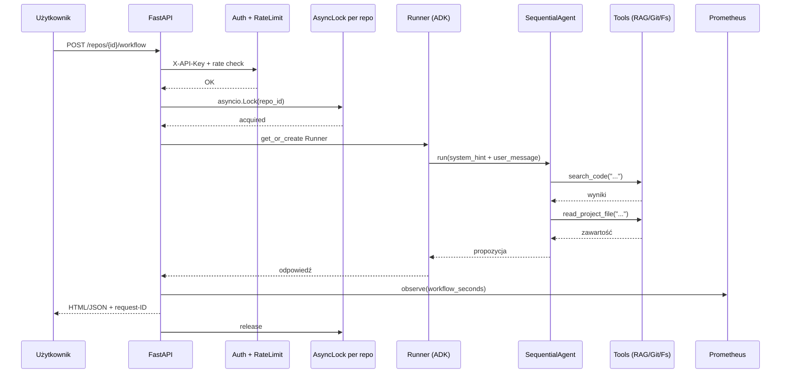

# Przegląd architektury

Code Analyst to **monolit w Pythonie** z trzema warstwami: **web (FastAPI)**, **agent runtime (ADK)** i **stan per-repo** (indeks RAG + pliki + git).

## Widok C4 — poziom kontekstu

## Widok C4 — poziom kontenerów

## Diagram sekwencji: od pytania do odpowiedzi

## Kluczowe decyzje architektoniczne (ADR-skrót)

### ADR-1: Multi-tenant per-repo z `asyncio.Lock`

**Decyzja**: Każde repo ma własny `CodeIndexer`, `Runner` i `asyncio.Lock`. Cache jest per-proces (in-memory).
**Powód**: Ten sam indeks nie może być modyfikowany równolegle (LlamaIndex nie jest thread-safe). Lock per-repo pozwala na równoległą pracę na różnych repo.
**Konsekwencja**: Jeden proces = jeden shard. Skalowanie horyzontalne wymaga load balancera z sticky session po `repo_id`.

### ADR-2: `SequentialAgent` zamiast jednego `LlmAgent`

**Decyzja**: Workflow'y w trybie implementacja używają `SequentialAgent([Analyst, Reviewer])`.
**Powód**: Rozdzielenie odpowiedzialności — jeden agent analizuje, drugi implementuje. Mniej halucynacji.
**Konsekwencja**: Podwójne koszty LLM za workflow, ale wyższa jakość.

### ADR-3: `user_message` jako osobny `types.Part`

**Decyzja**: Wejście użytkownika NIE jest wstrzykiwane do instrukcji agenta przez `.format()` — przekazujemy je jako osobną część wiadomości.
**Powód**: Ochrona przed prompt injection (użytkownik nie może „uciec" z nawiasu klamrowego).
**Konsekwencja**: Jeden layer promptu + jeden layer danych.

### ADR-4: Brak własnej bazy danych

**Decyzja**: Stan trzymamy w plikach na wolumenie (`web_data/indices/<repo_id>/`). Bez Postgres/Redis.
**Powód**: Prostota wdrożenia, brak zewnętrznych zależności. Indeksy RAG są deterministyczne (można przeliczyć).
**Konsekwencja**: Brak multi-node out-of-the-box. Dla kilku instancji: sticky session + wspólny NFS, lub migracja do zewnętrznego vector store.

### ADR-5: FastAPI + HTMX zamiast SPA

**Decyzja**: Jeden proces, serwerowy render HTML, aktualizacje częściowe przez HTMX.
**Powód**: Brak build pipeline, prostszy deployment, mniej powierzchni ataku (XSS).
**Konsekwencja**: Ograniczona interaktywność UI. Wystarczająca dla narzędzia wewnętrznego.

## Granice systemu

Co jest **wewnątrz** Code Analyst:

- Indeksacja kodu (LlamaIndex SimpleVectorStore, plik na dysku).
- Pipeline agentowy (ADK `Runner` + `SequentialAgent`).
- Interfejs web (FastAPI + szablony Jinja2).
- Metryki Prometheus, logi JSON, health checks.

Co jest **na zewnątrz**:

- Model embeddingów (Google GenAI albo Twój wybór).
- Model LLM (Gemini / inny skonfigurowany).
- Reverse proxy (nginx/Traefik) — zalecane w produkcji dla TLS.
- Prometheus, Grafana, Alertmanager — obserwowalność.
- Wolumen z repo źródłowymi (bind mount albo copy-in).

## Następny krok

- [Komponenty szczegółowo](komponenty.md) — co robi każdy moduł Pythonowy.
- [Przepływ danych](przeplyw-danych.md) — jak dokładnie płynie request.
- [Workflows](workflows.md) — jak zbudowane są scenariusze.
