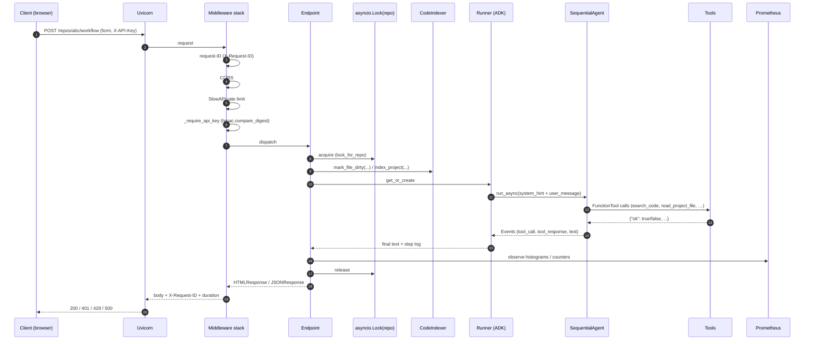
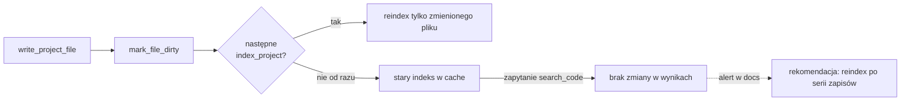
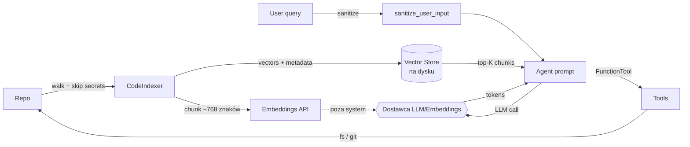

# Przepływ danych

## Request lifecycle — od HTTP do odpowiedzi



## Co robi każdy krok

### (1–2) Przyjęcie przez Uvicorn

Serwer ASGI. Bez magii — standardowe wejście FastAPI.

### (3) Request-ID middleware

Każdy request dostaje `X-Request-ID` (UUID4 albo przekazany z nagłówka od reverse proxy). ID trafia do logów (`LoggerAdapter`) i do odpowiedzi — ułatwia debugowanie.

### (4) CORS

Domyślnie `allow_origins=settings.cors_origins` (pusta lista → CORS wyłączony). Dla produkcji — enumeruj domeny, nigdy `*`.

### (5) Rate limiting (SlowAPI)

Per-IP, decorator na endpointach:

- `/repos/{id}/index` — 2/min (drogi zasób, indeksacja),
- `/repos/{id}/search` — 30/min,
- `/repos/{id}/workflow` — 10/min.

Przekroczenie → HTTP 429.

### (6) Auth — `_require_api_key`

- Jeśli `require_auth=false` albo `api_key=None` → nie sprawdzamy.
- Ścieżki w `_PUBLIC_PATHS` (`/health`, `/ready`, `/metrics`, `/static`) są pomijane.
- Odczytujemy z `X-API-Key` albo `?api_key=`.
- Porównanie **stało-czasowe** przez `hmac.compare_digest` — ochrona przed timing attackiem.
- Niezgodność → HTTP 401.

Szczegóły: [Autoryzacja krok po kroku](../bezpieczenstwo/autoryzacja.md).

### (7) Dispatch endpointu

FastAPI wybiera handler po ścieżce + metodzie.

### (8) Lock per-repo

```python
async with _lock_for_repo(repo_id):
    ...
```

`asyncio.Lock` trzymany w dict `_indexing_locks[repo_id]`. Gwarancja: operacje na tym samym `repo_id` są szeregowane. Różne repo = równolegle.

### (9) Indeks

Typowo `mark_file_dirty()` po `write_project_file`, potem następne `search_code` zobaczy aktualną treść. Pełny `index_project` jest inkrementalny — sprawdza mtime.

### (10) Runner

`_get_runner(repo_id, mode) → (Runner, session_id)`. Cache — jeden `Runner` per (repo, mode). `session_id` jest generowany raz i trzymany w `_session_ids[(repo_id, mode)]` do obsługi pamięci konwersacji (chat).

### (11) SequentialAgent

Dwa `LlmAgent`:

- **Analyst** — dostaje narzędzia RAG (search_code, get_index_stats) + read-only file_tools.
- **Reviewer/Implementer** — dostaje pełny zestaw: RAG + file write + git + build.

Dla trybu `analysis` Reviewer jest pomijany albo dostaje tylko instrukcję „nie dotykaj dysku".

### (12) FunctionTool calls

ADK decyduje na podstawie prompta, które narzędzie wywołać. Każde narzędzie zwraca `dict` z `ok: bool`. Jeśli `ok: false` → agent dostaje błąd w formie danych i MA W INSTRUKCJI rozkaz „zatrzymaj się, nie improwizuj".

### (13) Events

Runner emituje sekwencję eventów:

```
text (agent myśli)
tool_call(name=search_code, args={...})
tool_response(result={ok: true, ...})
text (agent podsumowuje)
```

`_run_agent_pipeline` zbiera je do listy kroków i wykrywa błędy tools (`had_error = any(r.get("ok") is False)`).

### (14) Metryki

- `code_analyst_workflow_seconds.labels(repo_id, workflow_id).observe(duration)`.
- `code_analyst_tool_calls_total.labels(tool, status).inc()`.
- `code_analyst_errors_total.labels(endpoint).inc()` przy każdym 5xx / błędzie narzędzia.

### (15) Release locka

Przez `async with`. Nawet przy wyjątku — lock zawsze zwolniony.

### (16–18) Odpowiedź

HTML (Jinja2 + HTMX fragmenty) albo JSON (dla endpointów API). Nagłówek `X-Request-ID` + `X-Duration-ms` (debug).

## Zdarzenia po stronie indeksu



## Przepływ danych wrażliwych



**Co NIE wychodzi poza system:**

- Całe pliki (jedynie chunki ~768 znaków, dobrane do zapytania).
- Pliki sekretów (wykluczone na etapie walk).
- Treści pól formularzy poza wybranym modelem.

**Co wychodzi:**

- Fragmenty kodu do embeddingu (przy indeksacji — raz na plik) i do promptu LLM (przy zapytaniu — top-K chunki).
- Input użytkownika (sanityzowany).

Jeśli to problem compliance'owy — użyj lokalnego modelu (Ollama, vLLM). Konfiguracja w `agent.py` i `code_indexer.py`.
