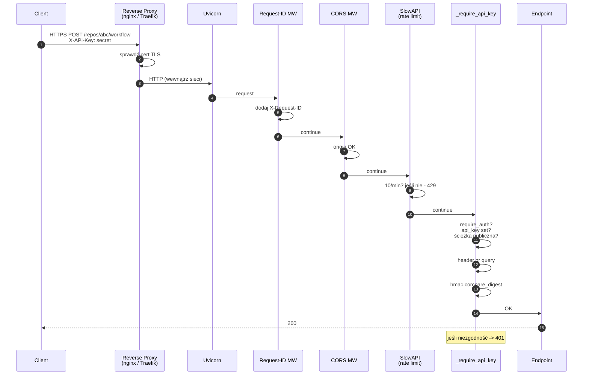

# Autoryzacja — krok po kroku

To jest **najważniejszy rozdział bezpieczeństwa**. Autoryzacja decyduje o tym, kto może uruchomić agenta, indeksować repo i modyfikować kod. Błędna konfiguracja = publiczny dostęp do Twojego kodu i zużycia budżetu LLM.

## TL;DR

1. Ustaw `CODE_ANALYST_REQUIRE_AUTH=true` w `.env`.
2. Ustaw `CODE_ANALYST_API_KEY=<silny_token>` (min. 32 znaki, losowe).
3. Wywołuj API z nagłówkiem `X-API-Key: <silny_token>`.
4. Nigdy nie umieszczaj klucza w URL (`?api_key=`) w produkcji — loguje się do reverse proxy.
5. Zawsze za HTTPS (reverse proxy z TLS).

## Dlaczego akurat API key, a nie OAuth?

**API key** wystarczy dla narzędzia wewnętrznego, gdzie:

- liczba użytkowników jest stała (zespół), albo
- uwierzytelnienie robi reverse proxy (OIDC → przepuszczanie do Code Analyst z określonych IP), albo
- instancja jest per-zespół (jeden klucz = jeden zespół).

**OAuth/OIDC** ma sens, gdy chcesz:

- ról użytkowników (admin, viewer, editor),
- integracji z SSO (Google Workspace, Okta, Azure AD),
- per-user audit trail.

Code Analyst **nie implementuje OAuth bezpośrednio**, ale jest przyjazny reverse proxy z OAuth (np. `oauth2-proxy`, `traefik-forward-auth`).

## Anatomia requesta z autoryzacją



## Krok 1 — Decyzja: czy w ogóle włączamy auth?

```python
# web/app.py : _require_api_key
async def _require_api_key(request: Request) -> None:
    if not settings.require_auth or not settings.api_key:
        return
```

**Interpretacja:**

- `require_auth=False` → wszystkie ścieżki publiczne.
- `require_auth=True`, ale `api_key=None` → efektywnie auth wyłączony (bezpieczny domyślny — jeśli zapomniałeś ustawić klucz, nie blokujesz legalnych żądań, ale…).
- `require_auth=True` + `api_key="…"` → **pełna ochrona**.

!!! danger "Częsty błąd"
    Ustawienie `require_auth=true` bez ustawienia `api_key` daje efekt odwrotny niż oczekiwany — system **NIE** wymaga klucza, bo nie ma co porównywać. Zawsze ustaw oba lub żaden.

## Krok 2 — Ścieżki publiczne

```python
_PUBLIC_PATHS = {"/health", "/ready", "/metrics", "/static"}

if any(request.url.path.startswith(p) for p in _PUBLIC_PATHS):
    return
```

**Uzasadnienie:**

| Ścieżka | Dlaczego publiczna? | Ryzyko | Mitigacja |
|---------|---------------------|--------|-----------|
| `/health` | Kubernetes liveness probe | leak wersji aplikacji | akceptowalne — wersja jest niewrażliwa |
| `/ready` | Kubernetes readiness probe | j.w. | j.w. |
| `/metrics` | Prometheus scrape | leak liczby zapytań | **ogranicz sieciowo** (scrape tylko z Prometheus IP) |
| `/static` | zasoby UI | leak struktury plików | akceptowalne — pliki publiczne |

!!! tip "Rekomendacja sieciowa"
    `/metrics` nie powinien być dostępny spoza wewnętrznej sieci. Konfiguracja
    reverse proxy: zabroń zewnętrznego dostępu do `/metrics`, przepuszczaj tylko
    dla IP Prometheusa.

## Krok 3 — Odczyt klucza z żądania

```python
header = request.headers.get("x-api-key") or request.query_params.get("api_key")
```

**Dwa sposoby:**

1. **Nagłówek `X-API-Key`** (preferowany):

    ```http
    POST /repos/abc/workflow HTTP/1.1
    Host: code-analyst.internal
    X-API-Key: 8a2b1c…
    ```

2. **Query parameter `?api_key=…`** (tylko do testów lokalnych):

    ```
    https://code-analyst.internal/repos/abc?api_key=8a2b1c…
    ```

!!! danger "Query parameter jest niebezpieczny w produkcji"
    Query string trafia do **access logów** reverse proxy, do **historii przeglądarki**,
    do **nagłówków Referer**. W produkcji zawsze używaj nagłówka `X-API-Key`.

## Krok 4 — Porównanie stało-czasowe

```python
expected = settings.api_key or ""
provided = header or ""
if not hmac.compare_digest(expected.encode("utf-8"), provided.encode("utf-8")):
    raise HTTPException(status_code=401, detail="Invalid API key")
```

**Co to jest `hmac.compare_digest`?**

Naiwne porównanie `a == b` kończy się **na pierwszym różnym bajcie**. Atakujący mierząc czas odpowiedzi może zgadywać znak po znaku — to atak czasowy (timing attack).

`hmac.compare_digest` porównuje wszystkie bajty, nawet po znalezieniu różnicy. Czas odpowiedzi nie ujawnia prefiksu zgodnego.

**Przykład timing attack (teoretyczny):**

```
odpowiedź dla "a…" : 0.0001s  (różnica na bajcie 0)
odpowiedź dla "8…" : 0.0001s  (różnica na bajcie 0)
odpowiedź dla "8a…": 0.0002s  (różnica na bajcie 1 — dłużej!)
```

Z `hmac.compare_digest` różnice czasu są **nieobserwowalne**.

**Dlaczego `.encode("utf-8")`?**

`compare_digest` wymaga `bytes`, nie `str`. Enkodujemy jawnie dla deterministycznego zachowania (UTF-8 zawsze się da zdekodować).

## Krok 5 — Generowanie silnego klucza

```powershell
# Windows (PowerShell)
python -c "import secrets; print(secrets.token_urlsafe(48))"

# Linux / macOS
python3 -c "import secrets; print(secrets.token_urlsafe(48))"

# Alternatywa — openssl
openssl rand -base64 48
```

**Dlaczego `secrets` a nie `random`?** `secrets` używa CSPRNG (cryptographically secure PRNG). `random` jest deterministyczny — nie dla kryptografii.

**Długość:** 48 bajtów = 384 bity entropii. Nierealne do zgadnięcia brute-force.

## Krok 6 — Przechowywanie klucza

**Tak:**

- `.env` w katalogu modułu **z plikiem wykluczonym z gita** (`.gitignore`).
- Vault/Keychain: Azure Key Vault, Hashicorp Vault, AWS Secrets Manager.
- Zmienna środowiskowa kontenera z sekret managerem Kubernetesa.

**Nie:**

- Hardcoded w kodzie (oczywiste).
- W obrazie Docker (`ENV CODE_ANALYST_API_KEY=…` w Dockerfile — trafia do warstw).
- W URL (`?api_key=…`).
- W systemach logowania.

## Krok 7 — Rotacja klucza

!!! tip "Procedura rotacji"
    1. Wygeneruj nowy klucz.
    2. Przeładuj `.env` + restart procesu (alt: użyj dwóch kluczy naraz w okresie przejściowym — wymaga zmiany kodu).
    3. Zaktualizuj konsumentów (klienci HTTP, integracje).
    4. Monitoruj `/metrics` — spadek 401 oznacza zakończenie rotacji.

Zalecany cykl: **90 dni** dla narzędzi wewnętrznych, **30 dni** dla wystawionych na szerszą organizację.

## Krok 8 — Monitorowanie prób nieautoryzowanego dostępu

W logach zobaczysz:

```json
{"level":"WARNING","msg":"401 Invalid API key","request_id":"…","ip":"…"}
```

Dla produkcji podłącz do alertów:

```promql
# Prometheus alert rule
sum(rate(code_analyst_errors_total{endpoint!~"/health|/ready|/metrics"}[5m])) > 1
```

## Pełny checklist wdrożeniowy

- [ ] `CODE_ANALYST_REQUIRE_AUTH=true` w `.env`.
- [ ] `CODE_ANALYST_API_KEY` = token z `secrets.token_urlsafe(48)`.
- [ ] `.env` w `.gitignore`.
- [ ] Reverse proxy z TLS (Let's Encrypt / enterprise cert).
- [ ] `/metrics` ograniczony sieciowo.
- [ ] Klucz w vault / sekret managerze.
- [ ] Alerty na wzrost 401.
- [ ] Cykl rotacji zaplanowany (90 dni).
- [ ] Dokumentacja dla zespołu: jak wołać API z kluczem.
- [ ] Onboarding nowego członka zespołu: generowanie per-user klucza (jeśli stosujesz wiele kluczy).

## Przykładowe wywołanie z kluczem

=== "curl"

    ```bash
    curl -X POST https://code-analyst.internal/repos/abc/search \
      -H "X-API-Key: $CODE_ANALYST_API_KEY" \
      -H "Content-Type: application/x-www-form-urlencoded" \
      -d "query=payment%20logic"
    ```

=== "PowerShell"

    ```powershell
    $headers = @{ "X-API-Key" = $env:CODE_ANALYST_API_KEY }
    Invoke-RestMethod -Uri "https://code-analyst.internal/repos/abc/search" `
      -Method POST -Headers $headers `
      -Body @{ query = "payment logic" }
    ```

=== "Python"

    ```python
    import os
    import httpx

    headers = {"X-API-Key": os.environ["CODE_ANALYST_API_KEY"]}
    r = httpx.post(
        "https://code-analyst.internal/repos/abc/search",
        headers=headers,
        data={"query": "payment logic"},
    )
    r.raise_for_status()
    ```

=== "JavaScript (fetch)"

    ```js
    const r = await fetch("/repos/abc/search", {
      method: "POST",
      headers: {
        "X-API-Key": CODE_ANALYST_API_KEY,
        "Content-Type": "application/x-www-form-urlencoded",
      },
      body: new URLSearchParams({ query: "payment logic" }),
    });
    ```

## Jeśli coś nie działa

| Objaw | Prawdopodobna przyczyna | Rozwiązanie |
|-------|-------------------------|-------------|
| 401 na wszystkim | `require_auth=true`, klucz nie wysyłany | Dodaj `X-API-Key` |
| 401 mimo poprawnego klucza | Białe znaki w `.env` | `.env` bez spacji wokół `=` |
| 401 po rotacji | Klient cache'uje stary klucz | Reload klienta |
| 403 (CORS) | Nie dodano origin | `CODE_ANALYST_CORS_ORIGINS=https://twoja-domena` |
| 429 | Limit SlowAPI | Zwiększ w `config.py` albo zmień wzorzec wywołań |

Następnie: [Path traversal](path-traversal.md).
