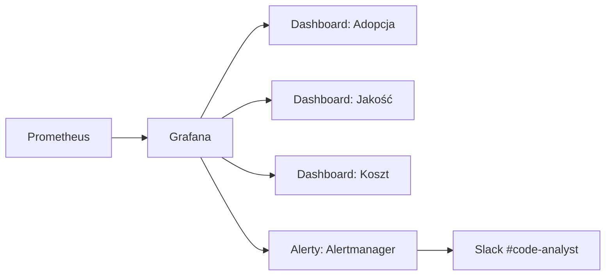

# ROI i metryki biznesowe

## Jak mierzyć wartość

Code Analyst udostępnia endpoint `/metrics` w formacie **Prometheus** — metryki spinają się z typowym stackiem obserwowalności (Prometheus → Grafana → alerty).

### Metryki zbierane automatycznie

| Metryka | Typ | Etykiety | Co mierzy |
|---------|-----|----------|-----------|
| `code_analyst_index_seconds` | Histogram | `repo_id`, `incremental` | Czas indeksacji repo |
| `code_analyst_search_seconds` | Histogram | `repo_id` | Czas zapytania RAG |
| `code_analyst_workflow_seconds` | Histogram | `repo_id`, `workflow_id` | Czas pełnego scenariusza (onboarding, bugfix, …) |
| `code_analyst_tool_calls_total` | Counter | `tool`, `status` | Liczba wywołań każdego narzędzia (git, file, build) z wynikiem |
| `code_analyst_errors_total` | Counter | `endpoint` | Błędy HTTP per-endpoint |

### Proste KPI do cotygodniowego przeglądu

=== "Adopcja"

    - **Aktywne repozytoria w tygodniu** — liczba unikalnych `repo_id` w `code_analyst_workflow_seconds`.
    - **Liczba workflow'ów per zespół** — suma `code_analyst_workflow_seconds_count` po `workflow_id`.
    - **Użytkownicy aktywni tygodniowo (WAU)** — z access logów / dashboardu reverse proxy.

=== "Efektywność"

    - **Średni czas scenariusza** — `avg(code_analyst_workflow_seconds)` po `workflow_id`.
    - **Stosunek analiza/implementacja** — ile z workflow'ów konwertuje się z trybu analizy w implementację (wymaga prostego oznaczenia w audit log).

=== "Jakość"

    - **Akceptacja branchy** — % branchy stworzonych przez agenta, które zostały zmergowane do `main` (metryka z GitHub/GitLab, nie z Code Analyst).
    - **Błędy narzędzi** — `rate(code_analyst_tool_calls_total{status="error"}[1h])` — wysoka wartość oznacza, że agent „walczy" z repo.

=== "Koszt"

    - **Wolumen embeddingów** — liczba chunków × cena dostawcy (Google `text-embedding-005` ≈ $0.00025 / 1k tokenów).
    - **Wolumen inferencji** — liczba wywołań LLM × średnia długość promptu.

## Przykładowe szacowanie ROI

!!! example "Mały zespół (10 devs) — kalkulacja kwartalna"
    **Założenia:**

    - 10 developerów × 40h/tydzień × 12 tygodni = 4 800 roboczogodzin/kwartał.
    - Bez Code Analyst: 25% czasu (1 200h) idzie na zadania podatne na automatyzację.
    - Z Code Analyst: odzyskujemy **30%** tego — ~360h czasu inżyniera/kwartał.

    **Wartość odzyskanego czasu:** 360h × 400 zł/h = **144 000 zł/kwartał**.

    **Koszt:**

    - Hosting (VM 4 vCPU / 8 GB): ~300 zł/mies. → 900 zł/kwartał.
    - LLM + embeddings (szacunkowo): ~500 zł/kwartał.
    - Operacje (SRE 2h/tydzień): 12 × 2 × 200 zł = 4 800 zł/kwartał.

    **Koszt całkowity:** ~6 200 zł/kwartał.

    **ROI:** 144 000 / 6 200 ≈ **23× koszt**. Pomijamy tu niemierzalne: szybszy onboarding, lepsze review, mniejsza rotacja.

## Pulpit menedżerski (propozycja)

Wzorcowy dashboard Grafana powinien mieć:

1. **Wykres aktywności** — `rate(code_analyst_workflow_seconds_count[1d])` przez ostatnie 30 dni.
2. **Top 5 repo** — `topk(5, sum by (repo_id)(code_analyst_workflow_seconds_count))`.
3. **Heatmapa czasu workflow'ów** — `histogram_quantile(0.95, rate(code_analyst_workflow_seconds_bucket[5m]))`.
4. **Błędy** — `sum(rate(code_analyst_errors_total[5m])) by (endpoint)` z progiem alertu.

## Antywzorce metryk

!!! danger "Nie mierz samej liczby wygenerowanych linii kodu"
    Liczba linii ≠ wartość. Agent, który generuje 1000 linii boilerplate, jest gorszy od tego,
    który generuje 10 linii rozwiązujących problem. Zamiast tego mierz: **akceptowane PR-y**,
    **czas do mergowania**, **jakość testów**.

!!! danger "Nie optymalizuj wyłącznie kosztu modelu"
    Tańszy model o gorszej jakości generuje więcej iteracji → wyższy całkowity koszt i frustracja.
    Balansuj koszt i jakość obserwując **wskaźnik akceptacji branchy** z agenta.
