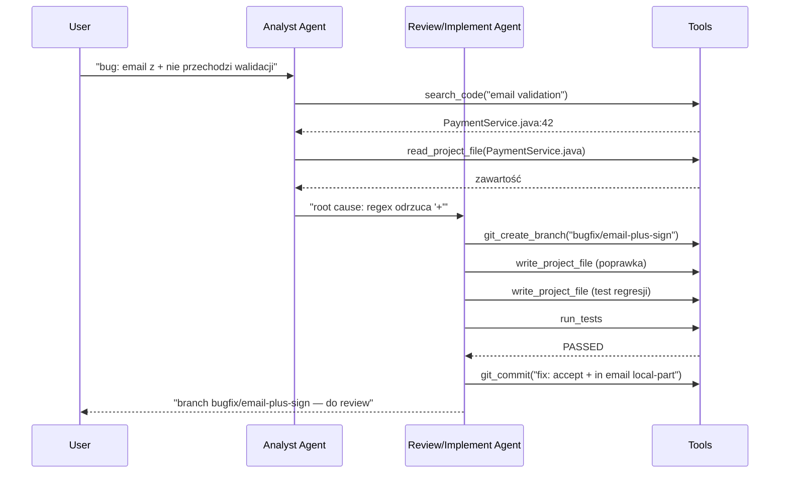

# Scenariusze użycia

Code Analyst dostarcza **6 gotowych scenariuszy (workflows)** dostępnych jednym kliknięciem w interfejsie web. Każdy ma tryb **analiza** (tylko czytanie) lub **implementacja** (analiza + zmiany na branchu).

| Ikona | Scenariusz | Tryb | Czas typowo | Dla kogo |
|-------|-----------|------|-------------|----------|
| 🗺️ | Onboarding | analiza | 2–5 min | Nowy deweloper, PM |
| 🔎 | Code review | analiza | 3–8 min | Senior, tech lead |
| 🐛 | Bug fix | implementacja | 5–15 min | Deweloper |
| ✅ | Generowanie testów | implementacja | 3–10 min | QA, deweloper |
| 🔧 | Change request | implementacja | 10–30 min | Deweloper |
| 📚 | Dokumentacja | implementacja | 3–8 min | Tech writer, deweloper |

## 🗺️ Onboarding — „Wprowadź mnie w ten projekt"

**Wejście:** nic (analiza startuje od mapy repo).
**Wyjście:** struktura modułów, kluczowe klasy, technologie, punkt wejścia do uruchomienia.

!!! example "Przykładowe pytanie"
    *„Przeprowadź mnie przez tę aplikację. Od czego zacząć czytać?"*

Agent:
1. Indeksuje repo (jeśli nie było wcześniej).
2. Wywołuje `search_code` dla fraz typu „main", „entry point", „config".
3. Prezentuje: technologie, schemat modułów, ~5 kluczowych plików, instrukcję uruchomienia.

## 🔎 Code review — „Znajdź problemy w tym kodzie"

**Wejście:** ścieżka pliku lub fragmentu (np. `src/checkout/PaymentService.java`).
**Wyjście:** lista znalezisk kategoryzowana: **CRITICAL** / **HIGH** / **MEDIUM** / **LOW**, z cytatami z linii.

Agent stosuje checklistę:

- błędy bezpieczeństwa (SQL injection, XSS, path traversal, hardkodowane sekrety),
- błędy logiki (race condition, NPE, nieobsłużony wyjątek),
- styl (nazewnictwo, spójność z resztą repo),
- brak testów / brak dokumentacji publicznego API.

## 🐛 Bug fix — „Napraw błąd X"

**Wejście:** opis błędu (np. „użytkownik dostaje 500 przy logowaniu gdy email zawiera `+`").
**Wyjście:** branch `bugfix/<slug>` z fixem + test regresji + opis zmian.

**Pipeline (dwuetapowy SequentialAgent):**

## ✅ Generowanie testów — „Dopisz testy do tej klasy"

**Wejście:** ścieżka klasy (np. `OrderService.java`).
**Wyjście:** branch `tests/<nazwa>` z plikiem `OrderServiceTest.java` zawierającym:

- happy path,
- przypadki brzegowe (null, pusta lista, limit),
- błędy (wyjątki, timeouty),
- asercje z JUnit 5 + Mockito dla Javy, pytest dla Pythona, itd.

Konwencja nazewnictwa testów: `should_X_when_Y` (zgodnie z preferencją zespołu).

## 🔧 Change request / feature — „Dodaj feature X"

**Wejście:** opis biznesowy (np. „użytkownik powinien widzieć łączną wartość zamówienia w walucie konta").
**Wyjście:** branch `feat/<slug>` z zmianami + testami + krótkim opisem w CHANGELOG.

Agent **najpierw analizuje**, potem **proponuje plan**, a dopiero po twojej akceptacji implementuje. W trybie implementacji następuje:

1. Analiza architektury (gdzie jest logika zamówień?).
2. Plan zmian (lista plików do modyfikacji).
3. Tworzenie brancha.
4. Zmiany plik po pliku.
5. Uruchomienie buildu i testów.
6. Commit z opisem.

## 📚 Dokumentacja — „Opisz ten moduł / to API"

**Wejście:** ścieżka modułu lub katalogu.
**Wyjście:** `README.md` lub `docs/*.md` z sekcjami:

- co robi ten moduł,
- API publiczne (sygnatury + opis),
- zależności,
- przykłady użycia,
- znane ograniczenia.

## Wybór trybu: analiza vs implementacja

!!! tip "Zasada: zaczynaj od analizy"
    Każdy workflow ma najpierw etap **analizy** (tylko czytanie). Zobacz plan,
    zweryfikuj, czy agent dobrze zrozumiał zadanie — dopiero potem przełącz
    w tryb **implementacji**. To 30 sekund weryfikacji kontra godzina cofania
    niechcianych zmian.

## Ograniczenia świadome

- Agent **nie** loguje się do zewnętrznych systemów (Jira, Slack) bez dodatkowej konfiguracji MCP — patrz [Rozszerzanie](../deweloper/rozszerzanie.md).
- Dla repo > ~5000 plików rozważ podzielenie indeksu per-moduł.
- Model LLM ma swoje limity kontekstu — bardzo duże pliki są obcinane (50 000 znaków w `read_project_file`).

Następny krok: [Ryzyka i zgodność](ryzyka-i-zgodnosc.md)
