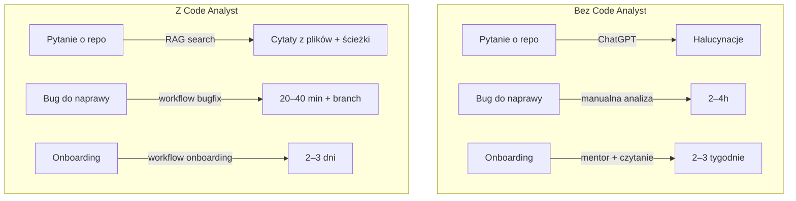

# Wartość biznesowa

## Problem

Zespoły inżynierskie tracą **20–40% czasu** na zadania niewymagające kreatywności, ale wymagające głębokiej znajomości repo:

- onboarding nowych osób (tygodnie zamiast dni),
- rutynowe code review powtarzalnych wzorców,
- dopisywanie testów do istniejącego kodu,
- analiza wpływu zmiany na inne moduły,
- dokumentowanie legacy bez aktywnych autorów.

LLM-y generyczne (ChatGPT, Copilot chat) nie znają **konkretnego repozytorium** — halucynują nazwy klas i ścieżki, nie widzą kontekstu biznesowego.

## Rozwiązanie

Code Analyst to **agent z pamięcią projektu** (RAG po Twoim kodzie) + **zestaw bezpiecznych narzędzi** (git, pliki, build) + **interfejs webowy** ze zdefiniowanymi scenariuszami.

## Dla kogo

| Persona | Co zyskuje |
|---------|-----------|
| **Nowy deweloper** | Onboarding z przewodnikiem po architekturze w dzień pierwszy. |
| **Senior / tech lead** | Automatyzacja code review według wewnętrznych standardów. |
| **QA / test engineer** | Wygenerowane propozycje testów jednostkowych + integracyjnych. |
| **PM / PO** | Natychmiastowa odpowiedź „gdzie w kodzie jest moduł X?" bez angażowania zespołu. |
| **Security / compliance** | Pełen audit trail (request-ID, logi JSON, metryki Prometheus). |

## Kluczowe cechy z perspektywy biznesu

!!! success "Bezpieczeństwo jest wbudowane, nie dodane"
    - Zmiany trafiają **tylko na feature branche** — nigdy na `main`/`master`.
    - Sekrety (`.env`, klucze, certy) są **wykluczone z indeksu i zapisu**.
    - Każde wywołanie narzędzia jest logowane z request-ID.
    - Autoryzacja API key z porównaniem stało-czasowym (ochrona przed timing attack).

!!! success "Przewidywalny koszt"
    - Koszt modelu = liczba wywołań × cena embeddingu/tokenu.
    - Rate limiting per-IP zapobiega niekontrolowanym wzrostom.
    - Metryki `/metrics` pokazują dokładnie: ile indeksacji, ile zapytań, jak długo trwają.

!!! success "Bez vendor lock-in"
    - ADK to open-source framework Google — pipeline agentowy jest przenośny.
    - Embeddingi i LLM konfigurowalne przez zmienne środowiskowe.
    - Możesz wymienić Google GenAI na lokalny model (Ollama, vLLM) bez zmiany kodu biznesowego.

## Czego Code Analyst **nie** robi

- ❌ Nie pushuje na remote, nie mergeuje PR, nie zatwierdza zmian.
- ❌ Nie zastępuje seniora — zostawia **propozycję** do akceptacji człowieka.
- ❌ Nie wysyła Twojego kodu do firm trzecich **poza** modelem embeddingowym, który sam konfigurujesz.
- ❌ Nie indeksuje plików sekretów ani plików binarnych (`.env`, `*.pem`, `*.jar` itp.).

## Następny krok

- **PM/biznes**: przejdź do [Scenariuszy użycia](scenariusze.md), by zobaczyć 6 gotowych przepływów.
- **Tech lead**: zacznij od [Architektury](../architektura/przeglad.md) i [Modelu zagrożeń](../bezpieczenstwo/model-zagrozen.md).
- **Security**: [Raport audytu](../bezpieczenstwo/audyt.md) z listą znalezisk i statusem.
