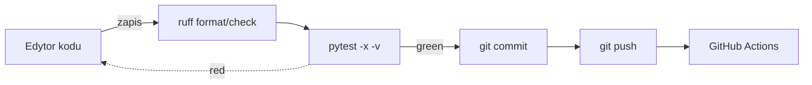

# Quick start dla dewelopera

## Wymagania

- Python 3.11+ (testowane na 3.11, 3.12)
- git (do tool `git_tools`)
- Klucz Google (Vertex AI albo Gemini API)
- Windows / Linux / macOS

## 60 sekund — uruchomienie lokalne

```powershell
# 1. Klon + venv
cd adk_training\module_13_code_analyst
python -m venv .venv
.venv\Scripts\Activate.ps1

# 2. Zależności (frozen versions)
pip install -r requirements.txt

# 3. Konfiguracja — kopiujemy i edytujemy
Copy-Item .env.template .env
# otwórz .env i uzupełnij GOOGLE_API_KEY albo GOOGLE_CLOUD_PROJECT

# 4. (opcjonalnie) wygeneruj API key dla web UI
$k = [Convert]::ToBase64String([Security.Cryptography.RandomNumberGenerator]::GetBytes(32))
Add-Content .env "`nCODE_ANALYST_API_KEY=$k"

# 5. Uruchom
python -m uvicorn web.app:app --reload --port 8088
```

Otwórz <http://localhost:8088>, dodaj repo przez formularz i zaindeksuj.

## Struktura katalogu

```
module_13_code_analyst/
├── agent.py                    # LlmAgent + tools (CLI mode)
├── code_indexer.py             # LlamaIndex wrapper
├── code_retrieval_tool.py      # Tool fabryka (make_retrieval_tools)
├── file_tools.py               # read/write/list + safe_resolve
├── git_tools.py                # git status/log/diff/branch
├── build_tools.py              # run_tests (subprocess safe)
├── security.py                 # safe_resolve, sanitize, is_secret
├── config.py                   # Pydantic Settings
├── logging_config.py           # JSON/plain structured logs
├── web/
│   ├── app.py                  # FastAPI endpoints
│   ├── templates/              # Jinja2 + HTMX
│   └── static/                 # CSS + marked + DOMPurify
├── tests/                      # 50+ pytestów
├── requirements.txt
├── Dockerfile
├── docker-compose.yml
├── .env.template
└── mkdocs.yml
```

## Najważniejsze pliki dla dewelopera

| Plik | Po co tam zaglądać |
|------|---------------------|
| `web/app.py` | Rejestr workflowów, endpointy, auth |
| `agent.py` | CLI (nie web) — szybkie pytanie do RAG |
| `security.py` | Gdy zmieniasz walidację ścieżek |
| `file_tools.py` | Gdy dodajesz nowe tool-e dla plików |
| `code_indexer.py` | Gdy zmieniasz parsing / chunking |
| `config.py` | Wszystkie ENV → jedna klasa `Settings` |

## Tryb CLI (bez web)

```powershell
$env:CODE_PROJECT_DIR = "C:\path\to\repo"
python -m adk_training.module_13_code_analyst.agent "Gdzie jest logowanie w tym projekcie?"
```

Używa `make_retrieval_tools` z singletonem indexera zbudowanym z `CODE_PROJECT_DIR`.

## Tryb web

```powershell
python -m uvicorn web.app:app --reload --port 8088
```

- `--reload` przeładowuje kod przy zmianie (tylko dev!).
- Produkcja: patrz [Deployment](../operacje/deployment.md).

## Dev-loop



Rekomendowane narzędzia w VS Code:

- Ruff extension (auto-format + lint on save),
- Python test explorer,
- Thunder Client / REST Client do testowania endpointów.

## Testy lokalnie

```powershell
pytest                           # cała suite
pytest -k "security"             # tylko pasujące
pytest -x                        # stop na pierwszym fail
pytest --cov=. --cov-report=html # coverage raport
```

Szczegóły: [Testy](testy.md).

## Debug przez logi

```powershell
$env:CODE_ANALYST_LOG_LEVEL = "DEBUG"
$env:CODE_ANALYST_LOG_FORMAT = "plain"
python -m uvicorn web.app:app --reload
```

Każdy request ma nagłówek `X-Request-ID` — można grepnąć logi po ID.

## Typowe problemy

| Problem | Rozwiązanie |
|---------|-------------|
| `ModuleNotFoundError: google.adk` | `pip install -r requirements.txt` |
| `401 Invalid API key` w UI | Sprawdź `CODE_ANALYST_API_KEY` w `.env` |
| Indeksacja trwa wieczność | Sprawdź `CODE_ANALYST_MAX_FILE_SIZE`; duże pliki są pomijane |
| `503` na `/ready` | Brak `GOOGLE_API_KEY` lub `GOOGLE_CLOUD_PROJECT` |
| Pusty search result | `similarity_cutoff` za wysoki — obniż `CODE_ANALYST_SIMILARITY_CUTOFF` do 0.3 |

Więcej: [Troubleshooting](../operacje/troubleshooting.md).

Następnie: [Konfiguracja (ENV)](konfiguracja.md).
