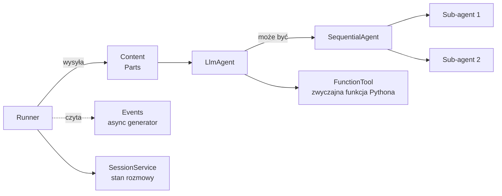

# ADK od wewnątrz

Google Agent Development Kit (ADK) — jak to naprawdę działa w Code Analyst.

## Główne abstrakcje



### Runner

Koordynator — przyjmuje `Content`, zwraca `async iterator[Event]`.

```python
runner = Runner(
    app_name="code_analyst",
    agent=root_agent,
    session_service=session_service,
)

events = runner.run_async(user_id="u1", session_id="s1", new_message=content)
async for event in events:
    if event.is_final_response():
        final_text = event.content.parts[0].text
```

- **`user_id`** + **`session_id`** — klucz stanu.
- **`new_message`** — `Content` z `role=user` i listą `Part`.

### Content + Part

```python
content = types.Content(
    role="user",
    parts=[
        types.Part(text="Jesteś ekspertem od bezpieczeństwa."),  # system_hint
        types.Part(text=user_input),                             # niezaufane
    ],
)
```

**Kluczowe:** LLM widzi te Parts jako strukturalnie oddzielne segmenty — to backbone naszej mitigacji prompt injection.

### LlmAgent

```python
agent = LlmAgent(
    name="CodeAnalyst",
    model="gemini-2.5-pro",
    instruction=_INSTR,        # system instruction (tuning)
    tools=[FunctionTool(f1), FunctionTool(f2)],
)
```

Pod maską:

- `instruction` → `system_instruction` w Gemini.
- `tools` → `function_declarations` w Gemini (auto-schema z type hints).
- Przy każdym tool call → tool wywołany → wynik wraca jako `Part(function_response=...)` → LLM kontynuuje.

### SequentialAgent

```python
seq = SequentialAgent(
    name="AnalysisPipeline",
    sub_agents=[code_analyst, architect, summarizer],
)
```

Event stream wygląda:

```
Event(from=CodeAnalyst, tool_call: search_code)
Event(from=CodeAnalyst, tool_response: [3 chunks])
Event(from=CodeAnalyst, final_response: "Found: ...")
Event(from=Architect, tool_call: read_project_file)
Event(from=Architect, final_response: "Arch review: ...")
Event(from=Summarizer, final_response: "Summary: ...")
```

Ostatni `final_response` od ostatniego agenta = output całej sekwencji.

Ale uwaga — wszystkie pośrednie finale widoczne w logach i można je renderować.

### SessionService

Przechowuje historię. Kilka implementacji:

- `InMemorySessionService` — RAM, giniemy przy restarcie.
- `DatabaseSessionService` — Postgres.
- Custom — np. Redis.

U nas: `InMemorySessionService`, tworzona raz globalnie. Każdy `(repo_id, mode)` ma **swój** `session_id` cache-owany w `_session_ids` w `web/app.py`.

## Event stream — pełna lista typów

```python
event.content.parts[0]
```

Może zawierać:

| Pole | Co oznacza |
|------|-----------|
| `text` | tekst (final response albo pośredni) |
| `function_call` | model prosi o wywołanie tool-a |
| `function_response` | wynik tool-a wraca do modelu |
| `thought` | myśl modelu (jeśli włączone thoughts) |

```python
async for event in runner.run_async(...):
    for part in event.content.parts:
        if part.function_call:
            log.info(f"tool call: {part.function_call.name}")
        if part.function_response:
            log.info(f"tool done: {part.function_response.response}")
        if part.text and event.is_final_response():
            log.info(f"final: {part.text}")
```

## Jak Code Analyst to wykorzystuje

W [`web/app.py`](../deweloper/api.md) funkcja `_run_agent_pipeline`:

```python
async def _run_agent_pipeline(runner, session_id, user_message, system_hint=None):
    parts = []
    if system_hint:
        parts.append(types.Part(text=system_hint))
    parts.append(types.Part(text=user_message))
    content = types.Content(role="user", parts=parts)

    steps = []
    final_response = ""
    had_error = False

    async for event in runner.run_async(
        user_id="web_user", session_id=session_id, new_message=content
    ):
        author = event.author or "agent"
        for part in event.content.parts:
            if part.function_call:
                steps.append({
                    "agent": author,
                    "tool": part.function_call.name,
                    "status": "calling",
                })
            if part.function_response:
                resp = part.function_response.response
                is_err = isinstance(resp, dict) and resp.get("ok") is False
                had_error = had_error or is_err
                steps.append({
                    "agent": author,
                    "tool": part.function_call.name if part.function_call else "",
                    "status": "error" if is_err else "ok",
                })
            if part.text and event.is_final_response():
                final_response = part.text

    return {"final_response": final_response, "steps": steps, "had_error": had_error}
```

UI (`_chat_message.html`, `_workflow_result.html`) renderuje `steps` jako timeline:

> 🔧 CodeAnalyst → search_code → ✓
> 🔧 CodeAnalyst → read_project_file → ✓
> 💬 CodeAnalyst → "Znalazłem w `auth/login.py`..."
> 🔧 Architect → read_project_file → ✓
> 💬 Architect → "Architektonicznie..."
> 🔧 Summarizer → (brak narzędzi)
> 💬 Summarizer → "Podsumowanie: ..."

## `function_call` vs `function_response` — pitfall

Event z `function_response` ma `part.function_response.name` **ALE** nie ma
`function_call` — musisz pamiętać call name z poprzedniego eventu albo używać
`part.function_response.name`.

W `_run_agent_pipeline` używamy fallbacku:

```python
tool_name = (part.function_call.name if part.function_call else "") \
            or (part.function_response.name if part.function_response else "")
```

## Custom LlmAgent z dodatkowym state

Gdy potrzebujesz sharować coś między sub-agentami (np. "wynik pierwszego kroku"):

```python
# Na końcu sub-agenta 1, zapisz do session state
agent1.save_to_state = {"first_output": lambda ctx: ctx.final_response}

# W sub-agencie 2, dostaniesz w contextcie
agent2 = LlmAgent(
    ...,
    before_invocation=lambda ctx: ctx.state.get("first_output"),
)
```

W Code Analyst — **nie używamy** tego. `system_hint` w Partach + sequential pipeline wystarczą. Prostsze = mniej błędów.

## Model swap

```python
LlmAgent(model="gemini-2.5-flash")   # tańszy, szybszy
LlmAgent(model="gemini-2.5-pro")     # większy, droższy, lepszy reasoning
```

Dla Code Analyst: `pro` dla workflowów, `flash` dla search/summarizer mogłoby zaoszczędzić koszt (TODO w backlog).

## Debugowanie eventów

```python
import json
async for event in runner.run_async(...):
    print(json.dumps({
        "author": event.author,
        "is_final": event.is_final_response(),
        "parts": [
            {"text": p.text, "fc": p.function_call.name if p.function_call else None}
            for p in event.content.parts
        ],
    }))
```

Daje pełny obraz: kto, kiedy, z jaką treścią.

Następnie: [RAG od wewnątrz](rag-wewnetrznie.md).
