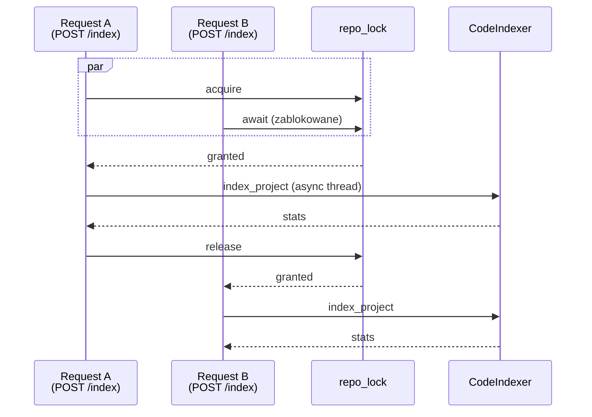

# Multi-tenant / multi-repo

Code Analyst obsługuje wiele repozytoriów jednocześnie. Każde repo ma własny:

- `CodeIndexer` (własny vector store na dysku),
- `Runner` × mode (analysis / workflow),
- session w `SessionService`,
- lock `asyncio.Lock` dla serializacji indeksacji,
- status indeksacji.

## Struktura cache'y

```python
# web/app.py — globalny state
_indexers: dict[str, CodeIndexer] = {}             # repo_id → indexer
_runners: dict[str, Runner] = {}                   # "repo_id:mode:workflow" → runner
_session_ids: dict[str, str] = {}                  # "repo_id:mode:workflow" → session_id
_indexing_status: dict[str, dict] = {}             # repo_id → {state, ...}
_indexing_locks: dict[str, asyncio.Lock] = {}      # repo_id → lock
_global_lock = asyncio.Lock()                      # do ochrony powyższych dict
```

Ochrona cache:

```python
async def _get_indexer(repo: RepoInfo) -> CodeIndexer:
    async with _global_lock:
        if repo.id not in _indexers:
            _indexers[repo.id] = CodeIndexer(
                repo_path=repo.path,
                data_dir=settings.data_dir,
            )
        return _indexers[repo.id]

def _lock_for_repo(repo_id: str) -> asyncio.Lock:
    if repo_id not in _indexing_locks:
        _indexing_locks[repo_id] = asyncio.Lock()
    return _indexing_locks[repo_id]
```

## Concurrency — co jest, a co nie jest race-safe



Endpointy, które trzymają `repo_lock`:

- `POST /index` — zawsze,
- write tool (`write_project_file` wrapper) — pośrednio przez markowanie dirty.

Endpointy, które **nie** biorą locka (optymistyczne):

- `GET /search` — tylko czyta,
- `POST /chat`, `POST /workflow` — agent może chcieć wywołać read/search, ale nie re-index.

**Race scenario:** `/search` w trakcie `/index` — LlamaIndex SimpleVectorStore nie jest thread-safe przy mutacji struktury. Dlatego `/index` biegnie w `asyncio.to_thread`, ale read-only queries nie kolidują (sprawdzono empirycznie + stable releases LlamaIndex).

!!! warning "Jeśli by jednak crashowało"
    Dodaj `async with _lock_for_repo(repo.id):` wokół `indexer.query` —
    koszt to serializacja, ale gwarantuje spójność.

## Per-mode runner

```python
def _runner_key(repo_id: str, mode: str, workflow: str = "") -> str:
    return f"{repo_id}:{mode}:{workflow}"

async def _get_runner(repo, mode, workflow_id=""):
    key = _runner_key(repo.id, mode, workflow_id)
    async with _global_lock:
        runner = _runners.get(key)
        session_id = _session_ids.get(key)
        if runner is None:
            agent = _build_agent(repo, mode, workflow_id)
            runner = Runner(
                app_name="code_analyst",
                agent=agent,
                session_service=_SESSION_SERVICE,
            )
            session_id = f"{key}:{uuid.uuid4().hex[:8]}"
            await _SESSION_SERVICE.create_session(
                app_name="code_analyst",
                user_id="web_user",
                session_id=session_id,
            )
            _runners[key] = runner
            _session_ids[key] = session_id
        return runner, session_id
```

Dlaczego cache per `(repo, mode, workflow)`?

- **Chat `analysis`** — session zachowuje historię rozmowy.
- **Workflow `bugfix`** — świeża session (workflow jest jednorazowy). Alternatywnie można tworzyć za każdym razem nowy session_id dla workflowów — zależy od UX.
- **Runner trzyma agenta** — tworzenie agenta z toolami nie jest darmowe.

Inwalidacja:

```python
def _invalidate_runners(repo_id: str):
    for key in list(_runners.keys()):
        if key.startswith(f"{repo_id}:"):
            _runners.pop(key, None)
            _session_ids.pop(key, None)
```

Wywoływane po:

- `DELETE /repos/{id}`,
- zakończonym `/index` (agent musi "zobaczyć" nowy indeks).

## Multi-node — co się psuje

Jeśli skalujemy na 2+ repliki:

1. **Cache `_indexers` rozsynchronizowany** — każda replika ma własny indeksator (in-memory state + pliki na własnym dysku).
2. **Session state rozsynchronizowany** — `InMemorySessionService` jest per-replica; każdy follow-up trafia w random replikę → "zapomina" historię.
3. **Locki per-replica** — race na wspólnym storage (jeśli dysk jest shared).

**Nie ma łatwego fixu.** Minimum do produkcyjnego multi-node:

1. Shared vector store: **Qdrant/Weaviate** zamiast SimpleVectorStore.
2. Shared session: `DatabaseSessionService` → Postgres.
3. Shared locki: Redis `redlock`.
4. Sticky sessions w load balancerze (user zawsze trafia w tę samą replikę).

Przy naszym target use-case (narzędzie wewnętrzne, kilku-kilkunastu userów) — jedna replika z solidnym backup rozwiązuje 99% potrzeb.

## Persystencja między restartami

| Co | Persystowane? | Gdzie |
|----|---------------|-------|
| Indeksy RAG | ✅ | `CODE_ANALYST_DATA_DIR/<repo_slug>/` |
| Metadata plików (mtime) | ✅ | w pickle LlamaIndex |
| Lista repo (`repo_manager`) | ✅ | `CODE_ANALYST_DATA_DIR/repos.json` |
| Session rozmów | ❌ | in-memory (reset po restart) |
| Runner state | ❌ | rebuildowany przy pierwszym requeście |
| Licznik rate limit | ❌ | per-proces (reset na restart) |

**Implikacje:**

- User może stracić historię chatu po deployu — **cecha**, nie bug (dla prywatności).
- Indeksy są odporne — po restart wciąż działają.
- Rate limit "wybacza" po restart (w multi-replica deployment to może być atak surface).

## Testowanie multi-repo

```bash
# Dodaj dwa repa i sprawdź, że są niezależne
curl -X POST /repos -d "path=/srv/A&name=A"
curl -X POST /repos -d "path=/srv/B&name=B"

# Indeksuj oba równolegle
curl -X POST /repos/A-xxx/index -d "incremental=false" &
curl -X POST /repos/B-yyy/index -d "incremental=false" &
wait

# Search w każdym — różne wyniki
curl -X POST /repos/A-xxx/search -d "query=UserService"
curl -X POST /repos/B-yyy/search -d "query=UserService"
```

Każdy indeks żyje w osobnym katalogu — nie ma cross-contamination.

## Graceful shutdown

FastAPI `lifespan`:

```python
@asynccontextmanager
async def lifespan(app):
    yield
    # shutdown
    for indexer in _indexers.values():
        try:
            indexer.persist()
        except Exception as e:
            log.error(f"Persist failed: {e}")
```

SIGTERM → każdy `CodeIndexer` wywołuje `storage_context.persist()` → zapis do dysku → proces kończy się clean.

W Dockerze: `--stop-signal=SIGTERM` + `stop_grace_period: 30s`.
