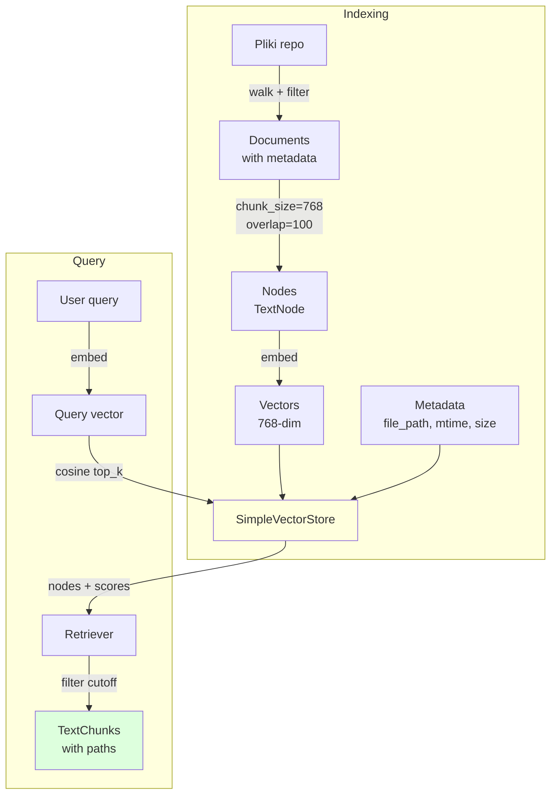

# RAG od wewnątrz

Jak działa indeksacja i retrieval, co można tunować, jakie trade-off'y.

## Stack

- **LlamaIndex** — orchestration (Reader → Parser → Index → Retriever).
- **SimpleVectorStore** — in-memory vector store, persystowany na dysk (pickle + JSON).
- **Gemini embeddings** (`text-embedding-004`) — 768-dim, multilingual.
- **Custom file filter** — `_should_index_file` w `CodeIndexer`.



## `CodeIndexer` — lifecycle

```python
class CodeIndexer:
    def __init__(self, repo_path: str, data_dir: str):
        self.repo_path = os.path.realpath(repo_path)
        self.storage_dir = os.path.join(data_dir, _slug(repo_path))
        self._index: VectorStoreIndex | None = None
        self._file_metadata: dict[str, dict] = {}  # path → {mtime, size}

    def index_project(self, ..., incremental: bool = True) -> dict:
        # 1. Walk repo → kandydaci
        # 2. Filter (is_secret_file, size, extension)
        # 3. Diff wg _file_metadata (if incremental)
        # 4. Load changed + dodaj / usuń z indexu
        # 5. Persist
```

### `_should_index_file` — filtr

```python
_INDEXABLE_EXTENSIONS = {
    ".py", ".java", ".js", ".ts", ".tsx", ".jsx",
    ".go", ".rs", ".cpp", ".c", ".h", ".hpp",
    ".cs", ".rb", ".php", ".swift", ".kt",
    ".md", ".rst", ".txt",
    ".yaml", ".yml", ".json", ".toml",
    ".html", ".css", ".scss",
    ".sql", ".sh", ".ps1",
}

_IGNORE_DIRS = {
    "__pycache__", ".venv", "venv", "node_modules", "target",
    "build", "dist", ".git", ".idea", ".vscode", "__MACOSX",
}

def _should_index(path: str) -> bool:
    if is_secret_file(path): return False
    ext = Path(path).suffix.lower()
    if ext not in _INDEXABLE_EXTENSIONS: return False
    if os.path.getsize(path) > settings.max_file_size: return False
    parts = Path(path).parts
    if any(p in _IGNORE_DIRS for p in parts): return False
    return True
```

Domyślnie **pomijamy** binaries, image, PDF — kod i dokumentację tylko.

### Inkrementalna indeksacja

```python
for path in candidates:
    mtime = os.path.getmtime(path)
    size = os.path.getsize(path)
    meta = self._file_metadata.get(path)
    if meta and meta["mtime"] == mtime and meta["size"] == size:
        skipped += 1
        continue        # nie zmieniło się — pomiń
    # re-parse + re-embed
```

Usuwanie plików:

```python
# Pliki, które były w indeksie a teraz nie istnieją → usuń
stale = set(self._file_metadata) - set(candidates)
for path in stale:
    self._remove_nodes_for(path)
```

### Persistencja

```python
self._index.storage_context.persist(persist_dir=self.storage_dir)
# struktura:
# storage_dir/
#   docstore.json           # metadata chunków
#   vector_store.json       # 768-dim wektory
#   index_store.json        # VectorStoreIndex state
#   graph_store.json
```

Przy starcie:

```python
ctx = StorageContext.from_defaults(persist_dir=self.storage_dir)
self._index = load_index_from_storage(ctx)
```

## Chunking — szczegóły

`SentenceSplitter(chunk_size=768, chunk_overlap=100)`:

- **768 tokenów** ≈ 3KB kodu (bardzo uśredniając).
- **100 overlap** — chroni przed zgubieniem kontekstu na granicy chunka.
- **Boundary heuristic** — splitter stara się nie rozcinać zdań / bloków Markdown.

!!! tip "Dostrajanie chunk_size"
    - **Mniejsze (256-512)** — więcej chunków, lepsza precyzja dla krótkich pytań, więcej kosztu.
    - **Większe (1024-1536)** — mniej chunków, lepszy kontekst dla złożonych pytań, większe ryzyko rozcieńczenia.
    - **Code** — `~768` sprawdza się jako balance (klasa Pythonowa / średnia metoda Javy mieści się).

## Retrieval

```python
retriever = self._index.as_retriever(similarity_top_k=settings.similarity_top_k)
nodes = retriever.retrieve(query_text)
# nodes: list[NodeWithScore], sorted by score desc
filtered = [n for n in nodes if n.score >= settings.similarity_cutoff]
```

Parametry:

| Parametr | Domyślnie | Efekt gdy wyższy |
|----------|-----------|------------------|
| `similarity_top_k` | 8 | więcej wyników, wolniej |
| `similarity_cutoff` | 0.35 | mniej śmieci, więcej pustki |

### Dlaczego 0.35?

Gemini text-embedding-004 produkuje cosine similarity w zakresie mniej więcej:

- Bardzo trafne pary — 0.80+
- Podobne — 0.50-0.75
- Luźno związane — 0.30-0.50
- Przypadkowe — < 0.30

0.35 to próg "luźno, ale jeszcze sensowne". Niższy daje halucynacje, wyższy — agent widzi za mało.

## `search_code` wrapper

W [`code_retrieval_tool.py`](../architektura/komponenty.md):

```python
def make_retrieval_tools(indexer: CodeIndexer) -> list[Callable]:
    def search_code(query: str, top_k: int = 5) -> dict:
        try:
            results = indexer.query(query, top_k)
            return {"ok": True, "results": results, "count": len(results)}
        except Exception as e:
            return {"ok": False, "error": str(e)}

    def get_index_stats() -> dict:
        return {"ok": True, "stats": indexer.stats()}

    def index_project(incremental: bool = True) -> dict:
        try:
            stats = indexer.index_project(incremental=incremental)
            return {"ok": True, "stats": stats}
        except Exception as e:
            return {"ok": False, "error": str(e)}

    return [search_code, get_index_stats, index_project]
```

Fabryka pozwala na **per-repo** indexer — bez globalnego singletona.

## Pitfalls

### 1. Stale cache po zapisie

Gdy agent zapisze plik, indeks wciąż ma stare embeddings. Rozwiązanie: `indexer.mark_file_dirty(path)` w wrapperze write + user musi wywołać `/index` ponownie.

### 2. Multi-lingual mieszanie

Gdy repo ma komentarze po polsku i angielsku + query po angielsku → text-embedding-004 sobie radzi, ale score bywa niższy. Jeśli zauważasz to — obniż cutoff do 0.3.

### 3. Duże pliki konfiguracji

`package-lock.json` lub podobne mogą mieć 5MB. Domyślny limit `CODE_ANALYST_MAX_FILE_SIZE=1MB` je pomija. Jeśli chcesz indeksować → podnieś limit, ale koszt embed rośnie liniowo.

### 4. Symlinks i podmoduły git

`os.walk` domyślnie **nie** wchodzi w symlinks (safe). Submodules — wchodzi, bo to prawdziwe katalogi. Dla monorepo z sub-projektami jest to pożądane.

## Alternatywy do rozważenia

Nasze SimpleVectorStore in-memory jest super na dev / lokalne single-node. Dla produkcji multi-node rozważ:

| Vector store | Plusy | Minusy |
|--------------|-------|--------|
| **Qdrant** | Open source, Rust, szybki, filters | Ops overhead |
| **Weaviate** | GraphQL API, hybrydowy search | Większy |
| **Chroma** | Prosty, embedowalny | Mniejszy zasięg featurów |
| **pgvector** | Żyje w Postgresie | Indexing wolniejszy |
| **Vertex AI Matching Engine** | Managed, skaluje | Koszt, GCP only |

Integracja: podmiana LlamaIndex VectorStore na odpowiedni klient — reszta kodu bez zmian.

Następnie: [Multi-tenant](multi-tenant.md).
