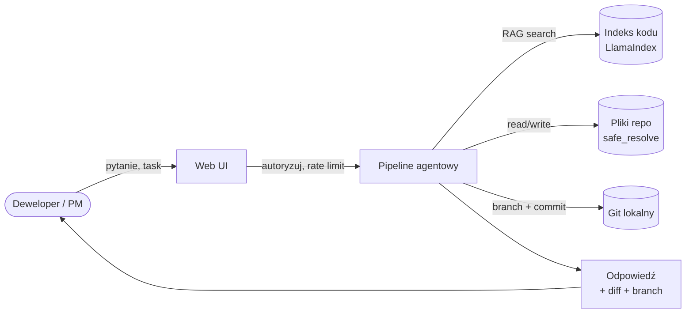

# Code Analyst

**Produkcyjny agent AI do analizy i bezpiecznej modyfikacji kodu źródłowego.**

Code Analyst łączy **Google ADK** (agent framework), **RAG** (Retrieval-Augmented Generation po kodzie) oraz **FastAPI** w jeden system, który rozumie Twoje repozytorium i wykonuje powtarzalne zadania developerskie pod nadzorem człowieka.

-   :material-briefcase-variant:{ .lg .middle } **Dla biznesu**

    ---

    Co to daje firmie, dla kogo jest, jakie są ryzyka i jak mierzyć wartość.

    [:octicons-arrow-right-24: Wartość biznesowa](biznes/wartosc.md)

-   :material-code-braces:{ .lg .middle } **Dla dewelopera**

    ---

    Zainstaluj, skonfiguruj i uruchom w 5 minut. Endpointy, testy, rozszerzanie.

    [:octicons-arrow-right-24: Quick start](deweloper/quick-start.md)

-   :material-shield-lock:{ .lg .middle } **Bezpieczeństwo**

    ---

    Model zagrożeń, autoryzacja krok po kroku, mitigacje prompt injection.

    [:octicons-arrow-right-24: Autoryzacja](bezpieczenstwo/autoryzacja.md)

-   :material-chart-line:{ .lg .middle } **Operacje**

    ---

    Deployment (Docker), observability (`/metrics`), rate limiting, logi JSON.

    [:octicons-arrow-right-24: Deployment](operacje/deployment.md)

-   :material-brain:{ .lg .middle } **Dla eksperta**

    ---

    ADK od środka (Runner, Events, SequentialAgent), tuning RAG, multi-tenant.

    [:octicons-arrow-right-24: ADK wewnętrznie](ekspert/adk-wewnetrznie.md)

-   :material-history:{ .lg .middle } **Historia zmian**

    ---

    Co się zmieniło, kiedy i dlaczego. Raport audytu + status fixów.

    [:octicons-arrow-right-24: Audyt + changelog](bezpieczenstwo/audyt.md)

---

## W jedną minutę — co robi Code Analyst

- **Rozmawiasz** z repo językiem naturalnym — RAG znajduje właściwe miejsca w kodzie.
- **Scenariusze** (onboarding, code review, bug fix, generowanie testów) jednym kliknięciem.
- **Zmiany** trafiają na **osobny branch** — nigdy bezpośrednio na `main`.
- **Audyt** — każde wywołanie narzędzia jest logowane z request-ID.

## Trzy szybkie odpowiedzi

!!! question "Czy to bezpieczne dla naszego kodu?"
    Kod nie opuszcza Twojej infrastruktury (kontener uruchomisz lokalnie).
    Do embeddingów RAG idzie tekst fragmentów — wybór modelu (Google, lokalny) to Twoja decyzja.
    Sekrety (`.env`, `*.pem`, `id_rsa`, …) są **wykluczone z indeksacji i zapisu**.
    Więcej: [Model zagrożeń](bezpieczenstwo/model-zagrozen.md).

!!! question "Kto może z tego korzystać?"
    Zespoły inżynierskie (onboarding, code review, rutynowe zadania), tech leadzi
    (impact analysis), a po włączeniu autoryzacji — wewnętrzny samoobsługowy portal.
    Narzędzie **nie zastępuje** inżyniera; wspiera go i przyspiesza.

!!! question "Ile to kosztuje?"
    Koszt = model (embeddings + LLM) × wolumen. Typowe 200–500 plików repo:
    indeksacja jednorazowa ~$0,10–0,50, każda odpowiedź agenta ~$0,005–0,05
    (zależnie od modelu). Metryki czasu i wolumenu zbierane w `/metrics`.

---

## Jak czytać tę dokumentację

| Kim jesteś? | Gdzie zacząć? |
|-------------|---------------|
| **PM / biznes** | [Wartość biznesowa](biznes/wartosc.md) → [Scenariusze](biznes/scenariusze.md) → [ROI](biznes/roi-i-metryki.md) |
| **Architekt / tech lead** | [Architektura](architektura/przeglad.md) → [Model zagrożeń](bezpieczenstwo/model-zagrozen.md) → [Deployment](operacje/deployment.md) |
| **Deweloper** | [Quick start](deweloper/quick-start.md) → [Konfiguracja](deweloper/konfiguracja.md) → [API](deweloper/api.md) |
| **SRE / DevOps** | [Deployment](operacje/deployment.md) → [Monitoring](operacje/monitoring.md) → [Troubleshooting](operacje/troubleshooting.md) |
| **Security / compliance** | [Audyt](bezpieczenstwo/audyt.md) → [Autoryzacja](bezpieczenstwo/autoryzacja.md) → [Ryzyka](biznes/ryzyka-i-zgodnosc.md) |
| **Ekspert ADK / ML** | [ADK wewnętrznie](ekspert/adk-wewnetrznie.md) → [RAG wewnętrznie](ekspert/rag-wewnetrznie.md) |

---

## Stack technologiczny w skrócie

- **Google ADK** `>=1.28` — `LlmAgent`, `SequentialAgent`, `Runner`, `FunctionTool`
- **LlamaIndex** `0.12.x` — `VectorStoreIndex`, `SentenceSplitter`, embeddingi Google GenAI
- **FastAPI** + **Jinja2** + **HTMX** — interfejs web, bez SPA, z sanityzacją XSS (DOMPurify)
- **Pydantic Settings** — walidowana konfiguracja z `.env`
- **Prometheus client** — histogramy czasu i counter błędów
- **SlowAPI** — rate limiting per-IP
- **pytest** — zestaw testów security / narzędzi / konfiguracji
- **Docker** — multi-stage `python:3.12-slim`, non-root, healthcheck
