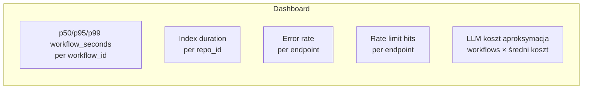

# Monitoring i metryki

Aplikacja eksponuje:

- **`/health`** — liveness,
- **`/ready`** — readiness,
- **`/metrics`** — Prometheus text format.

## Endpointy zdrowia

### `/health` — liveness

```bash
$ curl http://localhost:8088/health
{"status":"ok","version":"1.0.0"}
```

- Zawsze `200` gdy proces odpowiada.
- **Nie** sprawdza zależności (LLM, RAG) — to rola `/ready`.
- Używaj w **liveness probe** — jeśli wali `500`, pod restart.

### `/ready` — readiness

```bash
$ curl http://localhost:8088/ready
{"ready":true,"project":"my-prj"}
```

- `503` gdy brak `GOOGLE_CLOUD_PROJECT` albo `GOOGLE_API_KEY`.
- Używaj w **readiness probe** — ruch kierowany tylko do gotowych podów.

## Prometheus metrics

Dostępne gdy zainstalowano `prometheus-client` (domyślnie: TAK).

Endpoint: `GET /metrics` (bez auth, patrz [Audyt: R-2](../bezpieczenstwo/audyt.md)).

### Metryki kluczowe

| Metryka | Typ | Labels | Co mierzy |
|---------|-----|--------|-----------|
| `code_analyst_index_seconds` | Histogram | repo_id, incremental | czas indeksacji |
| `code_analyst_search_seconds` | Histogram | repo_id | czas search RAG |
| `code_analyst_workflow_seconds` | Histogram | repo_id, workflow_id | czas pełnego workflow'u |
| `code_analyst_errors_total` | Counter | endpoint | liczba błędów 5xx |
| `code_analyst_rate_limited_total` | Counter | endpoint | liczba 429 |

### Przykład scrape config

`prometheus.yml`:

```yaml
scrape_configs:
  - job_name: code-analyst
    scrape_interval: 30s
    metrics_path: /metrics
    static_configs:
      - targets: ['analyst:8088']
        labels:
          env: prod
          team: platform
```

## Grafana dashboard

Sugerowane panele:



### PromQL przykłady

**p95 czasu workflow'u per typ:**

```promql
histogram_quantile(0.95,
  sum(rate(code_analyst_workflow_seconds_bucket[5m])) by (workflow_id, le)
)
```

**Error rate > 1%:**

```promql
sum(rate(code_analyst_errors_total[5m]))
/
sum(rate(code_analyst_workflow_seconds_count[5m]))
> 0.01
```

**Top 5 repo po czasie indeksacji:**

```promql
topk(5,
  sum by (repo_id) (rate(code_analyst_index_seconds_sum[1h]))
)
```

## Alerting

`alerts.yml` (Prometheus Alertmanager):

```yaml
groups:
- name: code-analyst
  rules:
  - alert: CodeAnalystDown
    expr: up{job="code-analyst"} == 0
    for: 2m
    labels: { severity: critical }
    annotations:
      summary: "Code Analyst down"

  - alert: CodeAnalystHighErrorRate
    expr: |
      sum(rate(code_analyst_errors_total[5m]))
      /
      sum(rate(code_analyst_workflow_seconds_count[5m])) > 0.05
    for: 10m
    labels: { severity: warning }
    annotations:
      summary: "Error rate > 5% over 10m"

  - alert: CodeAnalystSlowWorkflows
    expr: |
      histogram_quantile(0.95,
        sum(rate(code_analyst_workflow_seconds_bucket[10m]))
        by (le)
      ) > 120
    for: 15m
    labels: { severity: warning }
    annotations:
      summary: "p95 workflow > 120s"
```

## Logi — gdzie szukać

Każdy request ma `X-Request-ID` (w nagłówku odpowiedzi i we wszystkich logach tego requestu). Do korelacji z metrykami:

```bash
# Znajdź request, który był slow
grep '"duration_ms":1[5-9][0-9][0-9][0-9]' /var/log/analyst.log

# Pobierz wszystko z tego request_id
grep '"request_id":"abc-def-123"' /var/log/analyst.log
```

Szczegóły: [Logowanie](logowanie.md).

## LLM koszt — estymacja

Brak bezpośredniej metryki (zależy od providera). Aproksymacja:

```promql
# Liczba workflowów × średni koszt (ustal z Vertex AI console)
sum(rate(code_analyst_workflow_seconds_count[1d])) * 86400 * 0.05
# ~ $/dzień przy $0.05 za workflow (typowe)
```

Dokładne rozliczenie: Google Cloud Billing → filtrowane po `resource.service = "aiplatform.googleapis.com"`.

## SLI / SLO propozycje

| SLI | Definicja | SLO |
|-----|-----------|-----|
| **Availability** | `/health` zwraca 200 | 99.5% month |
| **Latency (search)** | p95 `/search` | < 2s |
| **Latency (workflow)** | p95 `/workflow` | < 60s |
| **Error rate** | 5xx / total | < 1% |

Error budget: `100% - SLO`. Przekroczenie → freeze deployów.

Następnie: [Logowanie](logowanie.md).
