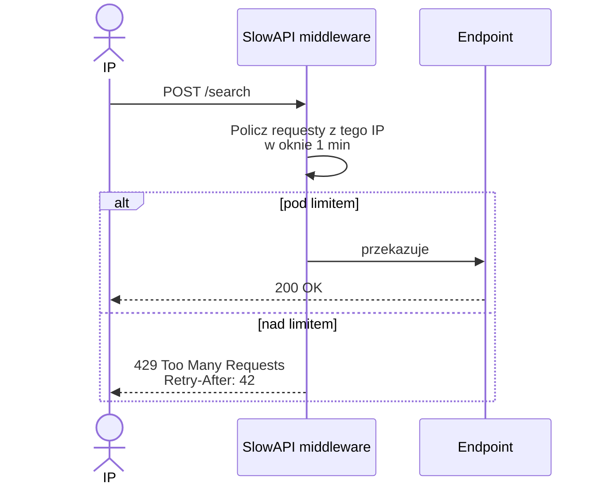

# Rate limiting

SlowAPI (`slowapi`), per-IP. Konfiguracja w `config.py` + ENV.

## Domyślne limity

| Endpoint | Limit | Powód |
|----------|-------|-------|
| `/index` | 2/minute | Pełny index to kilkanaście sek — ochrona przed DOS |
| `/search` | 30/minute | Lekki, ale płatny LLM embed |
| `/workflow`, `/chat` | 10/minute | Najdroższy — wiele LLM calls |
| `/repos/*/chat/reset` | brak | Idempotent, lekki |
| `/health`, `/ready`, `/metrics` | brak | Monitoring |

## Konfiguracja

```env
CODE_ANALYST_RATE_LIMIT_INDEX=2/minute
CODE_ANALYST_RATE_LIMIT_SEARCH=30/minute
CODE_ANALYST_RATE_LIMIT_WORKFLOW=10/minute
CODE_ANALYST_RATE_LIMIT_CHAT=20/minute
```

Format SlowAPI: `N/<unit>` gdzie unit = `second|minute|hour|day`. Np. `100/hour`, `5/second`.

## Jak to działa



Storage — in-memory per proces. Implikacje:

- Restart = reset licznika.
- Multi-replica = każda replika ma własne liczniki → **efektywny limit = N × limit** dla N replik.

Dla strict rate limiting w multi-replica: użyj backendu Redis (SlowAPI to wspiera przez `Limiter(storage_uri="redis://...")`). Nasz deployment domyślnie 1 replica, więc OK.

## Gdy limit przekroczony

Odpowiedź:

```
HTTP/1.1 429 Too Many Requests
Retry-After: 42
Content-Type: application/json

{"error":"Rate limit exceeded: 30 per 1 minute"}
```

HTMX to obsługuje — UI pokazuje komunikat + odblokuje przycisk po `Retry-After` sekund.

## Kiedy podnieść / obniżyć

**Obniż** gdy:

- Agent eksploruje kosztowne narzędzia, rachunek LLM rośnie.
- Pojedynczy user dominuje i blokuje innych.

**Podnieś** gdy:

- User po interwencji czeka 40s na ponowny request — to frustrujące.
- Masz budżet i chcesz płynnego UX.

Rekomendacje:

| Scenariusz | workflow | search |
|------------|----------|--------|
| Zespół 5 os., pojedyncze repo | 10/min | 30/min |
| Zespół 20 os. | 30/min | 60/min |
| Shared platforma 100+ os. | 60/min + per-user rate limit | 120/min |

## Per-user zamiast per-IP

Wszyscy za korporacyjnym NAT-em mają ten sam IP — limit ich łączy. Jeśli to problem:

1. Wprowadź użytkowników (OAuth/OIDC zamiast API key, patrz [Audyt](../bezpieczenstwo/audyt.md) backlog).
2. Custom `key_func`:

    ```python
    def get_user_key(request):
        return request.headers.get("X-User-Email") or get_remote_address(request)

    limiter = Limiter(key_func=get_user_key)
    ```

3. Idź dalej — Redis storage, żeby sharować liczniki między replikami.

## Metryki

| Metryka | Labels |
|---------|--------|
| `code_analyst_rate_limited_total` | endpoint |

PromQL:

```promql
# Top endpointów, które walą w limit
topk(5, sum by (endpoint) (rate(code_analyst_rate_limited_total[1h])))
```

Alert gdy > 1% requestów trafia w limit:

```yaml
- alert: HighRateLimitHits
  expr: |
    sum(rate(code_analyst_rate_limited_total[5m]))
    /
    sum(rate(code_analyst_workflow_seconds_count[5m])) > 0.01
  for: 15m
```

## Bypass dla health-checks

`/health`, `/ready`, `/metrics` są **bez** decoratorów rate-limit. Nie narzucaj ich
ręcznie — psuje to monitoring.

## Testowanie

```powershell
# Szybki burst — oczekujemy 429 po 30 requestach
1..35 | ForEach-Object {
  curl -s -o NUL -w "%{http_code}`n" `
    -H "X-API-Key: $KEY" `
    -X POST http://localhost:8088/repos/test/search `
    -d "query=x"
}
```

Oczekiwane: pierwsze 30 × `200`, dalej `429`.

Następnie: [Troubleshooting](troubleshooting.md).
