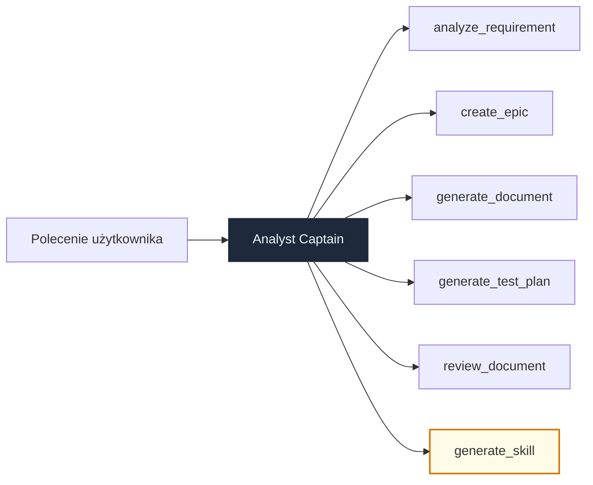

# Module 20: Analyst System

> Autonomiczny analityk projektowy oparty na AI — system wieloagentowy koordynujący wyspecjalizowane zespoły do analizy wymagań, generowania dokumentacji, tworzenia epików, planów testów i zarządzania wiedzą.

---

## Co to jest?

**Analyst System** to zaawansowany system wieloagentowy zbudowany na [Google ADK](https://google.github.io/adk-docs/), który automatyzuje powtarzalne zadania analityczne w projektach IT. Centralny agent (**Analyst Captain**) pełni rolę routera — analizuje polecenie użytkownika i deleguje pracę do jednego z 6 wyspecjalizowanych orkiestratorów, z których każdy zarządza pipeline'em kilku agentów AI.

### Kluczowe cechy

- **Dwupętlowa architektura** — pętla realizacji (5 orkiestratorów) + pętla wiedzy (generate_skill)
- **Kontekst projektu** — `ProjectKnowledgeContract` wstrzykuje domenę, glossary i konwencje do instrukcji agentów
- **Równoległa analiza** — 4 specjalistów jednocześnie bada wymaganie z różnych perspektyw
- **Dynamiczne umiejętności** — orkiestratory automatycznie ładują odpowiednie skille (Diataxis, style guide)
- **Opcjonalna integracja MCP** — Jira, Confluence Wiki, GitLab przez Comarch MCP (graceful fallback bez konfiguracji)
- **16 testów E2E** — pełne pokrycie struktury, kontraktu, narzędzi i pipeline'ów

---

## Architektura

```
agent.py                          ← Analyst Captain (router LlmAgent)
│
├── orchestrators/
│   ├── analyze_requirement.py    ← Sequential → Parallel(4) → Sequential
│   ├── create_epic.py            ← Sequential (4 kroki)
│   ├── generate_document.py      ← Sequential (5 kroków, dynamiczne skille)
│   ├── generate_test_plan.py     ← Sequential (4 kroki)
│   ├── review_document.py        ← Sequential (3 kroki)
│   └── generate_skill.py         ← Sequential (6 kroków — pętla wiedzy)
│
├── agents/                       ← Instrukcje 12+ wyspecjalizowanych agentów
├── tools/                        ← FunctionTools (pliki, szablony, skille) + MCP
├── skills/                       ← Baza wiedzy (SKILL.md wg agentskills.io)
├── contract/                     ← ProjectKnowledgeContract (Pydantic v2)
├── prompts/                      ← Dynamiczny builder instrukcji z kontraktem
└── mkdocs-site/                  ← Pełna dokumentacja MkDocs Material
```

### Diagram routingu



---

## Orkiestratory — szczegóły

| Orkiestrator | Wzorzec | Agenci w pipeline | Wynik |
|---|---|---|---|
| **analyze_requirement** | Seq → Par(4) → Seq | source_collector → clarity / scope / cross_ref / docs_gap → synthesis | Wielowymiarowa analiza wymagania |
| **create_epic** | Sequential (4) | source_collector → epic_writer → epic_reviewer → template_writer | Epic Jira z user stories i acceptance criteria |
| **generate_document** | Sequential (5) | classifier → source_collector → content_writer → quality_reviewer → file_writer | HLD, LLD, tutorial, how-to, reference, explanation |
| **generate_test_plan** | Sequential (4) | source_collector → test_planner → test_reviewer → test_writer | Plan testów ze scenariuszami i edge cases |
| **review_document** | Sequential (3) | reader → reviewer → report | Recenzja jakości dokumentu |
| **generate_skill** | Sequential (6) | source → extractor → dedup → architect → reviewer → presenter | Nowa umiejętność agentowa (SKILL.md) |

### Przepływ danych (State Passing)

Agenci komunikują się przez mechanizm `output_key` — każdy krok zapisuje wynik w `session.state`, a kolejny automatycznie go odczytuje:

```
source_collector → {collected_sources} → parallel_analysts → {clarity_analysis, scope_analysis, ...} → synthesis → {requirement_analysis}
```

---

## Przykładowe flow

### 1. Analiza wymagania

```
Użytkownik: "Przeanalizuj wymaganie: system musi obsługiwać aktywację SIM OTA"

→ Captain routuje do: analyze_requirement
  → Krok 1: source_collector zbiera kontekst (kontrakt, Jira, Wiki)
  → Krok 2: 4 analityków równolegle:
      • clarity_analyst  — czy wymaganie jest jasne i jednoznaczne?
      • scope_analyst    — jaki jest zakres i wpływ na bounded contexts?
      • cross_ref_analyst — powiązania z istniejącymi wymaganiami
      • docs_gap_analyst  — jakich dokumentów brakuje?
  → Krok 3: synthesis scala wnioski w strukturalny raport

← Wynik: kompletna analiza z rekomendacjami
```

### 2. Generowanie dokumentu HLD

```
Użytkownik: "Wygeneruj HLD dla modułu provisioning"

→ Captain routuje do: generate_document
  → Krok 1: doc_type_classifier rozpoznaje typ → "hld"
  → Krok 2: source_collector zbiera kontekst projektu
  → Krok 3: content_writer generuje treść (ładuje skille: diataxis-writing, style-guide)
  → Krok 4: quality_reviewer ocenia jakość wg standardów
  → Krok 5: file_writer zapisuje wynik do output/

← Wynik: dokument HLD w Markdown, zapisany na dysku
```

### 3. Tworzenie epika Jira

```
Użytkownik: "Stwórz epic dla migracji z Akka na Pekko"

→ Captain routuje do: create_epic
  → Krok 1: source_collector zbiera kontekst techniczny
  → Krok 2: epic_writer tworzy epic z user stories
  → Krok 3: epic_reviewer weryfikuje kompletność i spójność
  → Krok 4: template_writer formatuje wg szablonu Jira

← Wynik: gotowy epic z stories, AC i estymacjami
```

### 4. Tworzenie nowej umiejętności (pętla wiedzy)

```
Użytkownik: "Stwórz skill o wzorcach saga w naszym projekcie"

→ Captain routuje do: generate_skill
  → Krok 1: source_collector zbiera wiedzę z Wiki/GitLab/kontraktu
  → Krok 2: knowledge_extractor wyodrębnia kluczowe fakty
  → Krok 3: dedup_checker sprawdza duplikaty z istniejącymi skillami
  → Krok 4: skill_architect buduje SKILL.md (YAML frontmatter + body)
  → Krok 5: skill_reviewer weryfikuje zgodność z agentskills.io
  → Krok 6: presenter prezentuje gotowy skill

← Wynik: nowy skill dostępny dla przyszłych zadań
```

---

## Szybki start

### Wymagania

- Python 3.11+
- Google Cloud SDK z dostępem do Vertex AI
- (Opcjonalnie) Comarch MCP Server dla integracji Jira/Wiki/GitLab

### Instalacja

```bash
cd adk_training/module_20_analyst_system

# 1. Zależności
pip install -r requirements.txt

# 2. Konfiguracja
cp .env.template .env
# Edytuj .env — minimalna konfiguracja:
#   GOOGLE_GENAI_USE_VERTEXAI=1
#   GOOGLE_CLOUD_PROJECT=twoj-projekt-gcp
#   GOOGLE_CLOUD_LOCATION=us-central1
```

### Uruchomienie

```bash
adk web .
# → http://127.0.0.1:8000
```

### Kontrakt projektu

System korzysta z `contract/sample_contract.json` (przykład: IoT Connect). Aby dostosować do swojego projektu, stwórz własny plik JSON z:

```json
{
  "project_name": "Nazwa projektu",
  "project_description": "Opis projektu",
  "domain": { "domain": "Domena", "key_entities": [...], "glossary": {...} },
  "documentation": { "framework": "diataxis", "primary_language": "pl" },
  "tech_stack": ["Scala 2.13", "Kafka", "PostgreSQL"],
  "team_conventions": ["Conventional Commits", "PR required"]
}
```

---

## Umiejętności (Skills)

Wbudowane skille w `skills/`:

| Skill | Opis | Używany przez |
|-------|------|---------------|
| `diataxis-writing` | Framework dokumentacyjny Diataxis (tutorial, how-to, reference, explanation) | generate_document |
| `style-guide` | Konwencje pisania dokumentacji technicznej | generate_document, review_document |
| `document-templates` | Katalog szablonów: HLD, LLD, epic, test plan | generate_document, create_epic |
| `requirement-analysis` | Metodologia analizy wymagań | analyze_requirement |

System może autonomicznie tworzyć nowe umiejętności przez orkiestrator `generate_skill` — pętla wiedzy.

---

## Narzędzia (Tools)

| Narzędzie | Typ | Funkcje |
|-----------|-----|---------|
| `file_tools` | FunctionTool | `read_file`, `write_document`, `list_files` |
| `template_tools` | FunctionTool | `list_templates`, `load_template` |
| `skill_tools` | FunctionTool | `list_skills`, `read_skill`, `write_skill_draft`, `get_skill_metadata` |
| `mcp_setup` | McpToolset | Jira, Confluence Wiki, GitLab (opcjonalny — singleton z graceful fallback) |

---

## Testy

```bash
cd adk_training
python e2e_tests/test_module_20.py
```

16 testów pokrywających:

- Ładowanie root agenta i 6 orkiestratorów
- Walidację kontraktu Pydantic (poprawne + niepoprawne dane)
- Funkcje narzędzi (pliki, szablony, skille)
- Strukturę pipeline'ów (sekwencyjne, równoległe, output_key)
- Zgodność frontmatter skilli z agentskills.io
- Placeholdery TODO w szablonach
- Spójność łańcuchów output_key
- Prompt builder z kontraktem

---

## Dokumentacja MkDocs

Pełna dokumentacja w `mkdocs-site/` (Material theme, język polski):

```bash
cd mkdocs-site
pip install mkdocs-material
mkdocs serve
# → http://127.0.0.1:8001
```

Sekcje:
- **Produkt** — dlaczego AI Analyst, możliwości systemu
- **Architektura** — przegląd, system dwupętlowy, topologie, przepływ danych
- **Platforma** — narzędzia, skille, integracje
- **Technologia** — stos technologiczny, setup, konfiguracja

---

## Stack technologiczny

| Komponent | Wersja |
|-----------|--------|
| Google ADK | >= 1.28.0 |
| Gemini 2.5 Flash | domyślny model (`ADK_MODEL`) |
| Gemini 2.5 Pro | model silny (`ADK_MODEL_STRONG`) |
| Python | >= 3.11 |
| Pydantic | >= 2.0 |
| Vertex AI | backend LLM |
| Comarch MCP | integracja zewnętrzna (opcjonalna) |
