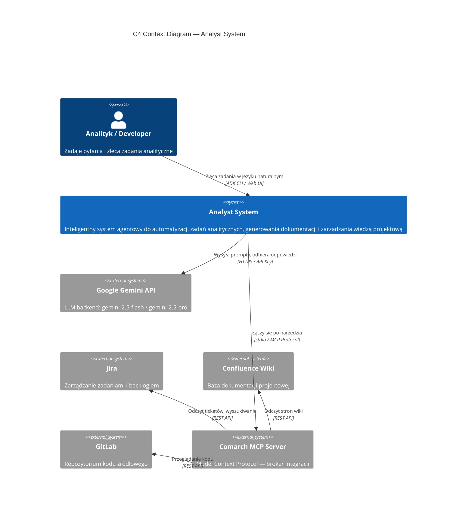
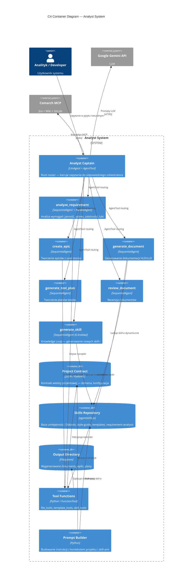
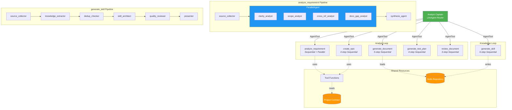
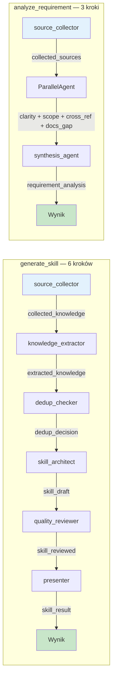

# Diagramy C4 — Analyst System

## 1. C4 Context (Level 1) — System w ekosystemie

---

## 2. C4 Container (Level 2) — Kontenery wewnętrzne

---

## 3. C4 Component (Level 3) — Pipeline agentów i przepływ danych

---

## 4. Przepływ stanu (output_key chain)

