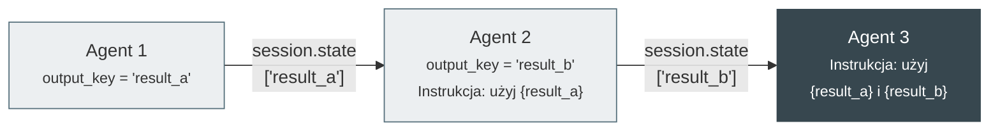
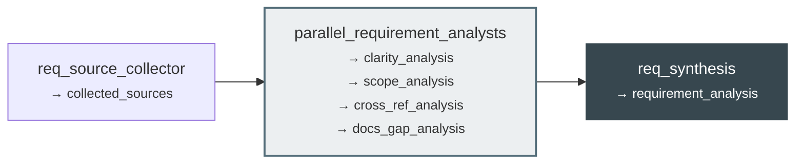
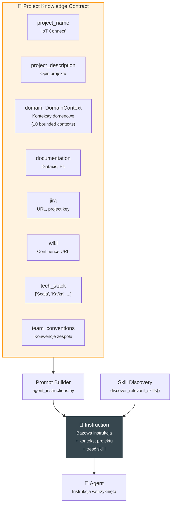
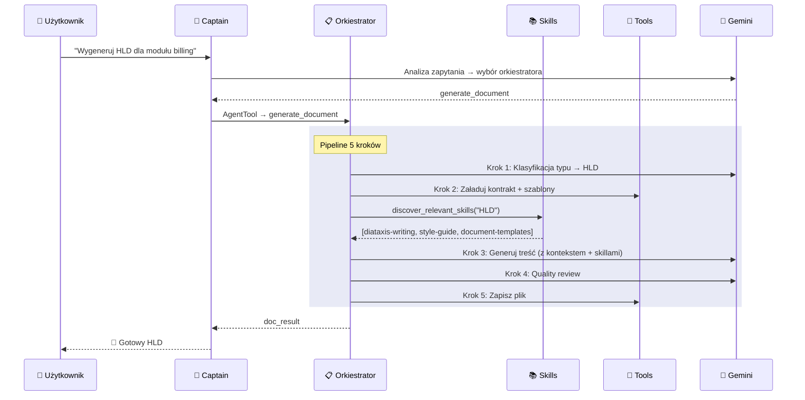

# Przepływ danych — State Passing

## Mechanizm output_key

Agenci w pipeline komunikują się przez mechanizm **output_key** — kluczowy wzorzec Google ADK. Każdy agent produkuje wynik, który jest automatycznie wstrzykiwany w sesję i dostępny dla kolejnych kroków.



!!! info "Jak to działa technicznie?"
    1. Agent kończy pracę →  wynik zapisywany pod `session.state[output_key]`
    2. ADK automatycznie podmienia `{output_key}` w instrukcjach kolejnych agentów
    3. Każdy agent widzi tylko to, co jest mu potrzebne

---

## Łańcuchy output_key per orkiestrator

### analyze_requirement



### generate_document

| Krok | Agent | output_key | Dostęp do stanu |
|------|-------|-----------|-----------------|
| 1 | doc_type_classifier | `doc_type` | — |
| 2 | doc_source_collector | `doc_sources` | `{doc_type}` |
| 3 | doc_content_writer | `doc_content` | `{doc_type}`, `{doc_sources}` + skille |
| 4 | doc_quality_reviewer | `doc_review` | `{doc_content}` |
| 5 | doc_file_writer | `doc_result` | `{doc_content}`, `{doc_review}` |

### generate_skill (Knowledge Loop)

| Krok | Agent | output_key | Dostęp do stanu |
|------|-------|-----------|-----------------|
| 1 | skill_source_collector | `collected_knowledge` | — |
| 2 | skill_knowledge_extractor | `extracted_knowledge` | `{collected_knowledge}` |
| 3 | skill_dedup_checker | `dedup_decision` | `{extracted_knowledge}` |
| 4 | skill_architect | `skill_draft` | `{extracted_knowledge}`, `{dedup_decision}` |
| 5 | skill_quality_reviewer | `skill_reviewed` | `{skill_draft}` |
| 6 | skill_presenter | `skill_result` | `{skill_draft}`, `{skill_reviewed}` |

---

## Kontrakt wiedzy projektowej

Centralnym elementem kontekstu jest **Project Knowledge Contract** — plik JSON walidowany Pydantic.



### Struktura kontraktu

```json
{
  "project_name": "IoT Connect",
  "project_description": "Enterprise IoT Connectivity Management Platform",
  "domain": {
    "contexts": [
      {
        "name": "Census",
        "description": "Zarządzanie klientami, partnerami",
        "entities": ["BusinessPartner", "Account", "Agreement"],
        "glossary": {
          "BP": "Business Partner",
          "Party": "Strona umowy"
        }
      }
    ]
  },
  "documentation": {
    "framework": "diataxis",
    "language": "pl",
    "style_notes": "Microsoft Writing Style Guide"
  },
  "jira": {
    "url": "https://jira.comarch/",
    "project_key": "IOTC"
  },
  "tech_stack": ["Scala 2.13", "Cats Effect 3", "Kafka", "PostgreSQL", "Elasticsearch"],
  "team_conventions": ["F-first signatures", "Resource lifecycle", "Domain ADTs"]
}
```

!!! tip "Rozszerzalność"
    Dodanie nowego modułu/domeny do systemu to **dodanie nowego wpisu w kontrakcie**. Nie wymaga zmian w kodzie ani konfiguracji agentów.

---

## Diagram przepływu — pełny cykl


