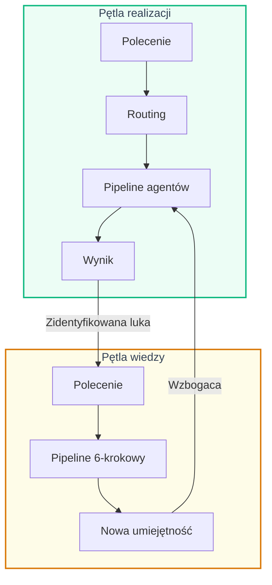
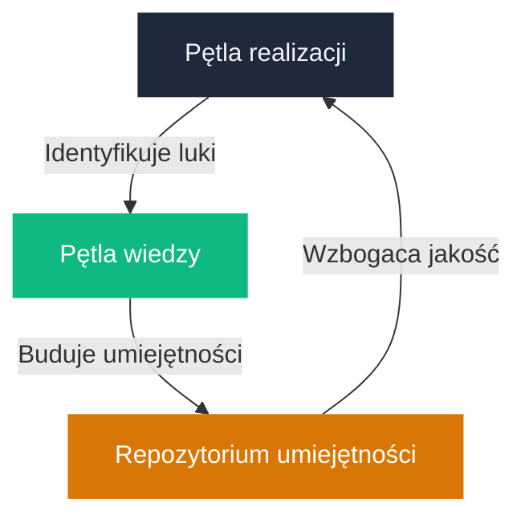

# System dwupętlowy

## Koncepcja

Analyst System łączy dwie komplementarne pętle — **realizacji** i **wiedzy** — tworząc system, który nie tylko wykonuje zadania, ale autonomicznie się doskonali.

---

## Pętla realizacji

Główna pętla systemu. Odpowiada za realizację zadań analitycznych — od analizy wymagań po generowanie dokumentów.

1

Polecenie użytkownika

→

2

Inteligentny routing

→

3

Pipeline agentów

→

4

Kontrola jakości

→

5

Gotowy wynik

### Pięć orkiestratorów

| Orkiestrator | Specjalność | Wyróżnik |
|-------------|-------------|-----------|
| **Analiza wymagań** | Wielowymiarowa analiza wymagań | Czterech analityków pracuje równolegle |
| **Tworzenie epików** | Epiki z user stories i kryteriami akceptacji | Kontekst projektu wbudowany automatycznie |
| **Generowanie dokumentów** | HLD, LLD, plany testów | Dynamiczne ładowanie umiejętności |
| **Plany testów** | Scenariusze testowe z edge cases | Uwzględnia specyfikę domeny |
| **Recenzja dokumentów** | Weryfikacja jakości i zgodności | Ocena wg Diátaxis i style guide |

---

## Pętla wiedzy

Unikalna cecha systemu. Pipeline 6-krokowy, który autonomicznie buduje nowe umiejętności z wiedzy rozproszonej po projekcie.

```mermaid
graph LR
    A["Zbieranie źródeł"] --> B["Ekstrakcja wiedzy"]
    B --> C["Sprawdzenie duplikatów"]
    C --> D["Projektowanie umiejętności"]
    D --> E["Kontrola jakości"]
    E --> F["Publikacja"]

    style A fill:#ecfdf5,stroke:#10b981,stroke-width:2px
    style B fill:#ecfdf5,stroke:#10b981,stroke-width:2px
    style C fill:#fefce8,stroke:#d97706,stroke-width:2px
    style D fill:#10b981,color:#fff,stroke:none
    style E fill:#ecfdf5,stroke:#10b981,stroke-width:2px
    style F fill:#dcfce7,stroke:#22c55e,stroke-width:2px
```

!!! success "Efekt kumulatywny"
    Każda nowa umiejętność trafia do repozytorium i jest automatycznie odkrywana przez przyszłe uruchomienia. System staje się lepszy z każdym użyciem — **bez zmian w kodzie**.

---

## Sprzężenie zwrotne

Obie pętle współpracują, tworząc cykl ciągłego doskonalenia:

???+ example "Przykład"
    1. System generuje dokument API — recenzja wskazuje brak konwencji nazewnictwa
    2. Użytkownik uruchamia Pętlę Wiedzy: *„utwórz umiejętność o konwencjach GraphQL API”*
    3. Nowa umiejętność trafia do repozytorium
    4. Kolejne dokumenty API **automatycznie** korzystają z tej umiejętności
