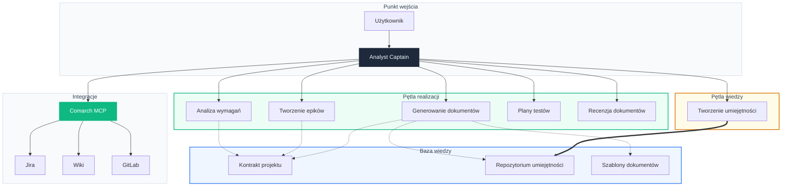

# Architektura

## Topologia systemu

Analyst System to platforma wieloagentowa z centralnym routerem i dwoma pętlami przetwarzania.

---

## Trzy filary

### Inteligentny routing

Centralny agent analizuje polecenie i kieruje je do odpowiedniego orkiestratora. Nie potrzeba ręcznych reguł — decyzję podejmuje model językowy.

### Pipeline krokowy

Każdy orkiestrator to sekwencja wyspecjalizowanych kroków — od zbierania kontekstu, przez przetwarzanie, po kontrolę jakości.

### Dwie pętle

**Pętla realizacji** wykonuje zadania. **Pętla wiedzy** buduje umiejętności. Razem tworzą system, który się doskonali.

---

**System dwupętlowy**

Jak współpracują pętla realizacji i pętla wiedzy

[Dual-Loop :material-arrow-right:](dual-loop.md)

**Topologie agentów**

Wizualne pipeline'y każdego orkiestratora

[Topologie :material-arrow-right:](orchestrators.md)

