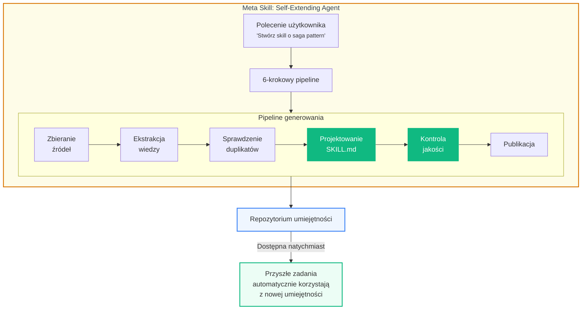
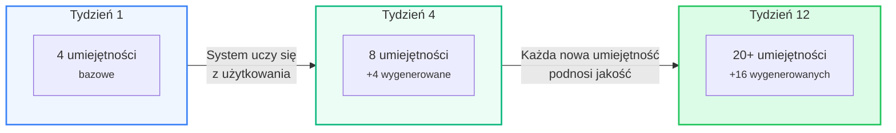
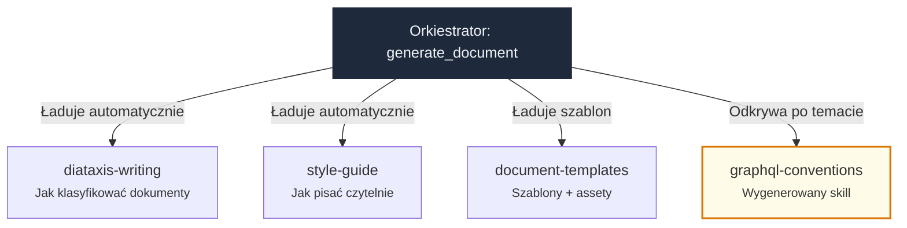

# Meta Skills — system który sam się rozbudowuje

## Idea

Standardowy system AI ma stały zestaw możliwości — tyle, ile wbudował programista. Analyst System idzie dalej: **potrafi sam tworzyć nowe umiejętności** i natychmiast z nich korzystać.

To nie jest teoria. Mechanizm działa już teraz — orkiestrator `generate_skill` to 6-krokowy pipeline z bramkami jakości, który produkuje umiejętności zgodne z otwartym standardem [agentskills.io](https://agentskills.io).

!!! tip "Efekt WOW"
    Zamiast ręcznie budować każdą capability, budujesz **jedną meta-umiejętność** — a system generuje resztę sam. To różnica między kupowaniem narzędzi a posiadaniem warsztatu, który je produkuje.

---

## Jak to działa



---

## Trzy poziomy umiejętności

| Poziom | Opis | Przykład |
|--------|------|---------|
| **Statyczne** | Wbudowane ręcznie przez programistę | `diataxis-writing`, `style-guide` |
| **Generowane** | Tworzone przez Knowledge Loop na żądanie | `saga-patterns`, `graphql-conventions` |
| **Meta** | Umiejętności tworzące umiejętności — self-extending | `skill-creator` z referencjami do specyfikacji |

Tradycyjny system AI zatrzymuje się na poziomie 1. Analyst System operuje na wszystkich trzech.

---

## Compound Knowledge Effect

Kluczowa przewaga ekonomiczna: wiedza rośnie wykładniczo, a koszt każdej kolejnej umiejętności spada.



**Dlaczego to ważne dla biznesu:**

- **Tydzień 1** — system zna podstawy: jak pisać dokumentację, jak analizować wymagania
- **Tydzień 4** — system wie, jak wyglądają saga patterny w *waszym* projekcie, jakie konwencje API stosujecie, jak wygląda *wasza* architektura
- **Tydzień 12** — system jest ekspertem domenowym, który zna specyfikę każdego modułu

Im dłużej system pracuje, tym lepsze wyniki — **bez dodatkowych kosztów wdrożenia**.

---

## Bramki jakości

Meta skills bez kontroli jakości to ryzyko. Dlatego pipeline ma wbudowane zabezpieczenia:

| Bramka | Mechanizm | Skutek |
|--------|-----------|--------|
| **Minimalna gęstość wiedzy** | Ekstraktor wymaga ≥ 3 wzorców | Odrzuca zbyt płytkie źródła |
| **Deduplikacja** | Checker porównuje z repozytorium | Zapobiega redundancji: CREATE / UPDATE / MERGE / SKIP |
| **Kontrola jakości** | Recenzent ocenia 1–10 | Score < 7 → blokada publikacji |
| **Zgodność ze specyfikacją** | Walidacja agentskills.io | Gwarantuje przenośność między agentami |

!!! info "Przejrzystość"
    Każdy wygenerowany skill jest w formacie Markdown — czytelnym dla człowieka. Zespół widzi dokładnie, czego system się "nauczył" i może to skorygować.

---

## Skill Composition — umiejętności współpracujące

Skille nie działają w izolacji. System kompozycji pozwala umiejętnościom referencjonować inne:



**Efekt**: dokument API wygenerowany w tygodniu 12 jest radykalnie lepszy niż w tygodniu 1 — bo korzysta zarówno z bazowych standardów pisania, jak i ze specyficznej wiedzy projektowej, która została wcześniej wygenerowana.

---

## Przykład: od zera do eksperta domenowego

**Dzień 1 — baza:**

> *"Wygeneruj HLD dla modułu billing"*

System korzysta z: `diataxis-writing` + `style-guide` + `document-templates`. Wynik: poprawny strukturalnie, ale ogólny.

**Dzień 14 — po wygenerowaniu 3 skilli:**

> *"Wygeneruj HLD dla modułu billing"*

System korzysta z: bazowych skilli + `billing-domain-model` + `pekko-streams-patterns` + `iot-connect-architecture`. Wynik: **konkretny, domenowy, z referencjami do istniejących komponentów**.

Różnica nie wynika ze zmiany kodu. Wynika z tego, że system **sam zbudował wiedzę**, z której teraz korzysta.

---

## Cross-team skill sharing

Skille to pliki Markdown w folderze `skills/`. Można je:

- **Wersjonować** w Git — audit trail, code review, rollback
- **Współdzielić** między zespołami — jeden zespół tworzy, wszystkie korzystają
- **Przenosić** między agentami — standard agentskills.io jest kompatybilny z 40+ narzędziami (Claude Code, Gemini CLI, Cursor, ADK)

```
# Instalacja skilli z team library
npx skills add comarch/iot-connect-skills -y -g
```

!!! success "Strategiczna przewaga"
    Organizacja, która konsekwentnie buduje repozytorium umiejętności, tworzy **aktywo wiedzy** — przenośne, wersjonowane i niezależne od rotacji pracowników.
