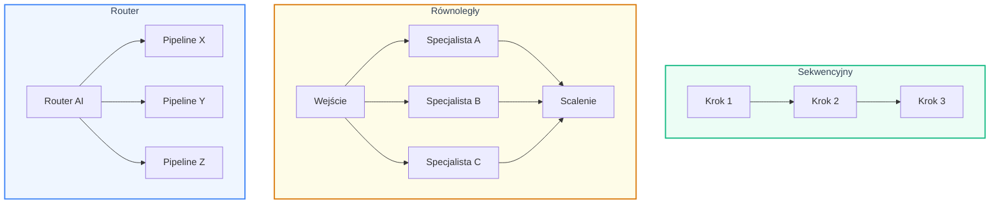
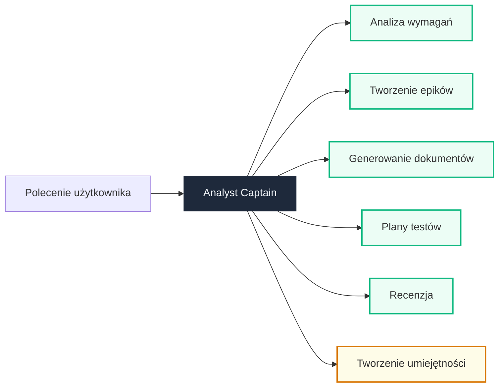
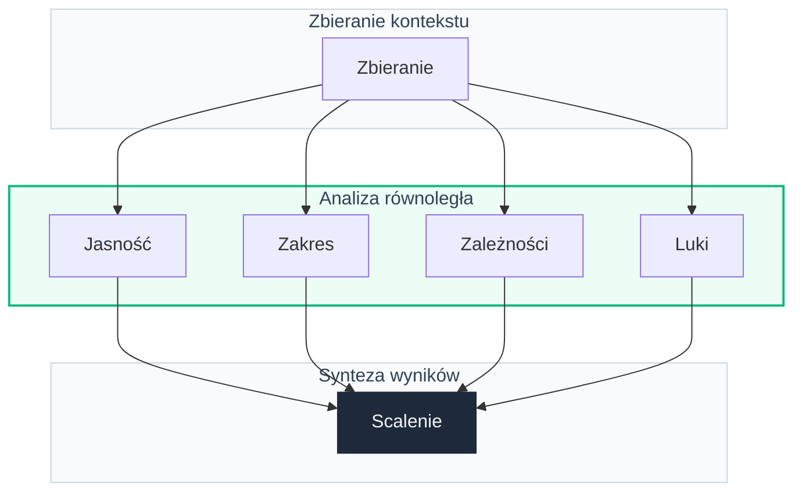
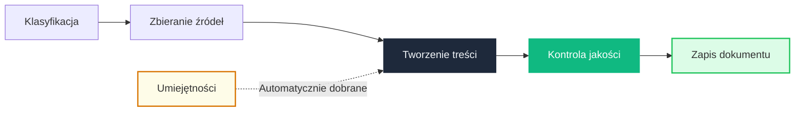
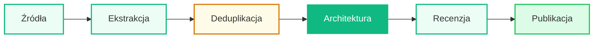
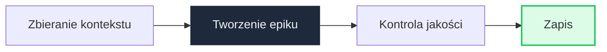
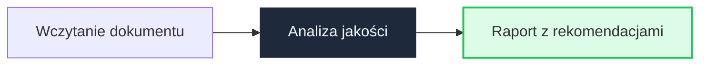

# Topologie agentów

## Trzy wzorce

System wykorzystuje trzy wzorce organizacji agentów — tworząc elastyczne pipeline'y dopasowane do zadania.

---

## Analyst Captain — router

Centralny agent analizuje polecenie użytkownika i kieruje je do odpowiedniego orkiestratora. Decyzję podejmuje model językowy na podstawie opisu zadań.

---

## Analiza wymagań

Jedyny orkiestrator łączący wzorzec sekwencyjny z równoległym. Czterech specjalistów bada wymaganie jednocześnie, a synteza scala ich wnioski.

!!! tip "Dlaczego analiza równoległa?"
    Cztery aspekty wymagania — jasność, zakres, zależności, luki — są niezależne. Równoległość oszczędza czas i zapewnia różnorodność perspektyw.

---

## Generowanie dokumentów

Najbardziej rozbudowany pipeline — pięć kroków z dynamicznym ładowaniem umiejętności dopasowanych do typu dokumentu.

---

## Tworzenie umiejętności

Pipeline 6-krokowy z wbudowaną deduplikacją — bezpieczne wytwarzanie nowych umiejętności.

---

## Tworzenie epików

Pipeline 4-krokowy — od kontekstu projektu po kompletny epik z user stories.

---

## Recenzja dokumentów

Najprostszy pipeline — trzy kroki weryfikacji dokumentu względem standardów.

