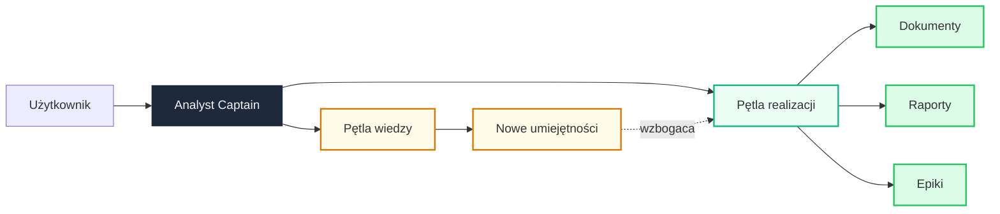

---
hide:
  - toc
  - navigation
---

# AI Analyst System

Autonomiczny analityk projektowy oparty na AI. 
Generuje dokumenty, analizuje wymagania 
i rozwija się z każdym zadaniem.

[Poznaj wartość](overview/why.md){ .md-button .md-button--primary }
[Architektura](architecture/index.md){ .md-button }

6
Orkiestratorów

2
Pętle systemu

4
Bazowe umiejętności

3
Integracje

---

## Jedno polecenie — kompletny wynik

Opisz zadanie w języku naturalnym. System sam zbierze kontekst projektu, zaangażuje odpowiednich specjalistów AI i dostarczy gotowy wynik.

---

### Dokumentacja

HLD, LLD, plany testów — generowane z pełnym kontekstem projektu, zgodne z Diátaxis i standardami wewnętrznymi

### Analiza wymagań

Czterech specjalistów AI bada równolegle jasność, zakres, zależności i luki w dokumentacji

### Samouczenie

Knowledge Loop autonomicznie buduje nowe umiejętności — system staje się lepszy z każdym użyciem

---

**Dlaczego AI Analyst?**

Jakie problemy rozwiązuje i jaką wartość przynosi organizacji

[Poznaj wartość :material-arrow-right:](overview/why.md)

**Architektura systemu**

Dwupętlowy design z inteligentnymi topologiami agentów

[Zobacz architekturę :material-arrow-right:](architecture/index.md)

**Platforma i integracje**

Jira, Wiki, GitLab — zintegrowany ekosystem narzędzi

[Przejdź do platformy :material-arrow-right:](tools/index.md)

