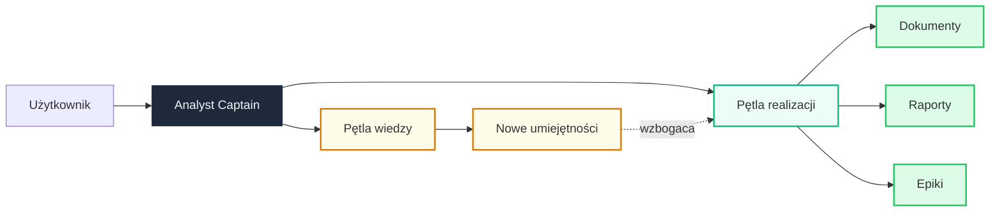

---
hide:
  - toc
  - navigation
---

# AI Analyst System

Analityk, który się uczy. 
Generuje dokumenty z kontekstem projektu, 
analizuje wymagania w minuty — i z każdym użyciem 
jest lepszy niż poprzednio.

[Poznaj wartość](overview/why.md){ .md-button .md-button--primary }
[Architektura](architecture/index.md){ .md-button }

6
Orkiestratorów

2
Pętle systemu

∞
Self-extending skills

3
Integracje

---

## Jedno polecenie — kompletny wynik

Opisz zadanie w języku naturalnym. System automatycznie zbiera kontekst projektu, angażuje wyspecjalizowanych agentów AI i dostarcza gotowy wynik — z wiedzą domenową, która rośnie z każdym użyciem.

```mermaid
graph LR
    U["Użytkownik"] --> C["Analyst Captain"]
    C --> AL["Pętla realizacji"]
    C --> KL["Pętla wiedzy"]

    AL --> D["Dokumenty"]
    AL --> R["Raporty"]
    AL --> E["Epiki"]

    KL --> S["Nowe umiejętności"]
    S -.->|wzbogaca| AL

    style C fill:#1e293b,color:#f1f5f9,stroke:none
    style AL fill:#ecfdf5,stroke:#10b981,stroke-width:2px
    style KL fill:#fefce8,stroke:#d97706,stroke-width:2px
    style D fill:#dcfce7,stroke:#22c55e,stroke-width:2px
    style R fill:#dcfce7,stroke:#22c55e,stroke-width:2px
    style E fill:#dcfce7,stroke:#22c55e,stroke-width:2px
    style S fill:#fefce8,stroke:#d97706,stroke-width:2px
```

---

### Dokumentacja

HLD, LLD, plany testów — generowane z pełnym kontekstem projektu, zgodne z Diátaxis i standardami wewnętrznymi

### Analiza wymagań

Czterech specjalistów AI bada równolegle jasność, zakres, zależności i luki w dokumentacji

### Meta Skills

System sam tworzy nowe umiejętności z wiedzy projektowej — i natychmiast z nich korzysta. [Compound knowledge effect →](architecture/meta-skills.md)

---

**Dlaczego AI Analyst?**

Jakie problemy rozwiązuje i jaką wartość przynosi organizacji

[Poznaj wartość :material-arrow-right:](overview/why.md)

**Architektura systemu**

Dwupętlowy design z inteligentnymi topologiami agentów

[Zobacz architekturę :material-arrow-right:](architecture/index.md)

**Rezultaty**

Mierzalne efekty: czas, jakość, compound knowledge

[Zobacz rezultaty :material-arrow-right:](overview/results.md)

