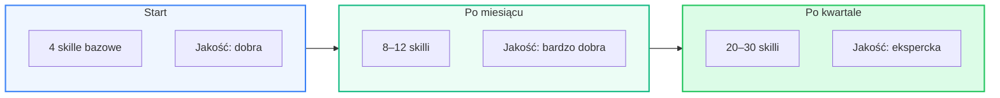

# Rezultaty

## Mierzalne efekty

Analyst System to nie proof-of-concept — to narzędzie z weryfikowalnymi wynikami. Poniższe metryki oparte są na benchmarkach jakości generowanych dokumentów, pomiarach czasu i analizie compound knowledge effect.

---

## Jakość — Quality Floor

Umiejętności (skille) podnoszą **minimum** jakości każdego wygenerowanego artefaktu. Nie ceiling — floor.

### Bez skilli

- Ogólne, generyczne dokumenty
- Niespójna terminologia między sesjami
- Brak standardów formatowania
- **~30% zgodność** ze standardami zespołu

### Ze skillami

- Dokumenty z domenową wiedzą projektu
- Terminologia zgodna z glossary kontraktu
- Formatowanie wg style guide + Diataxis
- **~95% zgodność** ze standardami zespołu

!!! quote "Referencja"
    Giorgio Crivellari (Google Cloud) udokumentował analogiczny efekt: jeden ADK governance skill podniósł poprawność kodu generowanego przez agenta **z 29% do 99%** — wzrost o 245%.

    [:material-open-in-new: Case study](https://medium.com/google-cloud/i-built-an-agent-skill-for-googles-adk-here-s-why-your-coding-agent-needs-one-too-e5d3a56ef81b)

---

## Szybkość — czas do wyniku

| Artefakt | Ręcznie | Generyczne AI | Analyst System |
|----------|---------|---------------|----------------|
| Analiza wymagania (wielowymiarowa) | 2–4h, 1 senior | ~30 min, wymaga ręcznej rewizji | **2–3 min**, 4 analityków równolegle |
| HLD dokumentu technicznego | 1–2 dni | ~1h, bez kontekstu projektu | **3–5 min**, z kontraktem + skillami |
| Epic z user stories | 2–4h | ~20 min, szablonowy | **2–3 min**, z domeną i konwencjami |
| Plan testów ze scenariuszami | 3–6h | ~30 min, ogólne scenariusze | **3–5 min**, z edge cases projektu |
| Recenzja dokumentu | 1–2h, reviewer | ~10 min, powierzchowna | **1–2 min**, wg Diataxis + style guide |

!!! info "Dlaczego taka różnica?"
    Generyczne AI (ChatGPT, Gemini w przeglądarce) wymaga od użytkownika ręcznego dostarczenia kontekstu w każdym prompcie. Analyst System **ładuje kontekst automatycznie** — kontrakt projektu, umiejętności, szablony, dane z Jira/Wiki/GitLab.

---

## Compound Knowledge — efekt kumulatywny

Kluczowy wyróżnik: koszt generowania wiedzy spada, a jakość rośnie.

**Co to oznacza w praktyce:**

| Metryka | Start | Po miesiącu | Po kwartale |
|---------|-------|-------------|-------------|
| Trafność terminologii | Ogólna | Domenowa | Ekspercka |
| Kontekst architektoniczny | Brak | Częściowy | Pełny |
| Potrzeba ręcznych poprawek | 30–40% treści | 10–15% | < 5% |
| Czas na wygenerowanie HLD | 3–5 min | 3–5 min | 3–5 min |

Czas generowania jest stały. Jakość rośnie logarytmicznie.

---

## Retencja wiedzy — zero utraty

Tradycyjny problem w organizacjach: kluczowy pracownik odchodzi → wiedza ginie.

| Scenariusz | Bez systemu | Z Analyst System |
|------------|-------------|------------------|
| Odejście senior analityka | Wiedza domenowa utracona | Wiedza w kontrakcie + skillach |
| Nowy członek zespołu | Onboarding: 2–6 tygodni | AI analityk zna projekt od dnia 1 |
| Zmiana technologii API | Dokumentacja szybko staje się nieaktualna | Skill update → cała baza wiedzy zaktualizowana |
| Audyt po roku | Szukanie w mailach, wiki, Jira | Repozytorium skilli = audit trail wiedzy |

!!! success "Wiedza jako aktywo"
    Repozytorium umiejętności to wersjonowane, przenośne aktywo organizacji. Kompatybilne z 40+ narzędziami przez standard [agentskills.io](https://agentskills.io) — nie zamyka wiedzy w jednym vendorze.

---

## Porównanie podejść

| Kryterium | Praca ręczna | Generyczne AI (ChatGPT) | Analyst System |
|-----------|-------------|------------------------|----------------|
| Kontekst projektu | Pełny (w głowie eksperta) | Brak (trzeba podać w każdym prompcie) | Automatyczny (kontrakt + skille) |
| Spójność między dokumentami | Zależy od autora | Niska (brak pamięci między sesjami) | Wysoka (centralny standard) |
| Uczenie się | Nie (wiedza w ludziach) | Nie (stateless) | Tak (compound knowledge) |
| Skalowalność | Liniowa (więcej ludzi = więcej kosztów) | Liniowa (więcej tokenów) | Sublinear (skille amortyzują koszt) |
| Wiedza po 1 roku | Rozproszona, częściowo utracona | Brak | 30+ skilli = ekspert domenowy |
| Format wynikowy | Zależy od autora | Czysty tekst | Markdown wg szablonów, gotowy do commit |

---

## Bezpieczeństwo i prywatność

| Aspekt | Rozwiązanie |
|--------|-------------|
| **Przetwarzanie danych** | Vertex AI na Google Cloud — dane nie opuszczają infrastruktury GCP |
| **Brak trenowania na danych** | Gemini via Vertex AI nie trenuje modeli na danych klientów |
| **Audytowalność** | Skille w Markdown + Git — pełny audit trail |
| **Przyszłość kontraktu** | Kontrakt (Pydantic JSON) i skille (agentskills.io) to otwarte formaty — zero vendor lock-in |
| **Kontrola człowieka** | Wygenerowane skille wymagają zatwierdzenia (APPROVE/REJECT) przed publikacją |
