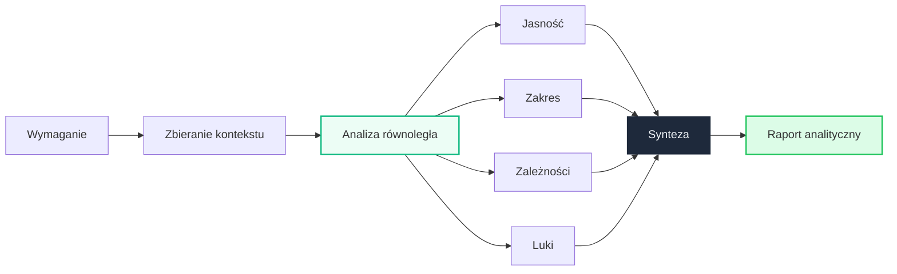
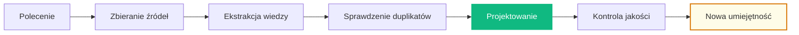

# Dlaczego AI Analyst?

## Problem

W złożonych projektach IT — setki modułów, tysiące encji, rozproszone zespoły — analityka staje się wąskim gardłem.

### Bez AI Analyst

- Dokumentacja pisana ręcznie, każdy dokument od zera
- Analiza wymagań zależy od jednego eksperta
- Wiedza domenowa rozproszona między wiki, Jira i kodem
- Onboarding nowych osób trwa tygodniami
- Brak spójnych standardów dokumentacji

### Z AI Analyst

- Dokumenty generowane automatycznie z kontekstem projektu
- Czterech analityków AI bada każde wymaganie równolegle
- Centralna baza wiedzy — kontrakt projektu + repozytorium umiejętności
- System rozumie projekt od pierwszej minuty
- Jeden standard: Diátaxis, style guide, szablony

---

## Wartość biznesowa

⚡

10x

Szybciej

Dokumenty w minutach zamiast godzin pracy manualnej

🎯

100%

Spójność

Centralny standard — każdy dokument wg tych samych reguł

🔄

∞

Samouczenie

System buduje nowe umiejętności autonomicznie

📈

0

Utrata wiedzy

Wiedza zakodowana w systemie — nie odchodzi z ludźmi

---

## Jak to działa w praktyce?

### Generowanie dokumentacji

> *„Wygeneruj High-Level Design dla modułu zarządzania alertami sieciowymi”*

```mermaid
graph LR
    A["Polecenie"] --> B["Klasyfikacja"]
    B --> C["Zbieranie kontekstu"]
    C --> D["Ładowanie umiejętności"]
    D --> E["Generowanie treści"]
    E --> F["Kontrola jakości"]
    F --> G["Gotowy dokument"]

    style A fill:#f8fafc,stroke:#cbd5e1,stroke-width:2px
    style E fill:#1e293b,color:#f1f5f9,stroke:none
    style F fill:#10b981,color:#fff,stroke:none
    style G fill:#dcfce7,stroke:#22c55e,stroke-width:2px
```

### Analiza wymagań

> *„Przeanalizuj: system musi obsługiwać masową aktywację 10 000 kart SIM”*

### Budowanie wiedzy

> *„Utwórz umiejętność dotyczącą konwencji nazewnictwa w GraphQL API”*

---

## Kluczowe pytania

???+ question "Ile osób trzeba do analizy jednego wymagania?"
    **Bez AI:** 1–2 seniorów, wielokrotne spotkania, szukanie w wiki.

    **Z AI Analyst:** Jedno polecenie → cztery niezależne analizy równolegle → zsyntezowany raport z rekomendacjami.

???+ question "Co się dzieje, gdy odchodzi kluczowy pracownik?"
    Wiedza jest zakodowana w **kontrakcie projektu** i **repozytorium umiejętności**. Nowe umiejętności budowane są autonomicznie — wiedza rośnie, nie ginie.

???+ question "Czy dokumentacja jest spójna między projektami?"
    Centralne umiejętności (Diátaxis, style guide) i szablony wymuszają jeden standard. System automatycznie weryfikuje jakość każdego dokumentu.
