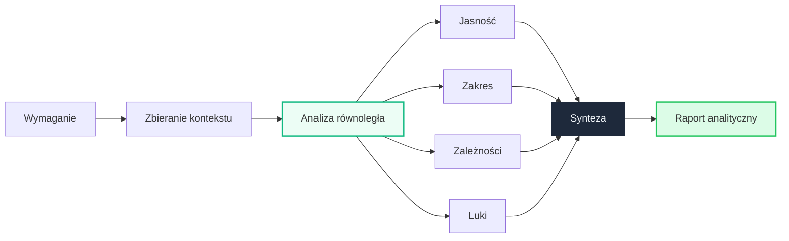
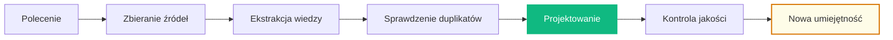

# Dlaczego AI Analyst?

## Problem

W złożonych projektach IT — setki modułów, tysiące encji, rozproszone zespoły — analityka staje się wąskim gardłem. Dokumenty powstają za wolno, wiedza ginie z rotacją ludzi, a każdy nowy prompt wymaga ręcznego dostarczenia kontekstu.

!!! abstract "W jednym zdaniu"
    Analyst System to AI analityk, który **zna twój projekt** — i z każdym dniem zna go lepiej.

### Bez AI Analyst

- Dokumentacja pisana ręcznie, każdy dokument od zera
- Analiza wymagań zależy od jednego eksperta
- Wiedza domenowa rozproszona między wiki, Jira i kodem
- Onboarding nowych osób trwa tygodniami
- Brak spójnych standardów dokumentacji

### Z AI Analyst

- Dokumenty generowane automatycznie z kontekstem projektu
- Czterech analityków AI bada każde wymaganie równolegle
- Centralna baza wiedzy — kontrakt projektu + repozytorium umiejętności
- System rozumie projekt od pierwszej minuty
- Jeden standard: Diátaxis, style guide, szablony

---

## Trzy podejścia — porównanie

| Kryterium | Praca ręczna | Generyczne AI (ChatGPT / Gemini) | Analyst System |
|-----------|-------------|----------------------------------|----------------|
| **Kontekst projektu** | W głowie eksperta | Brak — trzeba podać w prompcie | Automatyczny — kontrakt + skille |
| **Uczenie się** | Nie (wiedza w ludziach) | Nie (stateless, każda sesja od zera) | Tak — compound knowledge effect |
| **Spójność** | Zależy od autora | Niska (brak pamięci między sesjami) | Wysoka (centralny standard) |
| **Skalowalność** | 1 osoba = 1 dokument | Szybciej, ale ręczny context | Sublinear — skille amortyzują koszt |
| **Wiedza po roku** | Rozproszona, częściowo utracona | Zero | 30+ skilli = ekspert domenowy |
| **Czas HLD** | 1–2 dni | ~1h + ręczna rewizja | 3–5 min z kontekstem |

---

## Wartość biznesowa

⚡

10x

Szybciej

Dokumenty w minutach zamiast godzin pracy manualnej

🎯

100%

Spójność

Centralny standard — każdy dokument wg tych samych reguł

🔄

∞

Samouczenie

System buduje nowe umiejętności autonomicznie

📈

0

Utrata wiedzy

Wiedza zakodowana w systemie — nie odchodzi z ludźmi

---

## Jak to działa w praktyce?

### Generowanie dokumentacji

> *„Wygeneruj High-Level Design dla modułu zarządzania alertami sieciowymi”*

```mermaid
graph LR
    A["Polecenie"] --> B["Klasyfikacja"]
    B --> C["Zbieranie kontekstu"]
    C --> D["Ładowanie umiejętności"]
    D --> E["Generowanie treści"]
    E --> F["Kontrola jakości"]
    F --> G["Gotowy dokument"]

    style A fill:#f8fafc,stroke:#cbd5e1,stroke-width:2px
    style E fill:#1e293b,color:#f1f5f9,stroke:none
    style F fill:#10b981,color:#fff,stroke:none
    style G fill:#dcfce7,stroke:#22c55e,stroke-width:2px
```

### Analiza wymagań

> *„Przeanalizuj: system musi obsługiwać masową aktywację 10 000 kart SIM”*

```mermaid
graph LR
    A["Wymaganie"] --> B["Zbieranie kontekstu"]
    B --> P["Analiza równoległa"]

    P --> C1["Jasność"]
    P --> C2["Zakres"]
    P --> C3["Zależności"]
    P --> C4["Luki"]

    C1 --> S["Synteza"]
    C2 --> S
    C3 --> S
    C4 --> S
    S --> R["Raport analityczny"]

    style P fill:#ecfdf5,stroke:#10b981,stroke-width:2px
    style S fill:#1e293b,color:#f1f5f9,stroke:none
    style R fill:#dcfce7,stroke:#22c55e,stroke-width:2px
```

### Budowanie wiedzy

> *„Utwórz umiejętność dotyczącą konwencji nazewnictwa w GraphQL API”*

```mermaid
graph LR
    A["Polecenie"] --> B["Zbieranie źródeł"]
    B --> C["Ekstrakcja wiedzy"]
    C --> D["Sprawdzenie duplikatów"]
    D --> E["Projektowanie"]
    E --> F["Kontrola jakości"]
    F --> G["Nowa umiejętność"]

    style E fill:#10b981,color:#fff,stroke:none
    style G fill:#fefce8,stroke:#d97706,stroke-width:2px
```

---

## Kluczowe pytania

???+ question "Ile osób trzeba do analizy jednego wymagania?"
    **Bez AI:** 1–2 seniorów, wielokrotne spotkania, szukanie w wiki.

    **Z AI Analyst:** Jedno polecenie → cztery niezależne analizy równolegle → zsyntezowany raport z rekomendacjami.

???+ question "Co się dzieje, gdy odchodzi kluczowy pracownik?"
    Wiedza jest zakodowana w **kontrakcie projektu** i **repozytorium umiejętności**. Nowe umiejętności budowane są autonomicznie — wiedza rośnie, nie ginie.

???+ question "Czy dokumentacja jest spójna między projektami?"
    Centralne umiejętności (Diátaxis, style guide) i szablony wymuszają jeden standard. System automatycznie weryfikuje jakość każdego dokumentu.

---

## Czego Analyst System NIE robi

Transparentność buduje zaufanie:

| Ograniczenie | Wyjaśnienie |
|-------------|-------------|
| Nie zastępuje architekta | Generuje dokumenty na podstawie dostarczonej wiedzy — decyzje architektoniczne podejmuje człowiek |
| Nie pisze kodu produkcyjnego | Produkuje dokumentację, analizy i epiki — nie commituje do main |
| Nie gwarantuje 100% poprawności | Quality floor rośnie z każdym skillem, ale human review jest częścią procesu |
| Nie działa bez kontraktu | Bez kontraktu projektu wyniki są ogólne — jak każde inne AI |

---

## Dla kogo

| Rola | Korzyść |
|------|---------|
| **CTO / VP Engineering** | Mierzalny ROI: szybsza dokumentacja, zero utraty wiedzy |
| **Tech Lead** | Spójne standardy dokumentacyjne w zespole bez micromanagementu |
| **Senior Analityk** | 10x mniej pisania ręcznego, więcej czasu na myślenie strategiczne |
| **Nowy w zespole** | AI analityk zna projekt od dnia 1 — onboarding w minuty zamiast tygodni |
