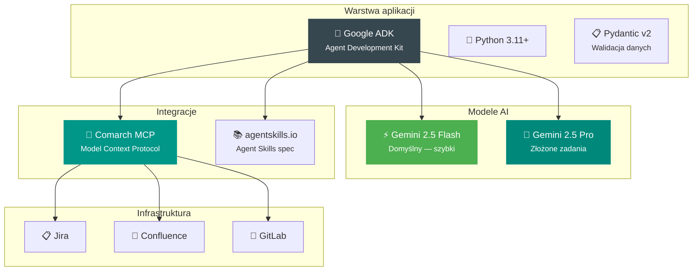

# Prezentacja techniczna

## Podsumowanie techniczne

Analyst System to wieloagentowa platforma zbudowana na Google ADK, wykorzystująca modele Gemini do automatyzacji zadań analitycznych.

---

## Architektura w liczbach

| Metryka | Wartość |
|---------|---------|
| Pliki implementacji | 36+ |
| Orkiestratory | 6 |
| Wyspecjalizowani agenci | 12 |
| Wbudowane skille | 4 |
| Szablony dokumentów | 4 |
| Testy E2E | 16 (wszystkie przechodzą) |
| Linie kodu | ~2 300 |

---

## Stack technologiczny

---

[:octicons-arrow-right-24: **Stack technologiczny**](stack.md)

Pełna lista technologii i zależności

[:octicons-arrow-right-24: **Konfiguracja i uruchomienie**](setup.md)

Jak skonfigurować i uruchomić system

