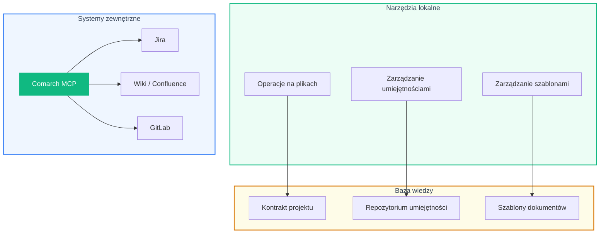

# Platforma

## Ekosystem narzędziowy

Analyst System integruje lokalne narzędzia, bazę wiedzy i systemy zewnętrzne w spójny ekosystem.

---

## Baza wiedzy

### Kontrakt projektu

Centralny dokument definiujący kontekst projektu — domeny biznesowe, konwencje techniczne, opis architektury. Każdy orkiestrator automatycznie ładuje kontrakt jako kontekst.

### Repozytorium umiejętności

Rosnąca baza umiejętności w formacie agentskills.io. Cztery umiejętności bazowe (Diátaxis, style guide, szablony, analiza wymagań) plus umiejętności generowane przez Pętlę Wiedzy.

### Szablony dokumentów

Predefiniowane struktury dla HLD, LLD, epików i planów testów — zapewniają spójność formatu we wszystkich generowanych dokumentach.

---

## Integracje

Comarch MCP (Model Context Protocol) łączy system z zewnętrznymi platformami:

| Platforma | Zastosowanie |
|-----------|-------------|
| **Jira** | Pobieranie wymagań, backlog, user stories |
| **Confluence** | Dokumentacja projektowa, wiki |
| **GitLab** | Kod źródłowy, schematy, konfiguracje |

!!! info "Model Context Protocol"
    MCP to standard komunikacji między agentami AI a zewnętrznymi systemami. Pozwala na bezpieczny, kontrolowany dostęp do danych bez konieczności budowania dedykowanych integracji.

---

## Technologia

| Komponent | Technologia |
|-----------|-------------|
| **Platforma agentowa** | Google ADK |
| **Modele AI** | Gemini 2.5 Flash / Pro |
| **Język** | Python 3.11+ |
| **Integracje** | Comarch MCP |
| **Format umiejętności** | agentskills.io |
