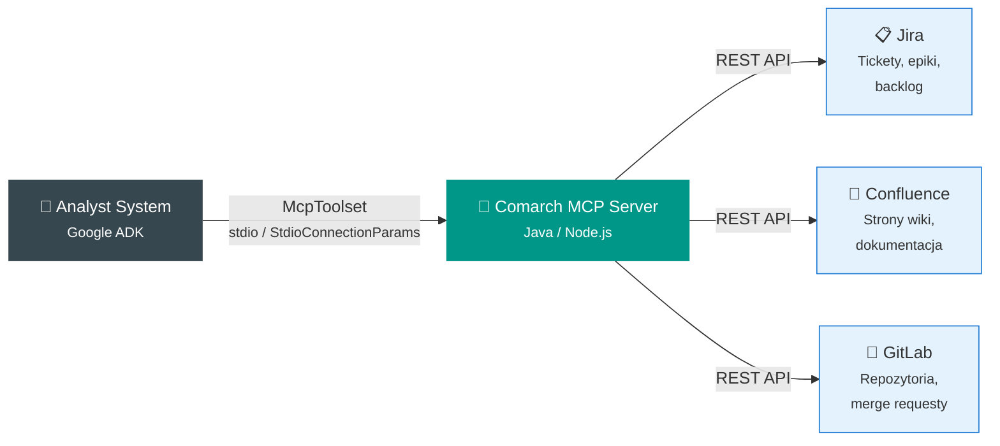

# Integracje zewnętrzne

## Model Context Protocol (MCP)

Analyst System integruje się z narzędziami zespołu przez **Comarch MCP** — serwer implementujący [Model Context Protocol](https://modelcontextprotocol.io).



---

## Jak działa integracja

### Architektura McpToolset

ADK udostępnia `McpToolset` — adapter, który łączy się z serwerem MCP i wystawia jego narzędzia jako `FunctionTool` dla agentów.

```python
from google.adk.tools.mcp_tool import McpToolset
from mcp import StdioConnectionParams

mcp_tools, mcp_exit = await McpToolset.from_server(
    connection_params=StdioConnectionParams(
        command="npx",
        args=["-y", "@comarch/mcp-server"],
        env={
            "JIRA_URL": "https://jira.comarch/",
            "WIKI_URL": "https://wiki.comarch/",
            "GITLAB_URL": "https://gitlab.comarch/",
            "NODE_EXTRA_CA_CERTS": os.environ.get("NODE_EXTRA_CA_CERTS", ""),
        }
    )
)
```

!!! info "Komunikacja stdio"
    MCP Server uruchamiany jest jako proces potomny komunikujący się przez stdin/stdout (standardowy transport MCP). Nie wymaga otwartych portów sieciowych.

---

## Możliwości per system

### :material-format-list-bulleted: Jira

| Operacja | Opis |
|----------|------|
| Wyszukiwanie ticketów | JQL queries, filtrowanie po projekcie |
| Odczyt ticketów | Tytuł, opis, status, komentarze |
| Odczyt epiców | User stories, definicja "done" |
| Analiza backlogu | Statystyki, priorytety, estymacje |

**Przykład użycia przez agenta:**

> _„Przeanalizuj backlog projektu IOTC — ile ticketów nie ma opisu?"_

System: McpToolset → Jira search → analiza wyników → raport

### :material-book-open-page-variant: Confluence

| Operacja | Opis |
|----------|------|
| Wyszukiwanie stron | Pełnotekstowe szukanie w przestrzeni |
| Odczyt stron | Treść strony + załączniki |
| Analiza struktury | Drzewo stron, hierarchia |

**Przykład:**

> _„Znajdź dokumentację modułu Census i sprawdź, czy jest aktualna"_

### :material-source-branch: GitLab

| Operacja | Opis |
|----------|------|
| Przeglądanie kodu | Odczyt plików, katalogów |
| Merge requesty | Analiza zmian, review |
| Historia | Logi commitów |

---

## Tryb offline

!!! warning "MCP jest opcjonalny"
    Integracja MCP jest **opcjonalna**. System działa w pełni bez niej, korzystając z:

    - Lokalnych plików (file_tools)
    - Wbudowanych skilli (skill_tools)
    - Szablonów (template_tools)
    - Kontraktu wiedzy (contract)

    Brak MCP oznacza jedynie brak dostępu do danych z Jira/Wiki/GitLab.

---

## Konfiguracja

Integracja MCP wymaga ustawienia zmiennych środowiskowych:

| Zmienna | Opis |
|---------|------|
| `COMARCH_MCP_COMMAND` | Komenda uruchamiająca MCP Server |
| `JIRA_URL` | URL instancji Jira |
| `WIKI_URL` | URL Confluence |
| `GITLAB_URL` | URL GitLab |
| `NODE_EXTRA_CA_CERTS` | Certyfikat CA (sieci korporacyjne) |

```bash
# .env
COMARCH_MCP_COMMAND=npx -y @comarch/mcp-server
JIRA_URL=https://jira.comarch/
WIKI_URL=https://wiki.comarch/
GITLAB_URL=https://gitlab.comarch/
NODE_EXTRA_CA_CERTS=/path/to/ca-cert.pem
```
