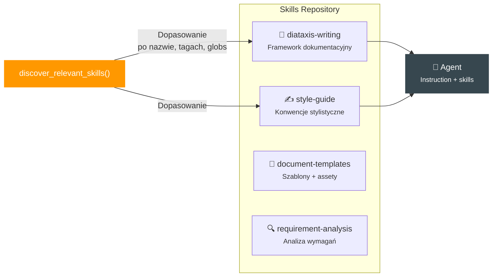

# System umiejętności (Skills)

## Czym są skille?

Skille to **reużywalne pakiety wiedzy** w formacie [agentskills.io](https://agentskills.io). Każdy skill to plik Markdown z YAML frontmatter, opisujący specjalistyczną umiejętność, którą agent może załadować w kontekst instrukcji.



---

## Wbudowane skille

System startuje z 4 wbudowanymi umiejętnościami:

### :material-book-open-variant: diataxis-writing

| Właściwość | Wartość |
|-----------|---------|
| **Cel** | Pisanie dokumentacji według frameworku Diátaxis |
| **Globs** | `docs/**/*.md`, `**/*documentation*` |
| **Tagi** | documentation, diataxis, writing |

Uczy agentów klasyfikować dokumenty na 4 typy: Tutorial, How-to, Reference, Explanation — i stosować odpowiedni ton, strukturę i podejście.

### :material-pencil-ruler: style-guide

| Właściwość | Wartość |
|-----------|---------|
| **Cel** | Konwencje stylistyczne inspirowane Microsoft Writing Style Guide |
| **Globs** | `**/*.md` |
| **Tagi** | documentation, style, writing |

Zasady: aktywny głos, zwracanie się do użytkownika, spójne terminy, formatowanie UI elementów, unikanie żargonu.

### :material-file-document-multiple: document-templates

| Właściwość | Wartość |
|-----------|---------|
| **Cel** | Szablony dokumentów technicznych |
| **Globs** | `docs/**/*.md`, `**/*template*` |
| **Tagi** | templates, documentation |
| **Assety** | `hld_template.md`, `lld_template.md`, `epic_template.md`, `test_plan_template.md` |

???+ example "Struktura szablonu HLD"
    ```markdown
    # [TODO: Nazwa modułu] — High-Level Design

    ## 1. Kontekst i zakres
    [TODO: Opisz kontekst biznesowy...]

    ## 2. Założenia i ograniczenia
    [TODO: Wymień kluczowe założenia...]

    ## 3. Architektura rozwiązania
    [TODO: Opisz proponowaną architekturę...]

    ## 4. Główne komponenty
    [TODO: Wymień i opisz komponenty...]

    ## 5. Integracje
    [TODO: Opisz integracje z innymi systemami...]
    ```

### :material-magnify: requirement-analysis

| Właściwość | Wartość |
|-----------|---------|
| **Cel** | Analiza wymagań: jasność, kompletność, wykonalność, ryzyka |
| **Globs** | `**/*requirement*`, `**/*spec*` |
| **Tagi** | requirements, analysis |

---

## Dynamiczne ładowanie skilli

Kluczowa cecha systemu — orkiestratory **automatycznie dobierają skille** do zadania.

### Jak działa `discover_relevant_skills()`

```python
# Prompt builder szuka skilli pasujących do zadania
skills = discover_relevant_skills(contract, task_type="HLD")
# → ["diataxis-writing", "style-guide", "document-templates"]

# Treść skilli jest wstrzykiwana w instrukcję agenta
instruction = build_instruction_with_skills(base_instruction, skills)
```

### Algorytm dopasowywania

1. **Nazwa** — czy nazwa skilla zawiera słowa kluczowe zadania?
2. **Tagi** — czy tagi pokrywają się z typem dokumentu?
3. **Globs** — czy wzorce plików pasują do docelowego output'u?

---

## Tworzenie nowych skilli

Nowe skille tworzone są przez **Knowledge Loop** (`generate_skill`). Pipeline 6-krokowy zapewnia jakość:

<div class="pipeline" markdown>

<div class="step">
<div class="step-circle">1</div>
<div class="step-label">Zbierz źródła wiedzy</div>
</div>
<div class="arrow">→</div>

<div class="step">
<div class="step-circle">2</div>
<div class="step-label">Wyciągnij kluczowe informacje</div>
</div>
<div class="arrow">→</div>

<div class="step">
<div class="step-circle">3</div>
<div class="step-label">Sprawdź duplikaty</div>
</div>
<div class="arrow">→</div>

<div class="step">
<div class="step-circle">4</div>
<div class="step-label">Zaprojektuj skill</div>
</div>
<div class="arrow">→</div>

<div class="step">
<div class="step-circle">5</div>
<div class="step-label">Recenzja jakości</div>
</div>
<div class="arrow">→</div>

<div class="step">
<div class="step-circle">6</div>
<div class="step-label">Prezentacja wyniku</div>
</div>

</div>

### Wymagania formatu agentskills.io

| Parametr | Wymaganie |
|----------|-----------|
| Nazwa | `lowercase-hyphen`, max 50 znaków |
| Frontmatter | YAML: name, version, description, globs, tags |
| Body | Max 500 linii Markdown |
| Assety | Opcjonalne pliki w `assets/` |

!!! success "Efekt sieci"
    Im więcej skilli w repozytorium, tym lepsze wyniki Analyst Loop. Nowe skille nie wymagają zmian w kodzie — system odkrywa je automatycznie przy każdym uruchomieniu.
