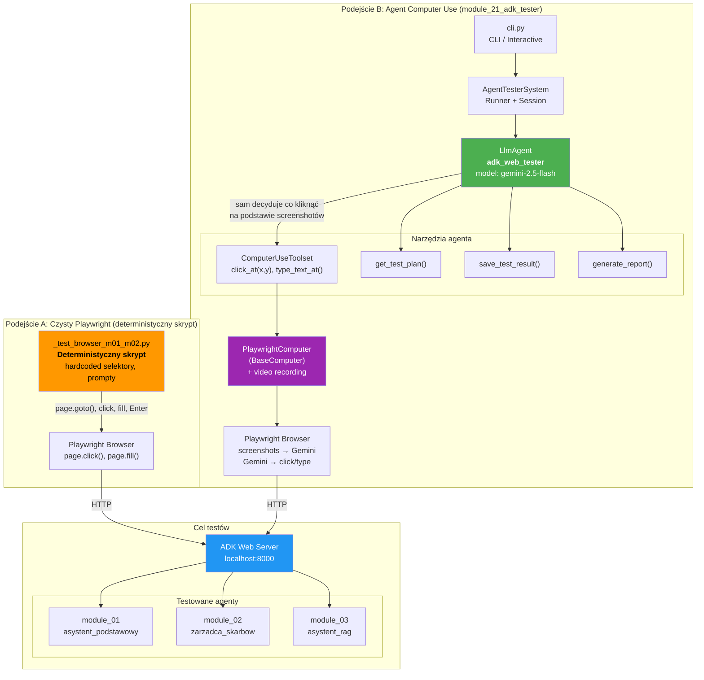
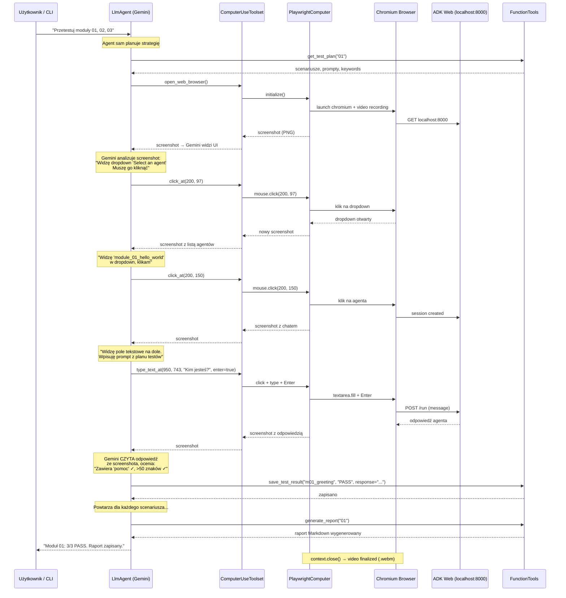

# Architektura module_21_adk_tester

## Diagram architektury — Co mamy vs Co testowaliśmy

## Flow agenta Computer Use — krok po kroku

## Porównanie podejść

| | **Czysty Playwright** | **Agent Computer Use** |
|---|---|---|
| **Kto decyduje co kliknąć?** | Skrypt — hardcoded selektory | **Gemini** — na podstawie screenshotów |
| **Skąd wie gdzie jest textarea?** | `page.locator("textarea[placeholder='...']")` | Widzi na screenshocie i klika `type_text_at(x, y)` |
| **Jak czyta odpowiedź?** | `page.query_selector(".bot-message")` | Gemini **czyta tekst ze screenshota** (OCR wizualny) |
| **Odporność na zmiany UI** | Łamie się gdy zmieni się selektor | Agent sam się adaptuje (widzi nowy layout) |
| **Koszt** | 0 (zero API calls) | ~$0.05-0.15 za moduł (Gemini API) |
| **Szybkość** | ~2min na 2 moduły | ~5-10min (screenshot → analiza → akcja w pętli) |
| **Plik** | `_test_browser_m01_m02.py` | `agent.py` + `cli.py` + `playwright_computer.py` |
