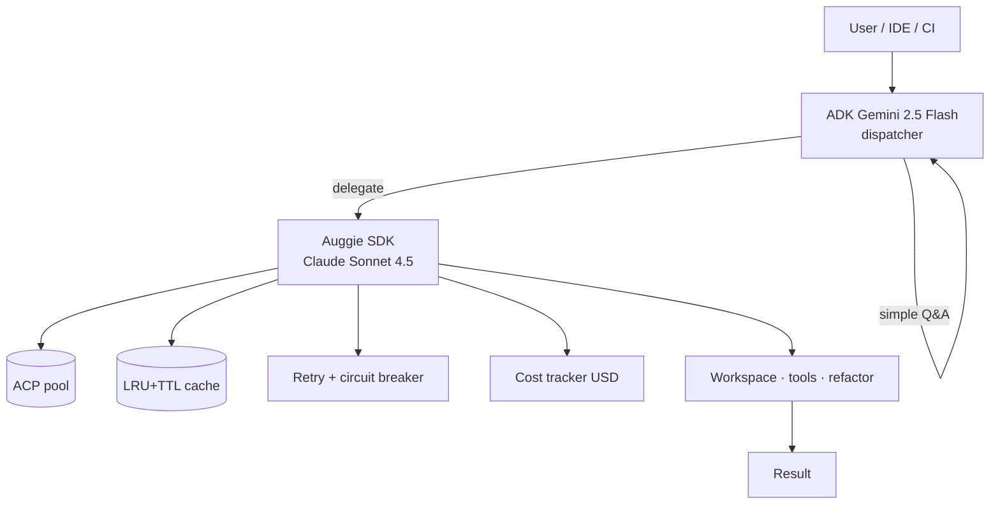

# Architecture

## Granice odpowiedzialności

| Warstwa | Modele | Co robi | Czego NIE robi |
|---|---|---|---|
| Tier 1 ADK | `gemini-2.5-flash` | klasyfikacja, prosty Q&A, decyzja o eskalacji | nie dotyka workspace |
| Tier 2 Auggie | `claude-sonnet-4.5` | edycja kodu, semantic search, tools | nie decyduje o eskalacji |
| Guardrails | — | cache, koszt, retry, breaker | nie zna business logic |

## Tool inventory (9)

| Tool | Tier | Co robi |
|---|---|---|
| `RUN_AUGGIE` | 2 | wolne wywołanie Auggie z promptem |
| `WRITE_TESTS` | 2 | generuje pytesty do pliku |
| `REVIEW_PR` | 2 | review diff (z `ci_review.py`) |
| `EXPLAIN_CODE` | 2 | wytłumaczenie pliku/function |
| `REFACTOR` | 2 | sugestie refaktoru |
| `ARTIFACTS` | 2 | listing wygenerowanych artefaktów |
| `TELEMETRY` | diag | snapshot per-tool latency / cache hit-rate |
| `COST` | diag | snapshot USD rolling |
| `HEALTH` | diag | CLI/session/breaker status |

Patrz [Developer guide](developer-guide.md) by dodać własny.

## Lifecycle requestu

1. FastAPI w `web/app.py` przyjmuje POST `/api/tools/run` (SSE).
2. `tools.dispatch(tool_id, inputs)` → wywołuje `auggie_factory.auggie_run(...)`.
3. `caching.get_cache().get(key)` — jeśli hit, zwracamy bez Auggie.
4. `resilience.resilient(...)` — retry 1/2/4/8 s + breaker.
5. `auggie --print` (subprocess lub ACP pool) → wynik.
6. `cost_tracker.record(model, seconds)` → akumuluje USD.
7. SSE emituje `progress` (heartbeat) + `final`.

## Pliki konfiguracji

| Plik | Co |
|---|---|
| `.env.template` | wzorzec — kopiuj do `.env`, ustaw `ANTHROPIC_API_KEY`, `AUGGIE_USE_ACP`, ... |
| `requirements.txt` | minimalne deps |
| `web/frontend/vite.config.ts` | proxy `/api` → `127.0.0.1:8770` |

## Gdzie idzie dalej

- [Cache · cost · resilience](cost-cache-resilience.md) — szczegółowe parametry.
- [MCP server](mcp-server.md) — integracja z IDE.
- Platform-level: [Architecture](../architecture.md) (gdzie AuditOps się wpina).
