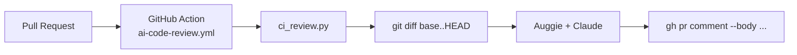

# CI · GitHub Action

`ci_review.py` + `.github/workflows/ai-code-review.yml` = AI review na każdym PR.

## Jak działa



## Workflow YAML (skrót)

```yaml
on:
  pull_request:
    types: [opened, synchronize]

jobs:
  review:
    runs-on: ubuntu-latest
    steps:
      - uses: actions/checkout@v4
        with: { fetch-depth: 0 }
      - uses: actions/setup-python@v5
        with: { python-version: '3.12' }
      - run: pip install -r adk_training/module_23_auggie_integration/requirements.txt
      - env:
          ANTHROPIC_API_KEY: ${{ secrets.ANTHROPIC_API_KEY }}
          GH_TOKEN:          ${{ secrets.GITHUB_TOKEN }}
        run: python -m adk_training.module_23_auggie_integration.ci_review
```

Pełna treść: `adk_training/module_23_auggie_integration/.github/workflows/ai-code-review.yml`.

## Co review ocenia

- bugi i edge case'y w zmienionych liniach,
- brak testów dla nowej logiki,
- naruszenia konwencji repo (`AGENTS.md` jako kontekst),
- security smell (hardcoded creds, missing input validation).

## Lokalne uruchomienie

```powershell
$env:GH_PR_NUMBER="123"
python -m adk_training.module_23_auggie_integration.ci_review --dry-run
```

`--dry-run` = wypisuje review na stdout zamiast komentować PR.

## Koszt

Średnio **$0.02–$0.08 / PR** (zależnie od rozmiaru diffa). Cache nie pomaga
(diff jest unikalny), więc warto ograniczyć: `paths-ignore: ['docs/**', '*.md']`
w workflow.

## Anti-patterns

- ❌ **Review bez `paths-ignore`** — dokumenty generują niskowartościowe komentarze.
- ❌ **Komentowanie *każdej linii*** — koncentruj się na ryzykach (max ~5 punktów / PR).
- ❌ **Bez `GITHUB_TOKEN` permissions** — dodaj `pull-requests: write` w workflow.
