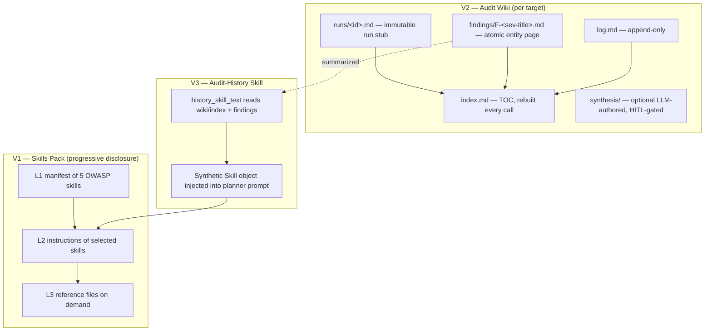

# Architecture

## Single-run dataflow

```mermaid
flowchart LR
  subgraph CLI["CLI / API entry"]
    A[user request]
  end
  subgraph Safety
    B[disclaimer ack]
    C[allow-list + rate-limit + runtime guard]
  end
  subgraph Plan
    D[passive_recon]
    E[skills_loader.render_planner_context]
    F[wiki.history_skill_text]
    G[LLM planner — auggie_run]
    H[dsl.validate_scenario]
  end
  subgraph Exec
    I[playwright_runner.run_scenario]
    J[Finding objects]
  end
  subgraph Memory
    K[reporter.write_report → report.md/json]
    L[wiki.record_run → wiki/<slug>/]
  end

  A --> B --> C --> D --> G
  D --> E --> G
  D --> F --> E
  G --> H --> I --> J
  J --> K --> L
```



Where each piece lives:

| Step | File | Notes |
|---|---|---|
| `passive_recon` | `recon.py` | HTTP only, no active probes. |
| `render_planner_context` | `skills_loader.py` | L1 manifest + L2 of selected skills. |
| `history_skill_text` | `wiki.py` | Synthetic skill body — empty if no wiki yet. |
| LLM planner | `pentest_agent._llm_translate_scenario` | Single-shot call via `auggie_run`. |
| `validate_scenario` | `dsl.py` | Whitelist of allowed verbs. |
| `run_scenario` | `playwright_runner.py` | Async Playwright runner with video. |
| `write_report` | `reporter.py` | Markdown + JSON. |
| `record_run` | `wiki.py` | Idempotent updater. |

## V1 + V2 + V3 in one picture



## File layout (artifacts directory)

```
artifacts/
├── <run_id>/
│   ├── report.md
│   ├── report.json
│   └── (videos, screenshots)
└── wiki/
    └── acme.test/                  ← per-host slug
        ├── index.md                ← always-current TOC
        ├── log.md                  ← append-only event log
        ├── findings/
        │   └── F-high-missing-csp.md
        ├── runs/
        │   └── r-abc123.md         ← stub linking to ../<run>/report.md
        └── synthesis/              ← optional, HITL-gated
```

## Why this layout?

The Karpathy LLM-Wiki blog post and the gist comment war (gnusupport,
SEO-Warlord, yogirk) converged on a few hard rules we adopted:

1. **Python writes the wiki, the LLM never edits it.** Eliminates
   "read-your-own-prose corruption".
2. **Runs are immutable.** Re-running `record_run` on the same audit does not
   rewrite the run stub.
3. **Findings are atomic Zettelkasten cards** — stable IDs from
   `(severity, normalized_title)` so the same finding from different runs
   merges into one page.
4. **Mechanical work in Python; semantics in LLM only.** The lint, the index
   rebuild, the slugging, the dedup — all deterministic functions. The LLM
   only writes the optional synthesis page, and only after a human ticks
   `accept=true`.

## Process model

- **Single-shot LLM**: We call the LLM once per scenario translation, not in
  a loop. This keeps costs predictable and lets us inject the full skills
  context up front.
- **No vector store**: The skills index and the wiki index are plain files
  on disk. At our scale (dozens of targets, dozens of runs) this is faster
  and infinitely more debuggable than a vector DB.
- **No background workers**: Audits run inside the FastAPI request task or
  the CLI process. SSE streams progress events to the browser.
