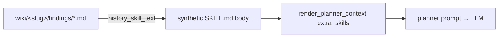

# V3 — Audit-History Skill

This is the cheapest possible "agent learns from the past" mechanism: we
turn the per-target wiki into a synthetic skill that gets injected into the
planner prompt, and we leave it at that.

## How it works



1. Before each LLM planner call, `pentest_agent._build_history_skill` calls
   `wiki.history_skill_text(cfg.artifacts_dir, target_url)`.
2. If a wiki exists for the target, it summarizes:
   - count of prior runs;
   - count of distinct findings;
   - top *N* findings (severity, title, occurrence count) sorted by severity.
3. The summary is wrapped as a `Skill` named `audit-history` and passed to
   `render_planner_context(..., extra_skills=[history_skill])`.
4. The model now sees, e.g.:

   ```text
   ## audit-history
   _Prior audit history for `https://acme.test/login` (read-only, summarized)._

   - Runs recorded: 7
   - Distinct findings: 3

   Known findings (do NOT re-test from scratch — confirm or refute):
   - [high] Missing CSP (seen 7×)
   - [medium] Open CORS (seen 2×)
   - [low] Verbose error (seen 1×)
   ```

## What we explicitly do **not** do

- We do not embed the wiki and do similarity search. The wiki is small;
  including the whole top-N as text is cheaper and more interpretable than
  a vector lookup.
- We do not let the LLM edit the wiki. The model reads only.
- We do not retrain or fine-tune. The "memory" is the on-disk wiki.

## Edge cases handled

| Case | Behaviour |
|------|-----------|
| First run on a new target | `history_skill_text` returns `""` → no extras injected → prompt unchanged. |
| Wiki was manually deleted | `index.md` missing → `history_skill_text` returns `""`. Same as first-run. |
| Hundreds of findings | `max_findings=25` cap; the summary stays bounded. |
| Severity tiers | Findings are pre-sorted by `_SEV_RANK` so critical/high appear first in the prompt. |

## Why this is enough

In practice the LLM doesn't *need* to see every prior run — it needs to
know which findings are *expected* on this target so it can prioritise
**confirming or refuting** them rather than re-discovering them
independently. That's exactly what the synthetic skill says.

If the skill body grows past, say, 20–25 findings the model gets bored
and starts ignoring it. Capping at 25 keeps the prompt actionable.
