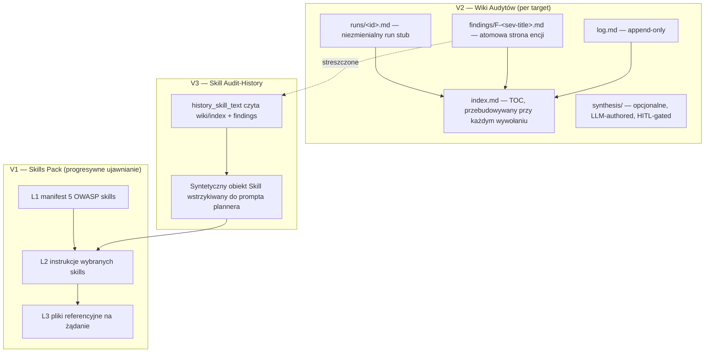

# Architektura

## Przepływ danych pojedynczego runa

```mermaid
flowchart LR
  subgraph CLI["Wejście CLI / API"]
    A[żądanie użytkownika]
  end
  subgraph Safety[Bezpieczeństwo]
    B[disclaimer ack]
    C[allowlista + rate-limit + runtime guard]
  end
  subgraph Plan[Planowanie]
    D[passive_recon]
    E[skills_loader.render_planner_context]
    F[wiki.history_skill_text]
    G[planner LLM — auggie_run]
    H[dsl.validate_scenario]
  end
  subgraph Exec[Wykonanie]
    I[playwright_runner.run_scenario]
    J[obiekty Finding]
  end
  subgraph Memory[Pamięć]
    K[reporter.write_report → report.md/json]
    L[wiki.record_run → wiki/<slug>/]
  end

  A --> B --> C --> D --> G
  D --> E --> G
  D --> F --> E
  G --> H --> I --> J
  J --> K --> L
```



Gdzie żyje każdy element:

| Krok | Plik | Notki |
|---|---|---|
| `passive_recon` | `recon.py` | Tylko HTTP, bez aktywnych sond. |
| `render_planner_context` | `skills_loader.py` | Manifest L1 + L2 wybranych skills. |
| `history_skill_text` | `wiki.py` | Syntetyczny skill body — pusty jeśli brak wiki. |
| Planner LLM | `pentest_agent._llm_translate_scenario` | Pojedyncze wywołanie przez `auggie_run`. |
| `validate_scenario` | `dsl.py` | Whitelist dozwolonych werbów. |
| `run_scenario` | `playwright_runner.py` | Async runner Playwright z wideo. |
| `write_report` | `reporter.py` | Markdown + JSON. |
| `record_run` | `wiki.py` | Idempotentny updater. |

## V1 + V2 + V3 w jednym obrazku



## Layout plików (katalog artefaktów)

```
artifacts/
├── <run_id>/
│   ├── report.md
│   ├── report.json
│   └── (wideo, screenshoty)
└── wiki/
    └── acme.test/                  ← slug per-host
        ├── index.md                ← zawsze aktualny TOC
        ├── log.md                  ← append-only log zdarzeń
        ├── findings/
        │   └── F-high-missing-csp.md
        ├── runs/
        │   └── r-abc123.md         ← stub linkujący do ../<run>/report.md
        └── synthesis/              ← opcjonalne, HITL-gated
```

## Dlaczego taki layout?

Wpis LLM-Wiki Karpathy'ego oraz dyskusja w komentarzach gistu (gnusupport,
SEO-Warlord, yogirk) zbiegły się na kilku twardych zasadach, które
przyjęliśmy:

1. **Wiki pisze Python, LLM nigdy go nie edytuje.** Eliminuje
   "korupcję czytaj-własną-prozę".
2. **Runy są niezmienialne.** Ponowne `record_run` na tym samym audycie
   nie przepisuje run stuba.
3. **Findingi to atomowe karty Zettelkasten** — stabilne ID z
   `(severity, normalized_title)` — to samo finding z różnych runów łączy
   się w jedną stronę.
4. **Mechaniczna robota w Pythonie; semantyka tylko w LLM.** Lint,
   przebudowa indeksu, slugowanie, dedup — wszystko deterministyczne
   funkcje. LLM pisze tylko opcjonalną stronę synthesis, i tylko po
   ludzkim ticku `accept=true`.

## Model procesu

- **Single-shot LLM**: Wywołujemy LLM raz per tłumaczenie scenariusza,
  nie w pętli. Trzyma to koszty przewidywalnymi i pozwala wstrzyknąć
  pełny kontekst skills z góry.
- **Brak vector store**: Indeks skills i indeks wiki to zwykłe pliki
  na dysku. Przy naszej skali (dziesiątki targetów, dziesiątki runów)
  jest to szybsze i nieskończenie łatwiejsze do debugowania niż vector DB.
- **Brak workerów w tle**: Audyty działają wewnątrz tasku request FastAPI
  albo procesu CLI. SSE strumieniuje eventy postępu do przeglądarki.
