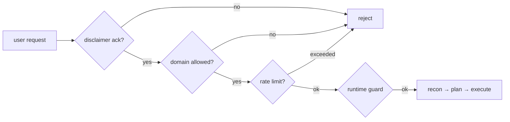

# Security & Safety

## Multi-layer defence

## Disclaimer ack — `safety.DisclaimerAck`

Stored in a sqlite database at
`AUDITOPS_ACK_STORE_PATH` (defaults to `<artifacts_dir>/.acks.db`). Each
ack records:

- `user_id`
- `target_url`
- `timestamp`
- free-text `statement`

The CLI bypasses the UI prompt by setting `AUDITOPS_REQUIRE_DISCLAIMER=0`,
but it still constructs a `DisclaimerAck` and the runtime guard still uses
it for downstream checks.

## Allow-list — `cfg.allowed_domains`

Set via `AUDITOPS_ALLOWED_DOMAINS` (comma-separated) or `--allow-domain`
flag (repeatable). The runtime guard refuses to start a run whose
`target_url` host isn't on the list.

## Rate limit — `safety.RateLimiter`

Default: 10 runs / hour / user. Tunable through environment variables.

## DSL whitelist — `dsl.ALLOWED_ACTIONS`

The LLM can only emit Playwright steps from a curated set
(`goto`, `click`, `fill`, `assert`, `screenshot`, `wait`, `expect_response`,
`evaluate_safe`, ...). Any other verb is rejected by `validate_scenario`.

## OWASP Top 10 alignment

We design and self-audit against the OWASP Top 10 (2021):

- **A01 / A07** — auth + access-control: enforced via allow-list + ack.
- **A03** — injection: DSL whitelist; no shell exec, no string-templated SQL.
- **A05** — misconfiguration: defaults are restrictive (rate limit, ack, allow-list).
- **A09** — logging: `runtime_guard` emits structured events; the wiki log is append-only.

## Prompt-injection hygiene

- The skills pack body is loaded from `skills/*/SKILL.md` files in the repo,
  not from user input. Tampering requires a code review.
- The audit-history skill body is composed by `wiki.history_skill_text` from
  finding pages **also written by Python** — no LLM-authored content is
  re-injected into the planner prompt.
- The synthesis endpoint is the only place LLM-authored content can land in
  the wiki, and it is gated behind `accept=true` (HITL).

## Reporting a vulnerability

See [`SECURITY.md`](https://github.com/) at the repo root.

## Air-gapped operation

- All persistence is local files + sqlite.
- The only outbound call is the LLM planner via `module_23_auggie_integration`.
- For air-gapped CI, replace `auggie_factory.auggie_run` with a mock that
  returns canned scenarios — the rest of the system works without the LLM.
