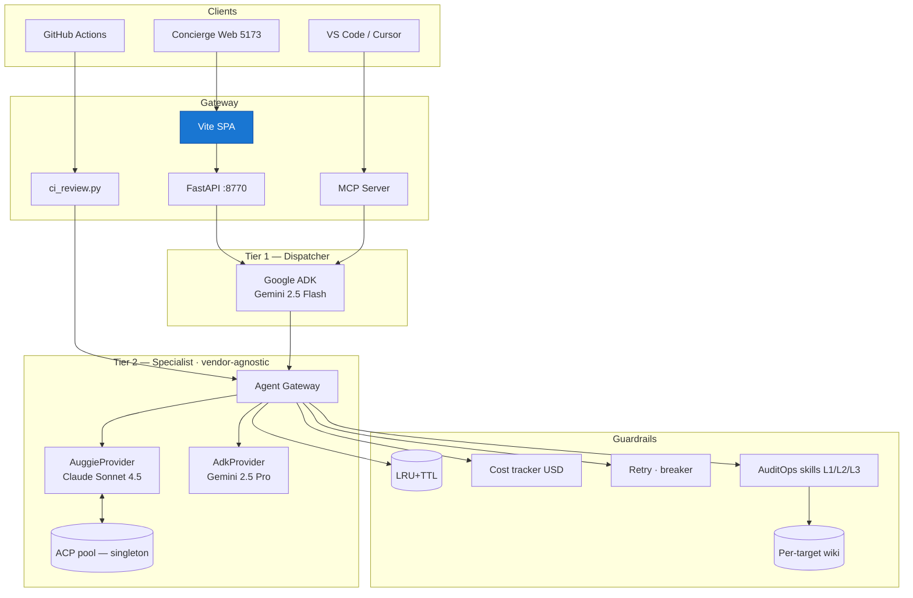

# Architecture

Platforma to **dwie warstwy + jedna szyna danych**: tani dispatcher (Gemini), **wymienialny**
specjalista (Auggie/Claude, Google Gemini, lub dowolny przyszły provider) i deterministyczne
guardrails (AuditOps + cache + cost + resilience). Backend AI jest **vendor-agnostic** —
dodanie nowego providera = 1 plik adaptera.

## High-level

## Granice odpowiedzialności

| Warstwa | Modele | Co robi | Czego NIE robi |
|---|---|---|---|
| Tier 1 — ADK Gemini | `gemini-2.5-flash` | klasyfikacja intentów, prosty Q&A, decyzja o eskalacji | nie pisze kodu, nie ogląda repo |
| Tier 2 — Auggie/Claude | `claude-sonnet-4.5` | edycja kodu, audyt, semantic search w workspace, web pentest | nie podejmuje decyzji o eskalacji |
| AuditOps planner | (brak — Python) | wybiera skille po recon, scheduling Playwright PoCs | nie modyfikuje wiki spoza Pythona |
| Wiki writer | (brak) | append-only log, atomic findings, lint | nie pozwala LLM-owi pisać index.md |

## Przepływ danych

1. **Request** trafia do FastAPI (`module_23_auggie_integration/web/app.py`).
2. ADK dispatcher pyta: *"czy potrzebuje specjalisty?"* — jeśli nie, odpowiada od razu.
3. Eskalacja → `gateway.run(prompt, opts)` (vendor-neutral). Po drodze:
    - `caching.py` sprawdza klucz SHA256 (skip dla `success_criteria` / `functions`).
    - `resilience.py` retry 1/2/4/8 s + circuit breaker 5 fails / 60 s → open 120 s.
    - `cost_tracker.py` notuje sekundy * stawka modelu (`RATES_USD_PER_SEC`).
4. Wynik wraca do ADK, który ewentualnie woła kolejne tools (`ARTIFACTS`, `LINT`...).
5. Audyt OWASP idzie ścieżką **AuditOps**:
    - `recon.py` zbiera sygnały (security headers, formy, ścieżki).
    - `skills_loader.SkillRegistry.by_triggers()` wybiera skille deterministycznie.
    - Planner woła Auggie z **L2 instructions** wybranych skilli.
    - `wiki.record_run(artifacts_dir, audit)` aktualizuje per-target wiki.

## Obserwowalność

| Endpoint | Co zwraca |
|---|---|
| `GET /api/health` | CLI/session/breaker snapshot |
| `GET /api/cost` | rolling USD per tool / model |
| `GET /api/telemetry` | execution times, cache hit-rate |
| `GET /api/audit/wiki` | lista per-target wiki (z lintem) |

Wszystkie dane są **pull-based** (HTTP/SSE), brak ukrytego stanu globalnego poza singletonami
opisanymi w [Features catalog](features-catalog.md#singletons).

## Bezpieczeństwo

- **Allowlist hostów** w AuditOps (`safety.py`) — nie audytujemy nieautoryzowanych celów.
- **Path-traversal guard** w `skills_loader.load_resource` (resolve + prefix check).
- **Brak credenciali w wiki** — `safety.redact()` filtruje cookies/tokeny.
- **CORS** zamknięty do `localhost` — patrz [Concierge / Security](ai-code-concierge/security.md).
