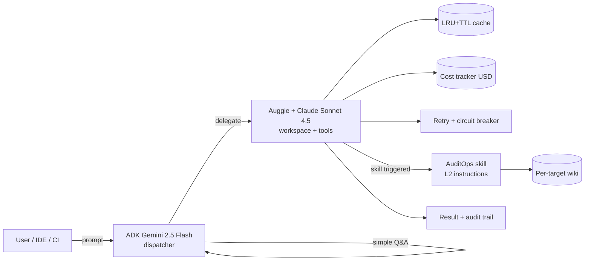

  ADK + Auggie
  Two-tier orchestration
  OWASP Top 10 audit guardrails
  CI ready

# ADK Fundamentals — Platform

Jeden produkt, dwie warstwy: <b>AI Code Concierge</b> kieruje ruchem (Gemini Flash — tani dispatcher),
<b>Auggie/Claude</b> robi ciężką robotę kodu i bezpieczeństwa, a <b>AuditOps</b> dorzuca skille,
audyt OWASP i pamięć instytucjonalną. Wszystko orkiestrowane przez Google ADK.

<a href="quick-start/" class="cta">⚡ Quick start</a>
<a href="architecture/" class="cta secondary">🏗 Architecture</a>
<a href="patterns/" class="cta secondary">🧩 Patterns</a>
<a href="features-catalog/" class="cta secondary">⚙️ Features</a>

## What's inside

module_23
### 🤖 AI Code Concierge
Two-tier dispatcher: ADK Gemini routes intents → Auggie/Claude executes. Cache (LRU+TTL),
cost tracker (USD/tool), retry+circuit-breaker, ACP pool, MCP server, GitHub Action for PR review.

[Explore Concierge →](ai-code-concierge/index.md)

module_24
### 🛡 AuditOps
LLM-driven web pentest with deterministic guardrails. Progressive-disclosure skills
(L1/L2/L3), per-target audit wiki, Playwright PoCs, OWASP Top 10 (2021) coverage,
124 tests in ~8s.

[Explore AuditOps →](AuditOps/index.md)

cross-cutting
### 🧩 Reusable patterns
The skills, wiki, recon→trigger and progressive-disclosure ideas are **module-agnostic**.
This site documents how to drop them into module_13 (Code Analyst), module_22 (Spec Generator),
module_09 (DB agents) and beyond.

[See patterns →](patterns/)

## Two-tier orchestration in 30 seconds

You only pay the expensive specialist when you actually need it. Everything is observable
(`/api/cost`, `/api/telemetry`, `/api/health`) and deterministic where it matters.

## Reading order

1. [Quick start](quick-start.md) — uruchom backend + frontend + docs.
2. [Architecture](architecture.md) — schemat dwuwarstwowy, granice odpowiedzialności.
3. [Patterns](patterns/index.md) — co i jak przenieść do innych modułów.
4. [Features catalog](features-catalog.md) — pełna lista funkcji platformy.
5. [AI Code Concierge](ai-code-concierge/index.md) lub [AuditOps](AuditOps/index.md) — deep-dive.
6. [Decision guide](decision-guide.md) — kiedy Concierge, kiedy AuditOps, kiedy oba.

!!! tip "Polish & English"
    AuditOps ma pełne tłumaczenie 🇵🇱 w sekcji *AuditOps → Polski*.
    Concierge i strony platformowe są dwujęzyczne (PL w treści, EN w nagłówkach).
