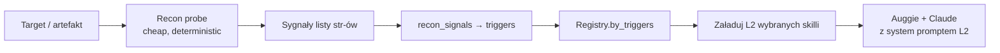

# Recon → trigger → skill

Tani, deterministyczny *probe* zbiera sygnały o targecie; mapping sygnał → trigger
wybiera skille; planner ładuje **L2 tylko dla wybranych**. Modelka nie decyduje
o wyborze — Python decyduje.

## Pipeline



## Implementacja referencyjna

```python
from adk_training.module_24_audit_ops.recon import recon
from adk_training.module_24_audit_ops.skills_loader import (
    default_registry, recon_signals,
)

probe = recon("https://target.example")           # forms, headers, paths, ...
signals = recon_signals(probe.__dict__)           # ["baseline", "missing:csp", "forms", ...]
chosen = default_registry().by_triggers(signals)  # tylko relevant skille
system = "\n\n".join(s.instructions for s in chosen)
```

## Anatomia mappera

`recon_signals(probe_dict) -> List[str]` w `skills_loader.py`:

- `"baseline"` — zawsze obecny.
- `"missing:<header>"` — dla każdego brakującego security header.
- `"forms"` — gdy wykryto formy z passwordem.
- `"crypto"` — gdy brak HSTS.
- `"injection"` — gdy parametry GET-owe widoczne w odpowiedzi.

Pełna logika: [`skills_loader.py`](https://github.com/) sekcja *recon → triggers*.

## Drop-in do innego modułu

```python
# np. module_22_spec_generator — sygnały z artefaktów PRD
def spec_signals(artifact: dict) -> list[str]:
    out = ["baseline"]
    if artifact.get("user_stories"): out.append("stories")
    if artifact.get("non_functional"): out.append("nfr")
    if "auth" in (artifact.get("domains") or []): out.append("auth-flow")
    return out

chosen = my_registry.by_triggers(spec_signals(prd))
```

## Anti-patterns

- ❌ **LLM klasyfikuje co załadować** — nieprzewidywalne, drogie, niedeterministyczne testy.
- ❌ **Triggery jako regex na stronie** — lepszy słownik sygnałów na wyjściu probe.
- ❌ **Probe woła LLM** — to ma być cheap. Jeden HTTP call + parsing.
- ❌ **Brak fallbacku `baseline`** — gdy żaden trigger nie matchuje, ładujemy podstawę.

## Co zyskujesz

- Predykowalny token cost: `tokens(L1) + Σ tokens(L2[chosen])`.
- Deterministyczne testy (mock probe → fixed skill set).
- Audytowalność (log który skill aktywował się i czemu).
